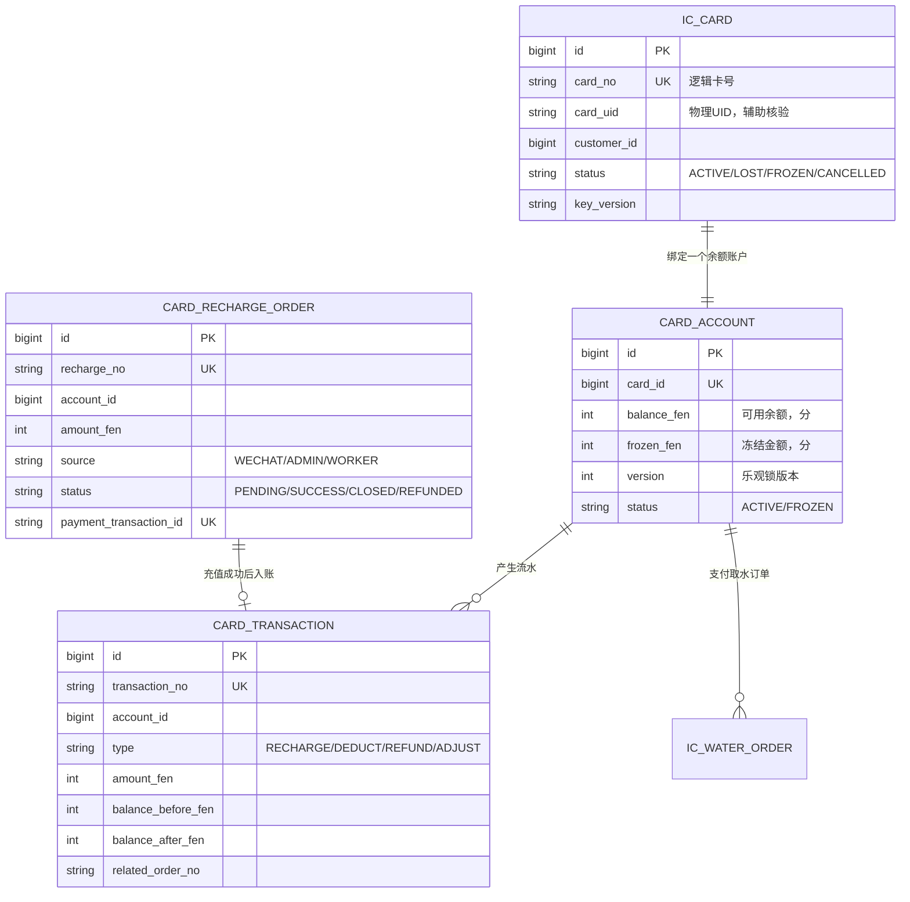
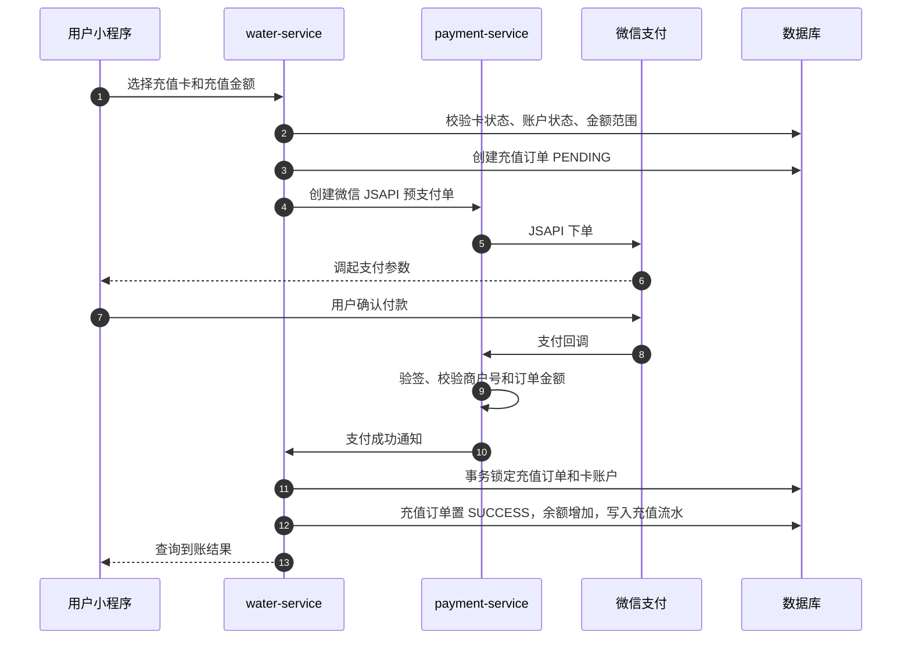
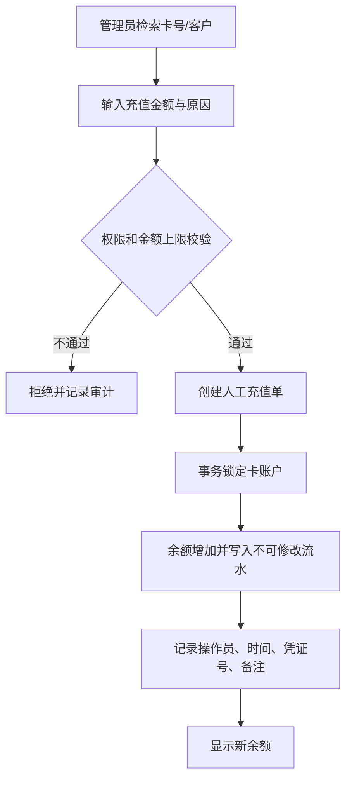
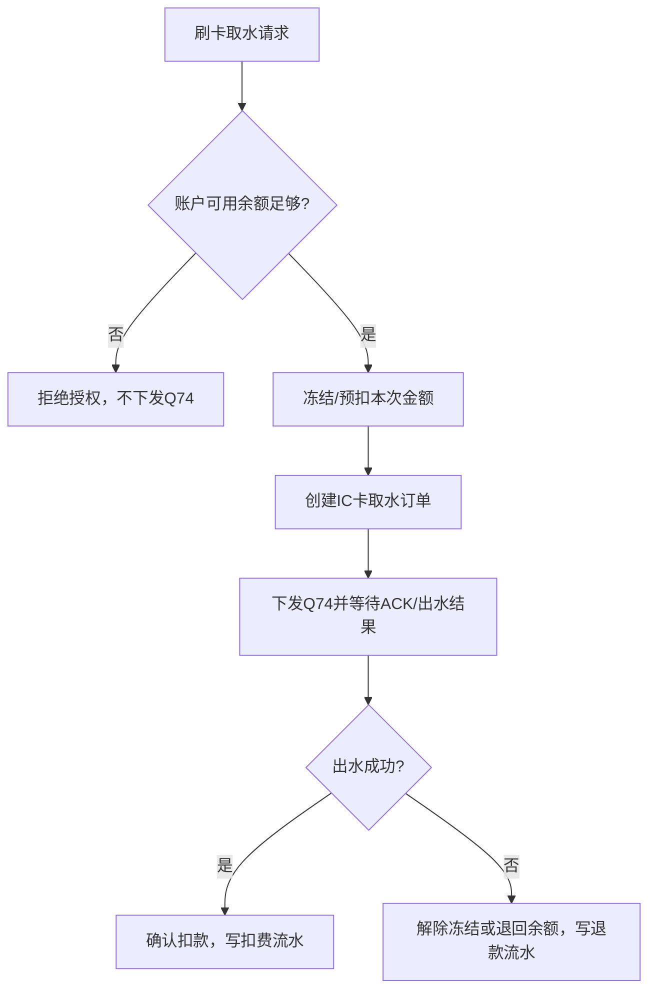
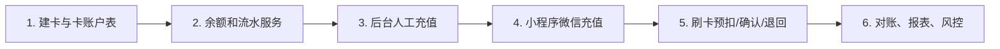

# IC 卡余额充值设计

## 核心原则

IC 卡不保存余额。卡只保存受保护的逻辑卡号，平台中的“卡账户余额”是唯一可信账本。

充值到账后，用户无需再次把余额写回卡内；只要刷卡时平台能够识别同一逻辑卡号，即可使用最新余额取水。

## 充值方式

| 方式 | 使用场景 | 到账规则 |
| --- | --- | --- |
| 小程序微信充值 | 用户自己充值 | 微信支付回调验签成功后自动到账 |
| 管理后台人工充值 | 现金收款、赠送余额、线下转账 | 有权限的管理员确认后立即到账 |
| 后续可选：运营人员充值 | 现场代收 | 绑定操作员、设备/地点与收款凭证，后台审核或直接到账 |

不建议将“充值金额”直接写入 M1 卡扇区。即使写入，也只能做显示缓存，不能作为扣费依据。

## 数据模型

金额全部使用“分”的整数存储，例如 `10.00 元` 存为 `1000`，不使用浮点数。

## 小程序微信充值流程

### 小程序页面建议

1. “我的”页面增加“IC 卡余额”。显示卡状态、逻辑卡号脱敏、当前余额和最近流水。
2. 点击“充值”后选择已绑定的卡，或输入/扫描卡号。
3. 提供固定金额 `10 / 20 / 50 / 100 / 200 元`，并可允许自定义金额。
4. 调起现有微信支付；支付成功页只展示“充值处理中”，由后端回调确认到账。
5. 历史列表显示：充值、刷卡取水扣费、出水异常退款、人工调整。

## 管理后台人工充值流程

人工充值必须记录操作人、原因、收款方式、外部凭证号和前后余额。高于设定阈值的充值应要求二次复核。

## 取水扣费与退款衔接

建议第一版按“选定出水量预扣、成功后确认、异常全额退回”实现，与现有扫码取水异常退款逻辑保持一致。后续若控制板稳定回传实际出水量，再扩展为按实际水量结算和差额退款。

## 幂等与风控要求

1. `recharge_no`、微信支付交易号、人工收款凭证号均建立唯一约束，重复回调只能入账一次。
2. 充值到账、余额变动、流水写入必须使用同一数据库事务和账户行锁或乐观锁。
3. 卡挂失、冻结、注销状态不得充值或取水；补卡时迁移账户关系，不迁移旧卡身份。
4. 小程序充值金额设定最小/最大值和每日上限，例如 `1 至 500 元`、每日 `1000 元`，具体额度由运营配置。
5. 连续失败支付、异常频繁充值、短时间高额人工调整应产生审计告警。
6. 充值退款不是普通出水退款：若微信充值已到账并被消费，不可直接原路退款；应走人工审核、余额冻结和财务审批流程。

## 实施顺序

## 与现有系统的复用点

- 微信支付创建订单、回调验签、支付交易号幂等可以复用现有 `payment-service` 能力。
- Q74、ACK、设备在线检查、命令异常与出水异常处理可复用现有扫码取水链路。
- 扫码订单页面可新增“IC 卡充值订单”“IC 卡取水订单”页面或筛选条件。
- 财务管理中增加卡账户余额、充值金额、扣费金额、退款金额与人工调整报表。
