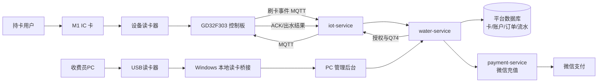
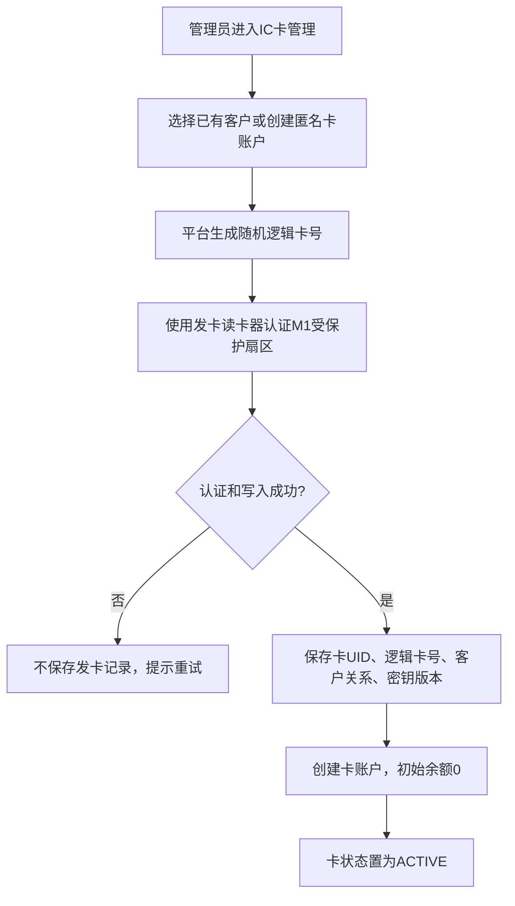
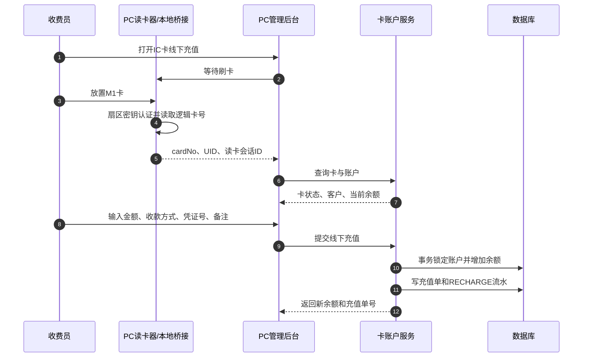
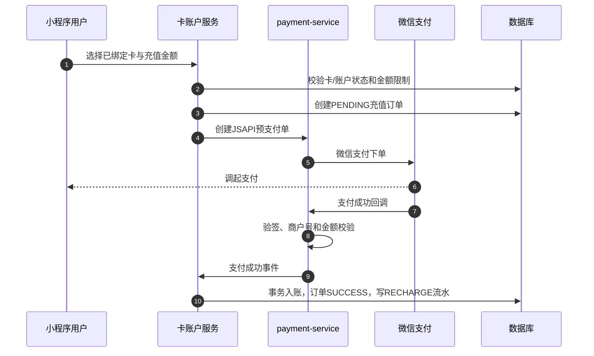
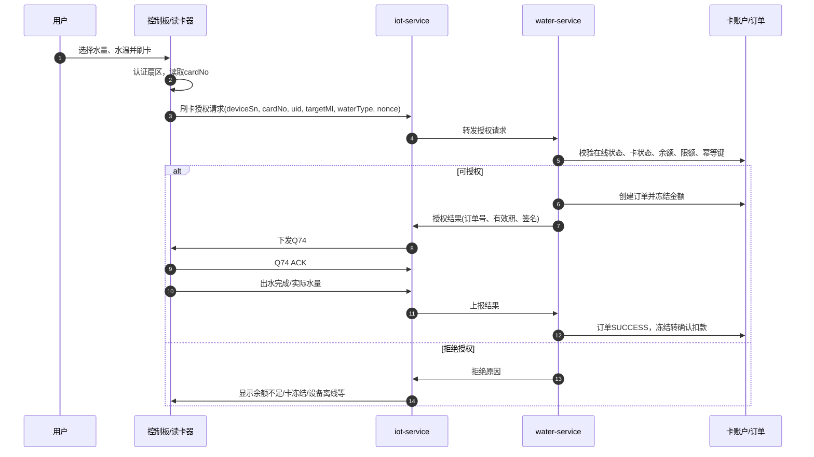
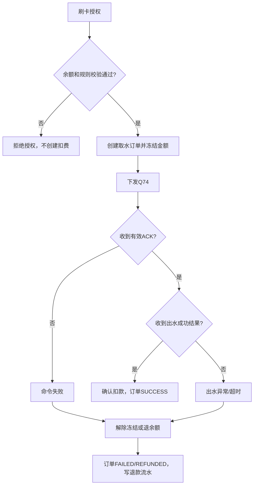

# IC 卡刷卡取水与充值综合设计方案

## 1. 建设目标

在现有直饮水平台和扫码取水能力之上，增加普通 M1 IC 卡的发卡、线下读卡充值、小程序微信充值、刷卡取水、余额扣费、异常退余额、对账与运营管理能力。

方案采用“**卡作为身份凭证，平台作为唯一资金账本**”的原则：

- IC 卡不存余额，不以卡内金额作为扣费依据。
- 平台卡账户保存可用余额、冻结金额、交易流水和订单状态。
- 用户刷卡后，平台在线鉴权、预扣或冻结余额，复用既有 Q74、ACK、出水结果和异常处理链路。
- 第一版要求设备联网。断网时拒绝刷卡售水，不实现离线余额。

## 2. 适用范围与边界

### 2.1 卡类型

- 第一版：`MIFARE Classic M1` 13.56MHz 卡。
- 正式安全基线：M1 受保护扇区保存随机生成的逻辑卡号，读取前进行扇区密钥认证。
- 不使用卡 UID 作为唯一账户身份，不将余额以明文写入卡内。
- 后续资金规模扩大时，可平滑升级为 CPU/DESFire 卡，后台账户模型和订单模型无需重做。

### 2.2 当前可复用的系统能力

- 水价和金额后端计算。
- 设备在线状态检查。
- Q74 出水协议：`SW1_START_{targetMl}_{waterType}_{timestamp}_{nonce}_{sign}`。
- Q74 ACK、命令重试、出水状态、异常订单与退款框架。
- 微信支付 V3 创建订单、回调验签、支付交易号幂等。
- PC 端账户、角色权限、审计日志、财务和报表模块。

### 2.3 第一版不包含

- 断网余额消费与离线交易同步。
- 卡内钱包或卡内余额写入。
- 自动按实际流量差额结算。第一版按选定水量预扣，成功后确认；失败全额退回。

## 3. 整体架构



## 4. 核心对象与状态

### 4.1 IC 卡

| 字段 | 说明 |
| --- | --- |
| `cardNo` | 平台随机生成的逻辑卡号，写入受保护扇区，唯一 |
| `cardUid` | 物理 UID，仅辅助核验和风险识别，不作为唯一身份 |
| `customerId` | 绑定客户，可按业务支持匿名储值卡 |
| `status` | `UNISSUED`、`ACTIVE`、`LOST`、`FROZEN`、`CANCELLED` |
| `keyVersion` | 当前扇区密钥版本，便于后续换密钥 |

### 4.2 卡账户

| 字段 | 说明 |
| --- | --- |
| `balanceFen` | 可用余额，单位分，整数 |
| `frozenFen` | 已冻结但未最终确认的金额，单位分 |
| `status` | `ACTIVE`、`FROZEN`、`CLOSED` |
| `version` | 乐观锁版本，防止并发扣款或重复充值 |

### 4.3 订单与资金流水

| 对象 | 关键状态 |
| --- | --- |
| 充值订单 | `PENDING`、`SUCCESS`、`CLOSED`、`REFUNDED` |
| IC 卡取水订单 | `PENDING_AUTH`、`FROZEN`、`DISPATCHED`、`DISPENSING`、`SUCCESS`、`FAILED`、`REFUNDED` |
| 账户流水 | `RECHARGE`、`FREEZE`、`CONFIRM_DEDUCT`、`UNFREEZE`、`REFUND`、`ADJUST` |

所有金额均以“分”存储和计算，例如 `0.3 元` 为 `30`，严禁使用浮点数参与账务运算。

## 5. 卡发放与绑定



发卡后支持挂失、冻结、注销和补卡。补卡时迁移账户关系与余额到新卡，旧卡立即置为不可用。

## 6. 充值设计

### 6.1 线下读卡充值

收费员使用 PC 管理后台和 USB 读卡器为用户充值。充值不写卡，只更新后台卡账户。



线下页面应展示读卡器状态、卡号脱敏、客户、当前余额、充值金额、收款方式、凭证号、操作员、门店和充值结果。

推荐收款方式：`现金`、`线下转账`、`赠送`、`其他`。金额较大时要求二次复核。

### 6.2 小程序微信充值



微信支付回调、微信交易号和充值订单号必须建立幂等保护，重复回调只允许余额增加一次。

## 7. 用户刷卡取水

### 7.1 设备端交互

1. 用户选择冷水/热水和目标水量，或使用设备默认档位。
2. 用户刷卡，读卡器认证受保护扇区并读取逻辑卡号。
3. 控制板通过 MQTT 上报刷卡授权请求。
4. 平台校验设备可控在线、卡状态、账户状态、余额、限额和重复请求。
5. 平台冻结本次金额，创建 IC 卡取水订单。
6. 平台授权并下发 Q74，控制板回传 ACK 和最终出水结果。
7. 成功则确认扣款；命令或出水失败则自动退回冻结金额。

### 7.2 主流程



### 7.3 MQTT 授权请求建议

建议新增独立主题，例如：`api/v2/card/auth/{deviceSn}`。

```json
{
  "messageID": "UUID",
  "cardNo": "C8A4F190D27E",
  "cardUid": "04A1B2C3D4",
  "targetMl": 500,
  "waterType": 0,
  "timestamp": 1780000000,
  "nonce": "A1B2C3D4"
}
```

`waterType=0` 为冷水，`waterType=1` 为热水。当前价格可沿用平台统一配置：冷水 `0.3 元/L`，热水 `0.5 元/L`，最终金额必须由后端计算。

Q74 仍沿用既有格式：

```text
SW1_START_{targetMl}_{waterType}_{timestamp}_{nonce}_{sign}
```

签名建议同时包含订单号或卡交易号，避免授权报文和 Q74 命令被重放。

## 8. 扣费、异常与退余额



第一版使用“预扣冻结”而不是立即扣除：

- 授权成功：可用余额减少、冻结余额增加。
- 出水成功：冻结金额变为最终扣费。
- ACK 超时、设备离线、出水异常：冻结金额完整退回可用余额。

后续如设备可靠回传实际出水量，可按实际毫升重新计算最终金额，自动释放差额。

## 9. 管理后台功能

| 菜单 | 功能 |
| --- | --- |
| IC 卡管理 | 发卡、绑定客户、查看卡、挂失、冻结、注销、补卡、读卡记录 |
| 卡账户管理 | 查询余额、冻结金额、账户状态、绑定关系、最近流水 |
| IC 卡线下充值 | PC 读卡、查询账户、现金/转账充值、凭证号、二次复核 |
| IC 卡取水订单 | 订单号、卡号脱敏、设备、冷热水、水量、金额、命令/出水/退款状态 |
| 资金流水 | 充值、冻结、扣费、退回、人工调整，支持按时间、卡、客户和操作员查询 |
| 财务报表 | 日/周/月充值、售水、退款、余额沉淀、设备维度统计、对账导出 |
| 风控与审计 | 额度、重复刷卡、异常充值、操作审计、卡黑名单 |

## 10. 小程序功能

| 页面 | 功能 |
| --- | --- |
| 我的 IC 卡 | 展示逻辑卡号脱敏、卡状态、可用余额、最近流水 |
| 余额充值 | 选择卡、选择金额、微信支付充值、到账状态 |
| 交易明细 | 充值、取水扣费、异常退回、人工调整的可查询明细 |
| 挂失申请 | 用户提交挂失，后台审核后冻结卡账户和卡状态 |

## 11. 安全与风控

1. 使用非默认 M1 扇区密钥，逻辑卡号不使用连续编号。
2. 扇区密钥不进入浏览器、小程序、固件日志或 Git 仓库。
3. 后台账户为资金唯一来源，卡内不存余额。
4. 卡读写失败、卡冻结、设备不可控离线、余额不足时不下发 Q74。
5. 以 `messageID + cardNo + deviceSn + nonce` 建立幂等键，避免重复刷卡或 MQTT 重传导致重复冻结、扣费或出水。
6. 充值订单号、微信支付交易号、线下收款凭证号建立唯一约束。
7. 余额更新、订单状态和资金流水必须在同一数据库事务中完成。
8. 所有人工充值与调整记录操作员、地点、时间、原因和前后余额；禁止物理删除流水。
9. 配置单笔、单日、单卡、单操作员额度和高额二次审核阈值。
10. 当前 Q66 存在心跳与配置点位冲突风险，正式接入卡扣费前必须完成点位协议收敛和 messageID 幂等处理。

## 12. 硬件与现场准备

### 12.1 设备侧读卡器

- 支持 MIFARE Classic 1K 和指定扇区 Key A/Key B 认证。
- 与 GD32F303 可通过 UART、RS485 或 SPI 通信。
- 防水、防静电、金属安装面天线干扰测试。
- 读卡失败、卡移开、通信超时等状态可上报。

### 12.2 PC 充值读卡器

- 推荐 USB 读卡器，提供 Windows x64 SDK 或串口协议。
- 必须能做 M1 扇区认证并读取逻辑卡号，而非只输出 UID。
- 充值电脑安装 Windows 本地读卡桥接程序，仅监听 `127.0.0.1`，密钥配置文件限制访问权限。

### 12.3 运营物料

- 用户卡、测试卡、管理员卡与卡号登记表。
- 发卡/补卡/挂失流程和用户告知。
- 收费凭证、现金管理、日终对账和异常处理规范。

## 13. 分阶段实施计划


### 阶段验收标准

| 阶段 | 验收重点 |
| --- | --- |
| 阶段1 | 读卡器能稳定认证扇区、读取逻辑卡号并与 GD32F303/PC 通信 |
| 阶段2 | 卡、账户、订单、流水事务一致，重复请求不重复入账 |
| 阶段3 | 收费员刷卡后可正确查询账户和线下充值，具备审计与额度控制 |
| 阶段4 | 设备在线才可刷卡授权；Q74 成功扣费，异常自动退余额 |
| 阶段5 | 微信支付回调验签后仅入账一次，小程序可查看余额和流水 |
| 阶段6 | 财务可对账、导出，异常能告警和人工处理 |
| 阶段7 | 现场连续刷卡、断网、重复刷卡、挂失、异常出水等场景通过测试 |

## 14. 实施前需确认的决策

1. 设备侧和 PC 端读卡器的品牌、型号、接口和 SDK 能力。
2. M1 卡发卡扇区、密钥版本、逻辑卡号编码规则。
3. 是否一人多卡、是否支持匿名储值卡、补卡是否收费。
4. 线下充值收款方式、单笔/单日限额、二次复核阈值。
5. 设备屏幕中的水量和冷热水选择由用户选择还是固定档位。
6. 第一版失败处理是否全额退余额，以及后续是否按实际出水量结算。
7. 是否需要小票打印、门店/运营人员维度对账与收款凭证附件。
