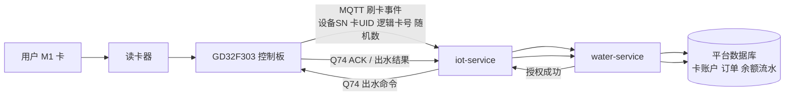
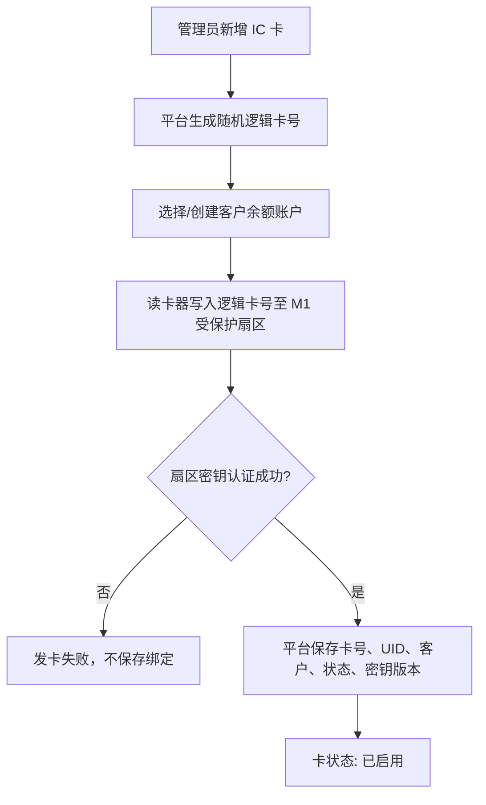
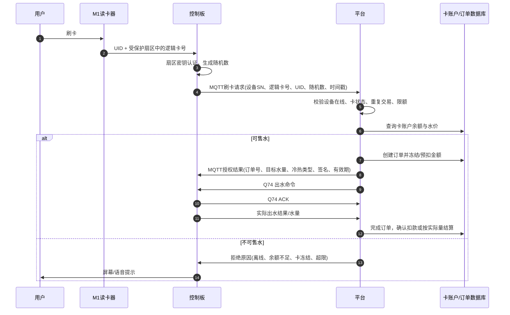
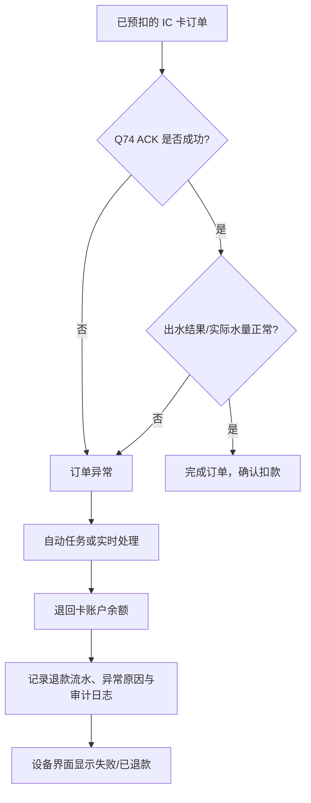
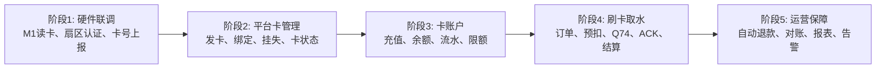

# IC 卡刷卡取水实现路径图

## 设计边界

- 卡类型：普通 `MIFARE Classic M1` 卡。
- 卡内不保存余额；余额、扣费、退款和订单均以平台数据库为准。
- 卡内受密钥保护扇区保存平台随机生成的逻辑卡号，不能仅使用 UID 作为账户身份。
- 设备、读卡器与平台联网后才允许扣费和出水。
- 出水控制复用当前 Q74 和 ACK 机制。

## 整体架构

## 发卡与绑定路径

## 用户刷卡取水主流程

## 异常与退款路径

## 分阶段实施路线

## 平台新增模块清单

| 模块 | 核心能力 |
| --- | --- |
| IC 卡管理 | 发卡、绑卡、挂失、冻结、注销、补卡、读卡记录 |
| 卡账户 | 余额、充值、冻结金额、扣款、退款、交易流水 |
| IC 卡订单 | 设备、卡号、冷热水、水量、金额、Q74 状态、出水状态、退款状态 |
| 风控规则 | 设备必须在线、单次/单日限额、短时间重复刷卡拦截、黑名单 |
| 财务报表 | 充值金额、售水金额、退款金额、卡余额、设备/日期维度统计 |
| 控制板协议 | 刷卡事件、授权响应、Q74、ACK、实际出水结果 |

## 控制板需准备的数据

| 上行刷卡事件字段 | 说明 |
| --- | --- |
| `deviceSn` | 当前控制板 SN，用于 MQTT 路由和设备映射 |
| `cardUid` | 卡物理 UID，仅用于辅助核验和风险识别 |
| `cardNo` | 受保护扇区读取的逻辑卡号，作为后台账户主查询键 |
| `nonce` | 单次随机数，防止报文重放 |
| `timestamp` | 设备产生事件的时间 |
| `readerStatus` | 认证成功、读卡失败、扇区异常等状态 |

## 正式上线前的最低安全要求

1. 不采用默认 M1 密钥，发卡时设置项目专用密钥并保密。
2. 不使用 UID 作为唯一账户身份；使用随机逻辑卡号。
3. 卡、账户、订单和余额流水的状态变更必须由平台事务处理。
4. 所有刷卡扣费必须经过在线平台校验；断网时默认拒绝售水。
5. 同一逻辑卡号短时间内的重复刷卡必须幂等，不能重复扣费或重复出水。
6. 先完成现有 Q66 心跳点位冲突和 messageID 幂等修复，再接入扣费出水链路。
