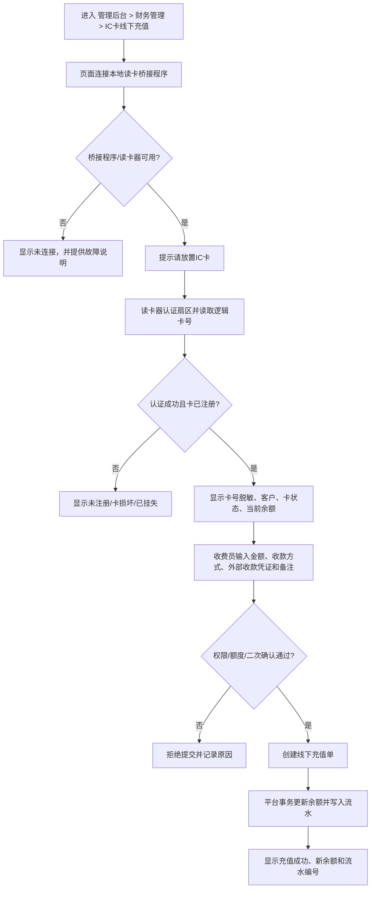
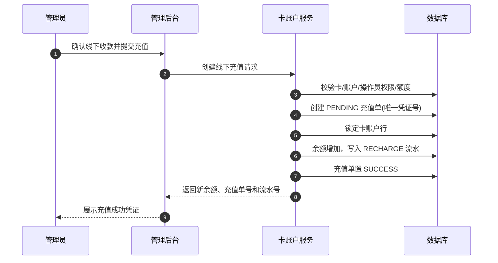

# IC 卡线下读卡充值设计

## 目标

收费员在管理后台打开“IC 卡线下充值”页面，将 M1 卡放到连接电脑的读卡器上。系统自动识别卡账户，收费员收取现金或确认线下转账后录入金额，平台立即为该卡账户加余额并生成可审计的充值流水。

卡内不保存余额，充值不需要写卡。读卡只用于定位正确的卡账户。

## 推荐的终端组成


### 为什么需要本地桥接程序

若正式方案在 M1 受保护扇区保存“逻辑卡号”，浏览器网页不能可靠地直接调用绝大多数 USB/串口读卡器 SDK，也不能安全保管扇区密钥。因此应在充值电脑安装一个轻量 Windows 读卡桥接程序：

1. 调用读卡器厂商 SDK 或串口协议。
2. 用配置的扇区密钥认证 M1 卡并读取逻辑卡号。
3. 仅把 `cardUid`、`cardNo`、读卡器编号和一次性随机数发给管理后台页面。
4. 不把扇区密钥发送给浏览器或云端 API。

桥接程序仅在本机 `127.0.0.1` 提供接口或 WebSocket 服务，管理后台通过本地连接接收读卡结果。

## 两种接入方式

| 方式 | 能读取内容 | 适用范围 | 结论 |
| --- | --- | --- | --- |
| USB 键盘模拟读卡器 | 通常仅 UID 或固定字符串 | 内部演示、仅以 UID 识别的旧系统 | 可快速试点，但不能读取受密钥保护扇区，不建议正式收费 |
| SDK/串口读卡器 + 本地桥接程序 | UID、M1 扇区逻辑卡号、认证结果 | 正式线下充值与发卡 | 推荐 |

采购时应明确要求：支持 `MIFARE Classic 1K`、支持读取指定扇区、提供 Windows x64 SDK 或明确串口命令文档、支持密钥认证、USB 供电、稳定的驱动支持。不能只确认“能读 UID”。

## 线下充值页面交互



## 页面字段建议

| 区域 | 字段 |
| --- | --- |
| 读卡状态 | 读卡器状态、读卡时间、卡 UID 脱敏、逻辑卡号脱敏、认证结果 |
| 卡账户信息 | 客户名称、卡状态、账户状态、当前可用余额、冻结金额、最近三笔流水 |
| 充值信息 | 充值金额、收款方式、收款凭证号、备注、是否赠送余额 |
| 审批信息 | 操作员、门店/地点、二次复核人、高金额审批状态 |
| 结果 | 充值单号、余额变动前后金额、流水号、打印/导出凭证 |

收款方式第一版可设为：`现金`、`线下转账`、`赠送`、`其他`。微信扫码付款应使用小程序线上充值流程，不应由人工“猜测付款成功”后直接录入。

## 后台接口设计

### 1. 查询卡账户

`POST /api/v1/ic-cards/read`

请求示例：

```json
{
  "cardNo": "C8A4F190D27E",
  "cardUid": "04A1B2C3D4",
  "readerId": "CASHIER-01",
  "readAt": "2026-08-19T10:30:00+08:00",
  "nonce": "9f7d..."
}
```

服务端按 `cardNo` 查询，`cardUid` 仅辅助核验和风险记录。返回卡状态、账户余额和允许充值的结果。

### 2. 创建线下充值

`POST /api/v1/card-recharges/offline`

请求示例：

```json
{
  "cardId": 10001,
  "amountFen": 5000,
  "paymentMethod": "CASH",
  "receiptNo": "CASH-20260819-0001",
  "remark": "现场现金充值",
  "readerId": "CASHIER-01",
  "readSessionId": "本次读卡会话ID"
}
```

服务端必须以登录后台账号作为充值操作人，不能相信浏览器传来的操作人字段。

## 余额更新事务



如果任何一步失败，整笔交易回滚，不能出现“余额已加但没有流水”或“流水存在但余额未加”。

## 防错与风控

1. 读卡会话有效期建议 60 秒。超过时效必须重新读卡，避免收费员给上一张卡误充值。
2. 充值前再次核验卡状态，挂失、冻结、注销卡不可充值。
3. `receiptNo` 在同一收款方式下必须唯一，防止重复点击或重复录单。
4. 设置单笔、单日、单操作员额度；超过额度要求二次复核。
5. 现金充值必须记录门店、操作员和备注；建议支持收据编号与附件凭证。
6. 所有余额变动不可物理删除，只能以反向调整流水冲正。
7. 读卡桥接程序的密钥配置文件需限制本机管理员访问权限，且不上传至平台代码仓库。

## 实施步骤


## 需要由采购/现场确认的信息

1. 读卡器品牌、型号、通讯方式，以及是否提供 Windows SDK/串口协议。
2. 是否能对 M1 卡指定扇区做 Key A/Key B 认证并读写。
3. 充值终端是固定 Windows 电脑还是 Android 终端。
4. 是否需要收据打印、现金箱、摄像头或线下转账凭证上传。
5. 每笔和每日允许的最高充值金额、是否需要管理员复核。
