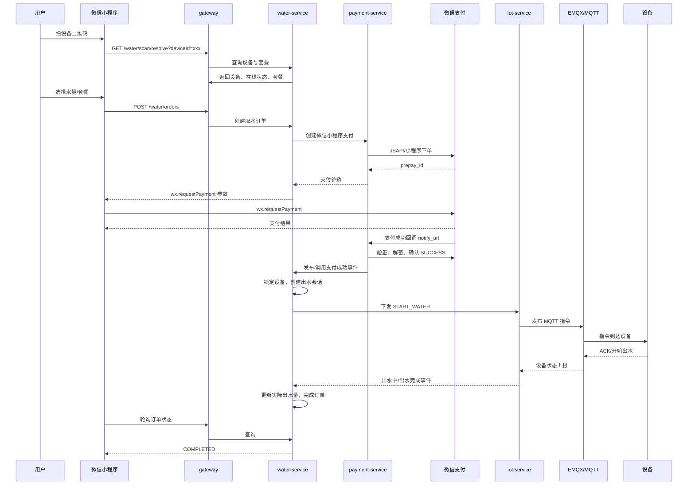
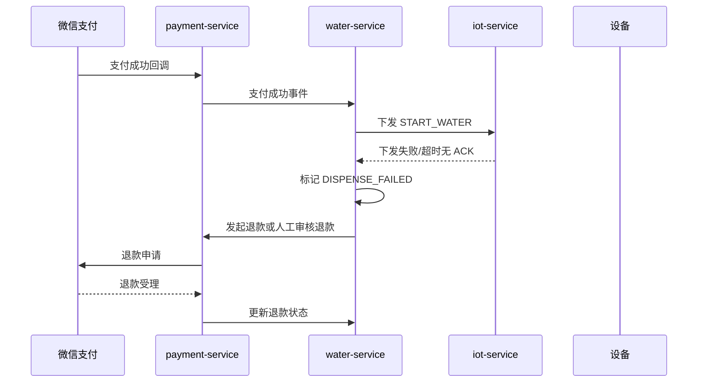

# 扫码取水功能设计文档

版本：v1.0  
日期：2026-07-24  
适用项目：直饮水平台  
目标功能：用户扫码设备二维码，完成微信支付后自动出水，并记录订单、支付、出水、异常与退款闭环。

---

## 1. 背景与目标

### 1.1 背景

当前平台已具备以下基础能力：

- 小程序微信登录与客户/运维身份体系。
- PC 端设备管理、设备详情、IoT 实时数据、历史曲线、远程配置下发。
- 设备通过 EMQX/MQTT 接入，平台通过 `iot-service` 下发指令。
- `order-service` 已有订单基础能力。
- `payment-service` 已有支付记录基础能力，但当前偏模拟支付/基础记录，尚未完整接入微信支付 API v3。
- `package-service` 已有套餐管理，套餐类型中已包含 `QR_SCAN`。
- 数据库已有 `order_info`、`payment_record`、`package`、`command_log` 等基础表。

扫码取水功能是在现有基础上新增一条完整的商业闭环：

用户扫码 -> 选择水量/套餐 -> 微信支付 -> 平台确认收款 -> 设备出水 -> 回传实际出水量 -> 订单完成/异常退款。

### 1.2 建设目标

1. 设备二维码长期固定，可贴在设备机身。
2. 用户扫码后进入小程序取水页面。
3. 用户可选择出水套餐，如 300ml、500ml、1000ml。
4. 平台调用微信支付小程序支付能力。
5. 支付成功以后，平台自动向设备下发出水指令。
6. 设备按目标水量出水，并上报开始、结束、实际流量。
7. 平台形成订单、支付、设备命令、出水记录、财务记录闭环。
8. 支持异常兜底：支付成功但出水失败、设备离线、超时未完成、实际出水不足。
9. PC 端可查看扫码取水订单、出水记录、退款记录、设备售水统计。

### 1.3 非目标范围

第一阶段不建议一次性做以下能力：

- 会员包月/包年无限取水。
- 复杂阶梯计费。
- 充值钱包余额扣费。
- 冷水/热水不同价格。
- 电子发票。
- 分账/服务商模式。
- 离线支付后补扣。

这些可作为第二阶段或第三阶段能力。

---

## 2. 关键结论

### 2.1 支付方式选择

推荐使用 **微信小程序支付/JSAPI 支付**，不推荐将设备二维码做成微信支付 Native 二维码。

原因：

- 设备二维码需要长期固定。
- 微信 Native 支付二维码是订单级动态二维码，适合 PC 网页或收银台展示，不适合长期贴在设备上。
- 小程序支付符合当前项目已有小程序入口，用户扫码后可展示设备状态、套餐、支付状态、出水状态。

### 2.2 二维码类型

推荐设备二维码内容为小程序路径：

```text
pages/water/scan-pay/index?deviceId={deviceId}
```

或通过服务端生成短链接/scene：

```text
scene=deviceId_or_short_code
```

小程序进入页面后，再通过后端接口解析设备信息。

### 2.3 出水控制方式

建议分两层设计：

1. 业务层使用语义命令：`START_WATER`、`STOP_WATER`、`QUERY_WATER_SESSION`。
2. 协议适配层再转换为具体硬件点位，例如 `Q83/Q84/Q89/Q90`。

这样以后硬件协议调整，不影响支付和订单业务。

---

## 3. 官方能力依据

本设计基于微信支付官方文档：

- JSAPI/小程序下单：`POST /v3/pay/transactions/jsapi`，返回 `prepay_id`，用于调起小程序支付。  
  文档：https://pay.wechatpay.cn/doc/v3/merchant/4012791897
- 小程序调起支付：小程序端使用 `wx.requestPayment`，其中 `package` 使用 `prepay_id=xxx` 格式。  
  文档：https://pay.wechatpay.cn/doc/v3/merchant/4012791898
- JSAPI/小程序支付开发指引：前端支付结果不能作为最终依据，商户后端应通过回调或查单确认支付状态；`prepay_id` 有效期为 2 小时。  
  文档：https://pay.wechatpay.cn/doc/v3/merchant/4012791870
- 支付成功回调通知：微信支付会向 `notify_url` 发送支付成功通知，商户需验签并解密通知内容。  
  文档：https://pay.wechatpay.cn/doc/v3/merchant/4012791902

---

## 4. 总体架构

### 4.1 参与端

```text
用户手机
  |
  | 扫设备二维码
  v
微信小程序
  |
  | HTTPS API
  v
gateway
  |
  +--> auth-service       登录、openid、JWT
  +--> device-service     设备状态、绑定、二维码
  +--> package-service    扫码取水套餐
  +--> water-service      扫码取水订单与出水会话，建议新增
  +--> order-service      平台订单
  +--> payment-service    微信支付 API v3、回调、查单、退款
  +--> iot-service        MQTT 出水指令下发、设备反馈处理
  |
  v
RabbitMQ
  |
  v
EMQX/MQTT
  |
  v
设备网关/控制板
```

### 4.2 是否新增 water-service

推荐新增 `water-service`，专门管理扫码取水业务。

原因：

- 取水不是普通订单，也不是普通支付；它还有设备状态、出水会话、实际流量、退款补偿。
- 放在 `order-service` 会让订单服务越来越重。
- 放在 `iot-service` 会让 IoT 服务承载支付业务，不利于边界清晰。

如果第一阶段为了省工作量，也可以先放在 `order-service` 中，后续再拆分。但最终形态建议独立服务。

推荐服务边界：

| 服务 | 职责 |
|---|---|
| mini-program | 扫码取水页面、选择套餐、调起支付、显示出水状态 |
| gateway | 统一 API 入口、鉴权、路由 |
| water-service | 取水订单、出水会话、状态机、异常补偿 |
| payment-service | 微信支付下单、回调验签解密、查单、退款 |
| iot-service | MQTT 指令下发、设备 ACK/状态上报处理 |
| package-service | 取水套餐配置 |
| device-service | 设备状态、设备二维码、设备可用性 |
| finance-service | 财务流水、收入统计、退款统计 |
| admin-web | 后台管理、报表、异常处理 |

---

## 5. 核心业务流程

### 5.1 正常取水流程



### 5.2 支付后出水失败流程



---

## 6. 领域模型

### 6.1 取水订单

取水订单表示一次扫码付费取水业务。

核心字段：

- 订单编号。
- 设备。
- 客户。
- 选择套餐。
- 目标出水量。
- 支付金额。
- 支付状态。
- 出水状态。
- 实际出水量。
- 退款状态。

### 6.2 出水会话

出水会话表示支付成功后，设备实际执行的一次出水过程。

一个取水订单通常对应一个出水会话。

出水会话关注：

- 是否成功下发指令。
- 设备是否 ACK。
- 设备何时开始。
- 设备何时停止。
- 实际流量。
- 是否超时。
- 是否异常停止。

### 6.3 支付记录

支付记录建议继续使用现有 `payment_record`，但需要扩展微信支付字段。

### 6.4 设备命令

设备命令建议继续使用 `command_log`，但需要补充和扫码取水订单的关联。

---

## 7. 状态机设计

### 7.1 取水订单状态

```text
CREATED
  -> PAYING
  -> PAID
  -> COMMAND_PENDING
  -> COMMAND_SENT
  -> DISPENSING
  -> COMPLETED

异常分支：
CREATED/PAYING -> CANCELLED
PAID/COMMAND_PENDING/COMMAND_SENT/DISPENSING -> FAILED
FAILED -> REFUNDING -> REFUNDED
FAILED -> MANUAL_HANDLED
```

建议枚举：

| 状态 | 含义 |
|---|---|
| CREATED | 已创建订单，未发起支付 |
| PAYING | 已请求微信预支付，等待用户支付 |
| PAID | 微信支付成功，平台已确认 |
| COMMAND_PENDING | 等待下发出水指令 |
| COMMAND_SENT | 出水指令已发送 |
| DISPENSING | 设备已开始出水 |
| COMPLETED | 出水完成 |
| CANCELLED | 用户未支付或订单关闭 |
| FAILED | 出水失败或异常 |
| REFUNDING | 退款处理中 |
| REFUNDED | 已退款 |
| MANUAL_HANDLED | 人工处理完成 |

### 7.2 支付状态

```text
UNPAID
PAYING
SUCCESS
FAILED
CLOSED
REFUNDING
REFUNDED
```

### 7.3 出水会话状态

```text
INIT
LOCKED
COMMAND_SENT
ACKED
DISPENSING
STOP_SENT
COMPLETED
TIMEOUT
FAILED
```

### 7.4 状态流转规则

1. 只有 `PAID` 状态的订单才能下发出水指令。
2. 同一设备同一时间只能存在一个 `LOCKED/COMMAND_SENT/ACKED/DISPENSING` 会话。
3. 支付成功回调必须幂等处理，重复回调不得重复下发出水。
4. 设备 ACK 超时应进入异常处理。
5. 实际出水量达到目标值或设备上报完成后，订单进入 `COMPLETED`。
6. 实际出水量明显不足时，可按策略自动退款或转人工审核。

---

## 8. 数据库设计

### 8.1 新增表：water_dispense_order

```sql
CREATE TABLE IF NOT EXISTS water_dispense_order (
    id                  BIGINT       NOT NULL AUTO_INCREMENT COMMENT '主键',
    order_no            VARCHAR(32)  NOT NULL COMMENT '取水订单号',
    customer_id         BIGINT       NOT NULL COMMENT '客户ID',
    customer_open_id    VARCHAR(128)          COMMENT '小程序openid',
    device_id           VARCHAR(32)  NOT NULL COMMENT '设备ID',
    device_sn           VARCHAR(64)  NOT NULL COMMENT '设备SN/MQTT ClientID',
    dealer_id           BIGINT                COMMENT '经销商ID',
    package_id          BIGINT                COMMENT '套餐ID',
    package_name        VARCHAR(128)          COMMENT '套餐名称快照',
    target_ml           INT         NOT NULL COMMENT '目标出水量，单位ml',
    actual_ml           INT         NOT NULL DEFAULT 0 COMMENT '实际出水量，单位ml',
    price_amount        BIGINT      NOT NULL COMMENT '标价金额，单位分',
    pay_amount          BIGINT      NOT NULL COMMENT '实付金额，单位分',
    order_status        VARCHAR(32) NOT NULL DEFAULT 'CREATED' COMMENT '取水订单状态',
    payment_status      VARCHAR(32) NOT NULL DEFAULT 'UNPAID' COMMENT '支付状态',
    refund_status       VARCHAR(32)          COMMENT '退款状态',
    pay_method          VARCHAR(32)          COMMENT '支付方式',
    wechat_transaction_id VARCHAR(64)        COMMENT '微信支付订单号',
    prepay_id           VARCHAR(128)         COMMENT '微信预支付ID',
    command_message_id  VARCHAR(64)          COMMENT '出水指令messageID',
    failure_reason      VARCHAR(512)         COMMENT '失败原因',
    paid_at             DATETIME(3)          COMMENT '支付成功时间',
    command_sent_at     DATETIME(3)          COMMENT '指令下发时间',
    dispense_started_at DATETIME(3)          COMMENT '开始出水时间',
    dispense_finished_at DATETIME(3)         COMMENT '出水完成时间',
    expire_at           DATETIME(3)          COMMENT '订单支付过期时间',
    created_at          DATETIME(3) NOT NULL DEFAULT CURRENT_TIMESTAMP(3),
    updated_at          DATETIME(3) NOT NULL DEFAULT CURRENT_TIMESTAMP(3) ON UPDATE CURRENT_TIMESTAMP(3),
    deleted             TINYINT(1)  NOT NULL DEFAULT 0 COMMENT '逻辑删除',
    PRIMARY KEY (id),
    UNIQUE KEY uk_order_no (order_no),
    KEY idx_customer_id (customer_id),
    KEY idx_device_sn (device_sn),
    KEY idx_order_status (order_status),
    KEY idx_payment_status (payment_status),
    KEY idx_created_at (created_at)
) ENGINE=InnoDB DEFAULT CHARSET=utf8mb4 COMMENT='扫码取水订单表';
```

### 8.2 新增表：water_dispense_session

```sql
CREATE TABLE IF NOT EXISTS water_dispense_session (
    id                  BIGINT       NOT NULL AUTO_INCREMENT COMMENT '主键',
    session_no          VARCHAR(40)  NOT NULL COMMENT '出水会话号',
    order_no            VARCHAR(32)  NOT NULL COMMENT '取水订单号',
    device_id           VARCHAR(32)  NOT NULL COMMENT '设备ID',
    device_sn           VARCHAR(64)  NOT NULL COMMENT '设备SN',
    target_ml           INT         NOT NULL COMMENT '目标出水量ml',
    actual_ml           INT         NOT NULL DEFAULT 0 COMMENT '实际出水量ml',
    status              VARCHAR(32) NOT NULL DEFAULT 'INIT' COMMENT '会话状态',
    mqtt_topic          VARCHAR(128)          COMMENT 'MQTT主题',
    command_payload     TEXT                  COMMENT '下发内容',
    ack_payload         TEXT                  COMMENT 'ACK内容',
    start_payload       TEXT                  COMMENT '开始出水上报',
    finish_payload      TEXT                  COMMENT '完成上报',
    timeout_sec         INT         NOT NULL DEFAULT 120 COMMENT '超时时间秒',
    locked_at           DATETIME(3)           COMMENT '设备锁定时间',
    command_sent_at     DATETIME(3)           COMMENT '指令发送时间',
    ack_at              DATETIME(3)           COMMENT 'ACK时间',
    started_at          DATETIME(3)           COMMENT '开始时间',
    finished_at         DATETIME(3)           COMMENT '结束时间',
    failure_reason      VARCHAR(512)          COMMENT '失败原因',
    created_at          DATETIME(3) NOT NULL DEFAULT CURRENT_TIMESTAMP(3),
    updated_at          DATETIME(3) NOT NULL DEFAULT CURRENT_TIMESTAMP(3) ON UPDATE CURRENT_TIMESTAMP(3),
    PRIMARY KEY (id),
    UNIQUE KEY uk_session_no (session_no),
    UNIQUE KEY uk_order_no (order_no),
    KEY idx_device_sn_status (device_sn, status),
    KEY idx_created_at (created_at)
) ENGINE=InnoDB DEFAULT CHARSET=utf8mb4 COMMENT='扫码取水出水会话表';
```

### 8.3 新增表：water_dispense_event

用于审计状态变化和设备上报。

```sql
CREATE TABLE IF NOT EXISTS water_dispense_event (
    id             BIGINT       NOT NULL AUTO_INCREMENT,
    order_no       VARCHAR(32)  NOT NULL,
    session_no     VARCHAR(40),
    device_sn      VARCHAR(64),
    event_type     VARCHAR(32)  NOT NULL COMMENT 'PAY_SUCCESS/COMMAND_SENT/ACK/START/FINISH/TIMEOUT/FAIL/REFUND',
    event_payload  TEXT,
    created_at     DATETIME(3)  NOT NULL DEFAULT CURRENT_TIMESTAMP(3),
    PRIMARY KEY (id),
    KEY idx_order_no (order_no),
    KEY idx_session_no (session_no),
    KEY idx_device_sn (device_sn),
    KEY idx_event_type (event_type)
) ENGINE=InnoDB DEFAULT CHARSET=utf8mb4 COMMENT='扫码取水事件日志表';
```

### 8.4 扩展 payment_record

现有 `payment_record` 建议补充：

```sql
ALTER TABLE payment_record
    ADD COLUMN appid VARCHAR(32) NULL COMMENT '微信appid',
    ADD COLUMN mchid VARCHAR(32) NULL COMMENT '微信商户号',
    ADD COLUMN out_trade_no VARCHAR(32) NULL COMMENT '商户订单号',
    ADD COLUMN trade_type VARCHAR(16) NULL COMMENT '交易类型',
    ADD COLUMN trade_state VARCHAR(32) NULL COMMENT '微信交易状态',
    ADD COLUMN payer_openid VARCHAR(128) NULL COMMENT '支付用户openid',
    ADD COLUMN callback_raw TEXT NULL COMMENT '回调原始报文',
    ADD COLUMN callback_decrypted TEXT NULL COMMENT '回调解密报文';
```

如果不想动现有表，也可以新增 `wechat_payment_record`。

### 8.5 扩展 command_log

建议补充业务关联字段：

```sql
ALTER TABLE command_log
    ADD COLUMN biz_type VARCHAR(32) NULL COMMENT '业务类型，如 WATER_DISPENSE',
    ADD COLUMN biz_no VARCHAR(64) NULL COMMENT '业务编号，如取水订单号',
    ADD COLUMN ack_status VARCHAR(32) NULL COMMENT 'ACK状态',
    ADD COLUMN ack_at DATETIME(3) NULL COMMENT 'ACK时间';
```

---

## 9. Redis 设计

### 9.1 设备出水锁

```text
key: water:lock:device:{deviceSn}
value: orderNo
ttl: 180s
```

作用：

- 防止同一设备同时处理多个取水订单。
- 防止微信重复回调导致重复出水。
- 防止用户重复点击支付或重复扫码。

释放条件：

- 出水完成。
- 出水失败。
- 超时任务兜底释放。

### 9.2 支付回调幂等锁

```text
key: water:pay-notify:{outTradeNo}
value: processing
ttl: 60s
```

作用：

- 避免微信重复回调并发处理。

### 9.3 小程序轮询状态缓存

```text
key: water:order:status:{orderNo}
ttl: 10m
```

可选，用于降低数据库查询压力。

---

## 10. API 设计

### 10.1 小程序扫码解析

```http
GET /api/v1/water/scan/resolve?deviceId={deviceId}
Authorization: Bearer {token}
```

返回：

```json
{
  "code": 200,
  "data": {
    "deviceId": "dcv-001",
    "sn": "j082438",
    "deviceName": "智饮RO-200",
    "online": true,
    "saleEnabled": true,
    "disableReason": null,
    "packages": [
      {
        "packageId": 101,
        "packageName": "取水300ml",
        "targetMl": 300,
        "priceAmount": 1
      }
    ]
  }
}
```

校验：

- 用户已登录。
- 设备存在。
- 设备已激活。
- 设备在线。
- 设备无故障/漏水/缺水/低压等阻断状态。
- 设备允许扫码售水。
- 存在可售扫码取水套餐。

### 10.2 创建取水订单并获取支付参数

```http
POST /api/v1/water/orders
Authorization: Bearer {token}
Content-Type: application/json
```

请求：

```json
{
  "deviceId": "dcv-001",
  "packageId": 101
}
```

返回：

```json
{
  "code": 200,
  "data": {
    "orderNo": "WT202607240001",
    "payAmount": 1,
    "targetMl": 300,
    "paymentParams": {
      "timeStamp": "1784890000",
      "nonceStr": "random_string",
      "package": "prepay_id=wx_xxx",
      "signType": "RSA",
      "paySign": "signature"
    }
  }
}
```

说明：

- 该接口内部可直接调用 `payment-service` 创建微信预支付。
- 第一版也可以拆成两个接口：先创建订单，再请求支付参数。

### 10.3 查询取水订单状态

```http
GET /api/v1/water/orders/{orderNo}
Authorization: Bearer {token}
```

返回：

```json
{
  "code": 200,
  "data": {
    "orderNo": "WT202607240001",
    "orderStatus": "DISPENSING",
    "paymentStatus": "SUCCESS",
    "targetMl": 300,
    "actualMl": 120,
    "deviceSn": "j082438",
    "message": "正在出水"
  }
}
```

### 10.4 用户主动停止出水

可选。

```http
POST /api/v1/water/orders/{orderNo}/stop
Authorization: Bearer {token}
```

注意：

- 如果按固定套餐收费，用户主动停止不一定退款。
- 如果按实际出水量计费，停止后需要按实际流量结算，多余金额退款或退余额。

第一阶段建议不做主动停止，设备端按目标水量自动停。

### 10.5 微信支付回调

```http
POST /api/v1/payments/wechat/notify
```

要求：

- 该接口不能要求 JWT。
- 必须验签。
- 必须使用 APIv3 密钥解密 `resource.ciphertext`。
- 必须幂等。
- 返回微信支付要求的成功应答。

### 10.6 内部出水指令接口

```http
POST /api/v1/iot/internal/water/start
X-Internal-Token: xxx
Content-Type: application/json
```

请求：

```json
{
  "orderNo": "WT202607240001",
  "sessionNo": "WS202607240001",
  "deviceSn": "j082438",
  "targetMl": 300,
  "timeoutSec": 120
}
```

返回：

```json
{
  "code": 200,
  "data": {
    "messageId": "uuid",
    "mqttTopic": "api/v2/set/j082438"
  }
}
```

---

## 11. 微信支付设计

### 11.1 必备配置

`.env` 建议新增：

```env
WX_PAY_ENABLED=true
WX_PAY_APPID=小程序AppID
WX_PAY_MCH_ID=商户号
WX_PAY_API_V3_KEY=APIv3密钥
WX_PAY_MCH_SERIAL_NO=商户证书序列号
WX_PAY_PRIVATE_KEY_PATH=/run/secrets/wxpay_apiclient_key.pem
WX_PAY_NOTIFY_URL=https://zyswx.juconyun.com/api/v1/payments/wechat/notify
WX_PAY_REFUND_NOTIFY_URL=https://zyswx.juconyun.com/api/v1/payments/wechat/refund-notify
```

注意：

- 私钥不要提交到 Git。
- APIv3 密钥不要写入源码。
- 回调地址必须公网 HTTPS 可访问。
- 微信支付回调可能被防火墙拦截，需要确认公网 443 和反向代理配置。

### 11.2 小程序下单参数

调用微信支付：

```http
POST https://api.mch.weixin.qq.com/v3/pay/transactions/jsapi
```

核心请求体：

```json
{
  "appid": "wx_xxx",
  "mchid": "1900000000",
  "description": "扫码取水-300ml",
  "out_trade_no": "WT202607240001",
  "time_expire": "2026-07-24T10:05:00+08:00",
  "notify_url": "https://zyswx.juconyun.com/api/v1/payments/wechat/notify",
  "amount": {
    "total": 1,
    "currency": "CNY"
  },
  "payer": {
    "openid": "用户小程序openid"
  },
  "attach": "WATER_DISPENSE"
}
```

微信返回：

```json
{
  "prepay_id": "wx201410272009395522657a690389285100"
}
```

后端再生成小程序调起支付参数：

```json
{
  "timeStamp": "1784890000",
  "nonceStr": "random_string",
  "package": "prepay_id=wx201410272009395522657a690389285100",
  "signType": "RSA",
  "paySign": "签名"
}
```

### 11.3 支付结果确认

小程序 `wx.requestPayment` 成功回调只代表用户端支付流程完成，不作为最终出水依据。

平台必须使用以下任一方式确认：

1. 微信支付成功回调。
2. 主动查单接口。

推荐策略：

- 支付回调作为主路径。
- 小程序支付成功后立即请求后端查单，作为加速体验。
- 如果 5 秒内回调未到，后端主动查单。

### 11.4 回调处理步骤

1. 接收微信支付回调 JSON。
2. 校验微信支付签名。
3. 使用 APIv3 密钥解密 `resource.ciphertext`。
4. 读取 `out_trade_no`、`transaction_id`、`trade_state`、`payer.openid`。
5. 校验订单存在。
6. 校验金额一致。
7. 校验 AppID/MchID 一致。
8. 幂等更新支付状态。
9. 发布 `water.payment.success` 事件。
10. 返回成功应答。

---

## 12. MQTT 与硬件协议设计

### 12.1 推荐主题

沿用当前平台约定 `api/v2/` 前缀。

平台下发：

```text
api/v2/set/{sn}
```

设备上报：

```text
api/v2/data/{sn}
```

如果硬件支持新增语义主题，建议：

```text
api/v2/water/start/{sn}
api/v2/water/stop/{sn}
api/v2/water/ack/{sn}
api/v2/water/status/{sn}
```

但当前项目已有 `sendSetCommand(sn, pointID, value)`，第一版可以继续复用 `api/v2/set/{sn}`。

### 12.2 语义命令格式

推荐平台内部统一使用：

```json
{
  "messageID": "uuid",
  "orderNo": "WT202607240001",
  "sessionNo": "WS202607240001",
  "command": "START_WATER",
  "targetMl": 300,
  "timeoutSec": 120,
  "timestamp": "2026-07-24T10:00:00+08:00"
}
```

停止命令：

```json
{
  "messageID": "uuid",
  "orderNo": "WT202607240001",
  "sessionNo": "WS202607240001",
  "command": "STOP_WATER",
  "reason": "TIMEOUT"
}
```

### 12.3 如果必须使用 Q 点位

需要硬件明确点位含义。建议预留：

| 点位 | 建议含义 | 类型 |
|---|---|---|
| Q83 | 出水命令：0停止，1启动 | uint16 |
| Q84 | 目标出水量，单位 ml | uint32 |
| Q89 | 取水会话号/订单校验低位 | uint32/string |
| Q90 | 命令序号/校验/备用 | uint32/string |

注意：以上只是建议，必须以硬件网关文档为准。

如果当前设备只支持单点位一次下发，则流程应为：

1. 下发 Q84 = 目标 ml。
2. 下发 Q89/Q90 = 会话校验值，可选。
3. 下发 Q83 = 1，启动。
4. 设备执行完成后上报 P/Q 状态。
5. 平台必要时下发 Q83 = 0 停止。

### 12.4 设备上报要求

设备需要至少支持：

```json
{
  "orderNo": "WT202607240001",
  "sessionNo": "WS202607240001",
  "waterStatus": "DISPENSING",
  "targetMl": 300,
  "actualMl": 120,
  "errorCode": 0
}
```

完成：

```json
{
  "orderNo": "WT202607240001",
  "sessionNo": "WS202607240001",
  "waterStatus": "COMPLETED",
  "targetMl": 300,
  "actualMl": 298,
  "errorCode": 0
}
```

失败：

```json
{
  "orderNo": "WT202607240001",
  "sessionNo": "WS202607240001",
  "waterStatus": "FAILED",
  "actualMl": 0,
  "errorCode": 1001,
  "errorMessage": "低压缺水"
}
```

---

## 13. 套餐与计费设计

### 13.1 第一阶段套餐

建议先做固定水量套餐：

| 套餐 | 水量 | 金额 |
|---|---:|---:|
| 测试取水 | 300ml | 0.01 元 |
| 标准取水 | 500ml | 0.50 元 |
| 大杯取水 | 1000ml | 1.00 元 |

数据库可复用 `package` 表：

- `package_type = QR_SCAN`
- `price = 金额分`
- `flow_quota = 水量ml 或 L*1000`
- `status = ENABLED`

### 13.2 第二阶段计费

可扩展：

- 按实际出水量计费。
- 钱包余额扣费。
- 月卡/年卡。
- 冷水/热水不同费率。
- 经销商自定义费率。
- 特定客户免费额度。

---

## 14. 异常处理设计

### 14.1 异常场景

| 场景 | 处理策略 |
|---|---|
| 用户取消支付 | 订单关闭，不下发出水 |
| 支付成功回调重复 | 幂等处理，不重复出水 |
| 设备离线 | 支付前阻断；支付后发现离线则退款 |
| 指令下发失败 | 标记失败，自动退款或人工审核 |
| 设备无 ACK | 超时失败，自动退款或人工审核 |
| 出水中断 | 根据实际出水量判断退款 |
| 实际出水量为 0 | 全额退款 |
| 实际出水量不足 | 按策略部分退款或人工审核 |
| 设备漏水/低压/故障 | 禁止售水或中止出水 |
| 用户重复扫码 | 若已有进行中订单，提示等待或继续查看 |
| 同一设备多人同时支付 | Redis 锁，只允许一个订单进入出水 |

### 14.2 退款策略

第一阶段建议：

| 条件 | 策略 |
|---|---|
| 支付成功但未下发指令 | 自动全额退款 |
| 指令已发但设备无 ACK | 自动全额退款 |
| 实际出水量 = 0 | 自动全额退款 |
| 实际出水量 < 目标 80% | 转人工审核或按比例退款 |
| 实际出水量 >= 目标 80% | 订单完成，记录偏差 |

第二阶段可支持按实际出水量自动部分退款。

---

## 15. 后台管理设计

### 15.1 PC 菜单

建议新增：

```text
订单管理
  - 扫码取水订单

设备管理
  - 设备售水统计

财务管理
  - 取水支付记录
  - 取水退款记录
```

### 15.2 扫码取水订单列表

搜索条件：

- 订单号
- 设备ID/SN
- 客户手机号
- 支付状态
- 出水状态
- 创建时间
- 经销商

列表字段：

- 订单号
- 设备ID/SN
- 客户
- 套餐
- 目标水量
- 实际水量
- 金额
- 支付状态
- 出水状态
- 支付时间
- 完成时间
- 操作：详情、退款、重试下发、查看设备日志

### 15.3 订单详情

详情页展示：

- 基本信息。
- 支付信息。
- MQTT 指令信息。
- 设备 ACK。
- 出水事件时间线。
- 退款信息。
- 原始报文。

---

## 16. 小程序页面设计

### 16.1 页面列表

```text
pages/water/scan-pay/index
pages/water/order-detail/index
pages/water/result/index
```

### 16.2 扫码取水页

页面内容：

- 设备名称。
- 在线状态。
- 水质状态。
- 可选套餐。
- 支付按钮。
- 异常提示。

按钮状态：

- 设备离线：不可支付。
- 设备故障：不可支付。
- 设备忙：不可支付，提示当前有人取水。
- 可用：允许支付。

### 16.3 支付后状态页

显示：

- 支付成功。
- 正在下发指令。
- 正在出水。
- 已完成。
- 出水失败，退款处理中。

建议小程序每 2 秒轮询一次订单状态，最长轮询 2 分钟。

---

## 17. 安全设计

1. 所有小程序接口必须 JWT 鉴权。
2. 微信支付回调接口不鉴权，但必须验签。
3. 内部服务调用使用 `X-Internal-Token`。
4. 出水命令必须校验订单已支付。
5. 出水命令必须校验设备锁。
6. 同一订单只能下发一次 START 命令。
7. MQTT payload 带 `messageID/orderNo/sessionNo`。
8. 设备端应拒绝过期命令。
9. 设备端应拒绝重复 `messageID`。
10. 支付金额以后端套餐价格为准，小程序传入价格不可信。
11. 微信回调金额必须与平台订单金额一致。
12. 商户私钥、APIv3 密钥不得进入 Git。

---

## 18. 定时任务设计

### 18.1 关闭未支付订单

每 1 分钟扫描：

```text
order_status in (CREATED, PAYING)
expire_at < now
```

处理：

- 调微信关单，可选。
- 更新订单为 `CANCELLED`。

### 18.2 出水超时处理

每 10 秒扫描：

```text
session status in (COMMAND_SENT, ACKED, DISPENSING)
started_at/command_sent_at 超过 timeout_sec
```

处理：

- 下发 STOP。
- 标记失败。
- 触发退款策略。

### 18.3 支付成功但未出水补偿

每 1 分钟扫描：

```text
payment_status = SUCCESS
order_status in (PAID, COMMAND_PENDING)
超过 2 分钟
```

处理：

- 尝试补发一次。
- 仍失败则退款或人工审核。

---

## 19. 消息队列设计

建议新增 RabbitMQ 事件：

| Exchange | Routing Key | 消费方 |
|---|---|---|
| water.event | water.payment.success | water-service |
| water.event | water.command.requested | iot-service |
| water.event | water.command.sent | water-service |
| water.event | water.device.acked | water-service |
| water.event | water.dispense.started | water-service |
| water.event | water.dispense.completed | water-service |
| water.event | water.dispense.failed | water-service/payment-service |
| water.event | water.refund.requested | payment-service |

第一阶段可以减少队列，先用同步接口：

- payment-service 回调后调用 water-service。
- water-service 调 iot-service。

但长期建议事件化，避免支付回调被 IoT 慢操作阻塞。

---

## 20. 监控与告警

### 20.1 指标

- 扫码访问次数。
- 创建订单数。
- 支付成功数。
- 出水成功数。
- 出水失败数。
- 自动退款数。
- 平均支付耗时。
- 平均出水耗时。
- 设备繁忙率。
- 指令 ACK 超时率。

### 20.2 告警

以下情况应告警：

- 支付成功但出水失败连续升高。
- 某设备 ACK 超时率高。
- 微信支付回调连续失败。
- 退款失败。
- 设备上报实际出水量异常。

---

## 21. 实施路径

### 阶段 0：硬件协议确认

必须确认：

1. 是否支持目标水量出水。
2. 是否支持开始/停止命令。
3. 是否支持回传 ACK。
4. 是否支持回传实际出水量。
5. `Q83/Q84/Q89/Q90` 的真实含义。
6. 设备断网、断电、低压、漏水时的处理逻辑。

输出：

- 《扫码取水硬件点位确认表》
- MQTT 示例报文
- 联调测试固件版本

### 阶段 1：微信支付真实接入

改造 `payment-service`：

- 增加微信支付配置。
- 增加 JSAPI/小程序下单。
- 增加小程序支付参数签名。
- 增加支付回调验签解密。
- 增加查单。
- 增加退款。

验收：

- 0.01 元测试订单可支付。
- 支付回调可收到。
- 回调金额校验通过。
- 重复回调不重复处理。

### 阶段 2：取水订单与小程序页面

新增：

- `water_dispense_order`
- `water_dispense_session`
- 扫码取水页面
- 取水订单接口

验收：

- 扫码进入设备取水页。
- 可选择套餐。
- 可调起微信支付。
- 支付成功后订单状态变为 `PAID`。

### 阶段 3：支付成功后下发出水

新增：

- 设备锁。
- 出水会话。
- MQTT START 命令。
- command_log 关联。

验收：

- 支付成功自动下发。
- 设备收到命令。
- 平台记录 messageID。

### 阶段 4：设备反馈与订单完成

新增：

- ACK 解析。
- 出水中状态解析。
- 完成状态解析。
- 实际出水量记录。

验收：

- 小程序能看到正在出水。
- 出水完成后订单完成。
- PC 能看到实际出水量。

### 阶段 5：异常与退款

新增：

- 超时任务。
- 自动退款。
- 人工审核退款。
- 失败原因记录。

验收：

- 模拟设备离线，支付前禁止。
- 模拟支付后设备无响应，订单失败并退款。
- 模拟重复回调，不重复出水。

### 阶段 6：PC 管理与报表

新增：

- 扫码取水订单列表。
- 订单详情。
- 设备售水统计。
- 退款审核。

---

## 22. 测试方案

### 22.1 单元测试

- 订单状态机。
- 支付回调幂等。
- 金额校验。
- 设备锁。
- 退款策略。

### 22.2 集成测试

- 创建订单 -> 微信预支付。
- 支付回调 -> 订单 PAID。
- PAID -> MQTT 命令下发。
- 设备 ACK -> DISPENSING。
- 设备完成 -> COMPLETED。

### 22.3 异常测试

| 测试项 | 预期 |
|---|---|
| 用户取消支付 | 订单保持 PAYING，过期后 CANCELLED |
| 微信重复回调 | 只处理一次 |
| 金额不一致 | 拒绝处理并告警 |
| 设备离线 | 不允许下单或自动退款 |
| MQTT 下发失败 | 订单 FAILED |
| 设备无 ACK | 超时退款 |
| 实际出水 0ml | 全额退款 |
| 同设备并发两单 | 第二单提示设备忙 |

### 22.4 现场联调

1. 使用测试商户号或 0.01 元真实支付。
2. 设备连接公网 MQTT。
3. 小程序体验版扫码。
4. 支付成功后观察设备是否出水。
5. 对比平台记录、微信支付后台、设备流量。

---

## 23. 上线准备清单

### 23.1 微信支付

- [ ] 已开通微信支付商户号。
- [ ] 小程序 AppID 已绑定商户号。
- [ ] 已配置 APIv3 密钥。
- [ ] 已下载商户 API 证书/私钥。
- [ ] 已配置支付回调 HTTPS 地址。
- [ ] 已验证回调地址公网可达。
- [ ] 已配置服务器防火墙。
- [ ] 已完成 0.01 元支付测试。

### 23.2 小程序

- [ ] 小程序服务器域名已配置 `https://zyswx.juconyun.com`。
- [ ] 小程序码/设备码路径已确定。
- [ ] 体验版可扫码进入取水页。
- [ ] 正式版上线前完成审核。

### 23.3 设备

- [ ] 设备支持目标水量出水。
- [ ] 设备支持开始/停止命令。
- [ ] 设备支持 ACK。
- [ ] 设备支持实际上报流量。
- [ ] 设备异常状态可上报。
- [ ] 设备二维码已贴机测试。

### 23.4 平台

- [ ] `water-service` 或对应模块已部署。
- [ ] `payment-service` 已接入真实微信支付。
- [ ] `iot-service` 已支持出水命令。
- [ ] Redis 设备锁已启用。
- [ ] RabbitMQ 事件已配置。
- [ ] PC 后台可查订单和退款。
- [ ] 日志和告警可用。

---

## 24. 风险与建议

### 24.1 最大风险

最大风险不是支付，而是 **支付成功以后设备是否能可靠、可确认、可停止地出水**。

必须优先确认硬件协议：

- 指令是否可靠到达。
- 是否有 ACK。
- 是否能回传实际出水量。
- 是否能防重复执行。
- 是否能超时停止。

### 24.2 第一版建议

第一版只做最小闭环：

```text
固定设备码
固定套餐
微信小程序支付
支付成功下发 START
设备目标水量自动停
设备回传完成
失败全额退款
```

不要第一版就做复杂余额、会员、部分退款、分账。

### 24.3 推荐排期

| 阶段 | 工作量 |
|---|---|
| 硬件协议确认 | 1-2 天 |
| 微信支付接入 | 2-4 天 |
| 取水订单与小程序页面 | 3-5 天 |
| MQTT 出水联调 | 3-7 天 |
| 异常退款与后台 | 3-5 天 |
| 现场测试与修正 | 3-7 天 |

整体预计：2-4 周，取决于硬件协议配合程度。

---

## 25. 后续待确认问题

1. `Q83/Q84/Q89/Q90` 的真实含义是什么？
2. 设备是否按 ml 控制出水，还是按秒控制出水？
3. 设备是否能回传实际出水量？
4. 设备是否支持订单号/会话号回传？
5. 出水完成由设备判断还是平台按流量判断？
6. 支付成功但只出了一部分水，是否自动退款？
7. 每台设备是否允许多个用户排队？
8. 经销商是否需要独立设置价格？
9. 是否需要余额钱包？
10. 是否需要发票、分账、对账单导出？

---

## 26. 结论

扫码取水功能完全可以基于当前平台实现。推荐架构是：

```text
设备固定码 -> 小程序取水页 -> 微信小程序支付 -> 后端回调确认 -> water-service 建立出水会话 -> iot-service MQTT 下发 -> 设备出水 -> 回传实际流量 -> 平台完成订单
```

第一阶段的核心是打通支付和设备出水闭环，第二阶段再完善退款、报表、钱包和会员套餐。
