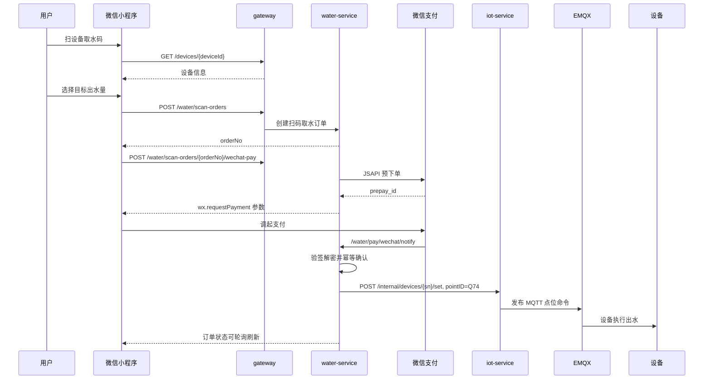

# 直饮水平台新版设计文档

> 文档版本：V4.0  
> 编制日期：2026-07-28  
> 编制依据：当前后端微服务、Vue 管理后台、微信小程序、数据库脚本和既有专项设计  
> 适用范围：产品设计、后端开发、前端开发、小程序开发、测试、部署运维

---

## 1. 文档定位

本文档是基于当前代码仓库重新整理的现状版设计文档，重点描述已经落地或已经进入代码结构的系统能力，并把后续需要完善的边界单独列出。

与旧版文档相比，本版重点变化如下：

1. 后端模块从阶段规划更新为当前实际微服务清单。
2. 管理后台从待开发更新为现有菜单、页面与功能边界。
3. 微信小程序从规划更新为当前页面结构、登录体系、设备绑定、工单、滤芯和扫码取水能力。
4. 扫码取水从专项设计更新为当前 `water-service`、小程序 `water-scan` 页面和后台扫码订单页面的已实现闭环。
5. 数据库从初始 33 张表扩展到当前补充脚本中的扫码取水表、微信支付字段和审计字段。

---

## 2. 系统概览

直饮水平台是面向直饮水设备运营、客户服务、经销商协作、滤芯维护、工单处理和扫码取水交易的物联网业务平台。系统由三类入口组成：

| 入口 | 面向对象 | 主要能力 |
|---|---|---|
| Vue 管理后台 | 平台管理员、运营、财务、客服 | 设备、客户、经销商、工单、订单、财务、库存、报表、监控、系统配置 |
| 微信小程序 | 客户、运维人员、游客申请用户 | 登录、设备绑定、设备查看、滤芯查看、工单创建与处理、扫码取水、身份申请 |
| 设备 MQTT 接入 | 直饮水设备网关/控制板 | 设备鉴权、遥测上报、状态更新、远程点位下发、Q74 出水命令 |

系统采用 Spring Cloud 微服务架构，统一通过 `gateway` 暴露 `/api/v1/**` 接口。管理后台和小程序均调用网关，由网关根据路径转发到对应微服务。设备侧通过 EMQX/MQTT 接入，`iot-service` 负责数据解析和命令下发。

---

## 3. 技术架构

### 3.1 技术栈

| 层级 | 技术选型 |
|---|---|
| 后端框架 | Spring Boot 3.2.5、Spring Cloud 2023.0.1、Spring Cloud Alibaba 2023.0.1.0 |
| 注册配置 | Nacos |
| API 网关 | Spring Cloud Gateway |
| ORM | MyBatis-Plus 3.5.5 |
| 数据库 | MySQL 8.0 |
| 缓存 | Redis 7 |
| 时序数据 | InfluxDB 2.7 |
| 消息队列 | RabbitMQ 3.12 |
| MQTT Broker | EMQX 5.3 |
| 文件存储 | MinIO |
| 后台前端 | Vue 3、Vite 5、TypeScript、Pinia、Element Plus、ECharts |
| 移动端 | 微信小程序原生开发 |
| 部署 | Docker Compose、Nginx、HTTPS 反向代理 |

### 3.2 总体拓扑

```mermaid
flowchart TB
    Admin["Vue 管理后台"]
    Mini["微信小程序"]
    Device["直饮水设备"]
    Nginx["Nginx/HTTPS 代理"]
    Gateway["gateway :8080"]
    EMQX["EMQX/MQTT"]
    MySQL["MySQL"]
    Redis["Redis"]
    Influx["InfluxDB"]
    Rabbit["RabbitMQ"]
    MinIO["MinIO"]
    Nacos["Nacos"]

    Admin --> Nginx
    Mini --> Nginx
    Nginx --> Gateway
    Gateway --> Auth["auth-service"]
    Gateway --> User["user-service"]
    Gateway --> DeviceSvc["device-service"]
    Gateway --> Filter["filter-service"]
    Gateway --> WorkOrder["worker-order-service"]
    Gateway --> Order["order-service"]
    Gateway --> Payment["payment-service"]
    Gateway --> Water["water-service"]
    Gateway --> Finance["finance-service"]
    Gateway --> Package["package-service"]
    Gateway --> Inventory["inventory-service"]
    Gateway --> Monitor["monitor-service"]
    Gateway --> Report["report-service"]
    Gateway --> System["system-service"]
    Gateway --> Push["push-service"]

    Device --> EMQX
    EMQX --> Iot["iot-service"]
    Iot --> EMQX

    Auth --> MySQL
    User --> MySQL
    DeviceSvc --> MySQL
    Filter --> MySQL
    WorkOrder --> MySQL
    Order --> MySQL
    Payment --> MySQL
    Water --> MySQL
    Finance --> MySQL
    Package --> MySQL
    Inventory --> MySQL
    Monitor --> MySQL
    Report --> MySQL
    System --> MySQL
    Push --> MySQL
    Iot --> MySQL
    Iot --> Influx
    WorkOrder --> MinIO
    Gateway --> Redis
    Water --> Redis
    Push --> Rabbit
    WorkOrder --> Rabbit
    Auth --> Nacos
```



---

## 4. 微服务设计

### 4.1 当前服务清单

| 服务 | 应用端口 | 网关路径 | 职责 |
|---|---:|---|---|
| `gateway` | 8080 | `/api/v1/**` | 统一入口、路由、JWT 鉴权、跨域 |
| `auth-service` | 8081 | `/api/v1/auth/**` | 管理员、客户、小程序、运维登录，Token 签发、刷新、登出、改密 |
| `user-service` | 8082 | `/api/v1/customers/**` 等 | 客户、经销商、运维人员、系统用户、身份申请、公众号绑定 |
| `device-service` | 8083 | `/api/v1/devices/**`、`/api/v1/device-models/**` | 设备登记、型号、绑定、二维码、客户名下设备 |
| `filter-service` | 8084 | `/api/v1/filters/**`、`/api/v1/filter-models/**` | 滤芯登记、批量登记、追溯、更换记录、型号 |
| `iot-service` | 8085 | `/api/v1/iot/**`、`/internal/**` | MQTT 鉴权、遥测、历史数据、点位命令、MQTT 配置重载 |
| `worker-order-service` | 8089 | `/api/v1/work-orders/**` | 工单创建、派单、接单、开始、完成、取消、审核、文件上传 |
| `order-service` | 8090 | `/api/v1/orders/**` | 通用订单创建、查询、取消、支付标记、统计 |
| `payment-service` | 8091 | `/api/v1/payments/**` | 支付记录、模拟通知、退款申请、退款审核 |
| `package-service` | 8092 | `/api/v1/packages/**` | 套餐新增、修改、上下架、可用套餐 |
| `finance-service` | 8094 | `/api/v1/finance/**` | 分佣、结算、发票、财务汇总 |
| `inventory-service` | 8095 | `/api/v1/inventory/**` | 设备入库、调拨、库存查询、批次管理 |
| `monitor-service` | 8096 | `/api/v1/monitor/**`、`/api/v1/alerts/**` | 告警、阈值、告警统计、告警处理 |
| `report-service` | 8097 | `/api/v1/reports/**` | 仪表盘、设备、订单、财务、工单、流量报表 |
| `system-service` | 8098 | `/api/v1/system/**` | 系统配置、角色、账户、审计日志、MQTT 配置 |
| `push-service` | 8099 | `/api/v1/push/**` | 告警推送、批量推送、公众号通知、推送统计 |
| `water-service` | 8100 | `/api/v1/water/**` | 扫码取水订单、微信支付预下单、支付回调、Q74 命令下发、取水事件 |

### 4.2 公共基础模块

`platform-common` 提供跨服务基础能力：

| 能力 | 说明 |
|---|---|
| 统一返回 | `R<T>`、`PageResult<T>`、`ResultCode` |
| 异常处理 | `BusinessException`、`GlobalExceptionHandler` |
| 认证上下文 | `JwtUtil`、`UserContext`、`CurrentUser`、`TokenUserInterceptor` |
| 数据基础 | `BaseEntity`、`BaseController`、`BaseMapperPlus` |
| 配置 | MyBatis-Plus、Redis、RabbitMQ、Jackson |
| 枚举 | 设备、滤芯、订单、支付、工单、告警、计费等业务枚举 |
| 工具 | 雪花 ID、金额处理、二维码生成 |

---

## 5. 管理后台设计

### 5.1 前端结构

管理后台位于 `admin-web`，采用 Vue 3 单页应用。核心结构：

| 目录 | 职责 |
|---|---|
| `src/views` | 页面组件 |
| `src/api` | 后端接口封装 |
| `src/router` | 路由和菜单配置 |
| `src/stores` | Pinia 状态管理 |
| `src/layouts` | 后台布局 |
| `src/utils` | 请求、鉴权、格式化、点位映射 |
| `src/styles` | 全局样式变量 |

### 5.2 菜单与页面

| 菜单 | 页面 | 功能 |
|---|---|---|
| 仪表盘 | `/dashboard` | 平台关键指标总览 |
| 设备管理 | 设备列表、设备登记、设备型号、设备详情 | 设备档案、生命周期、二维码、IoT 数据查看 |
| 滤芯管理 | 滤芯列表、滤芯入库、滤芯型号、滤芯追溯 | 滤芯资产、库存、安装更换、寿命追踪 |
| 客户管理 | 客户列表、客户详情 | 客户档案、绑定设备、服务记录 |
| 身份审批 | 申请列表 | 小程序客户/运维身份申请审核 |
| 经销商管理 | 经销商列表 | 经销商资料与层级 |
| 运维人员 | 运维人员列表 | 运维账号、手机号、状态 |
| 工单管理 | 工单列表、工单详情 | 安装、维修、滤芯更换等工单闭环 |
| 订单管理 | 订单列表、扫码订单、异常订单 | 普通订单、扫码取水订单、异常处理入口 |
| 套餐管理 | 套餐列表 | 套餐定价、类型、状态 |
| 库存管理 | 设备库存、进货批次 | 设备和滤芯库存入库、调拨、批次 |
| 财务管理 | 充值记录、结算账单、分佣明细、发票管理、退款管理 | 财务流水、结算、发票、退款 |
| 报表中心 | 水质、流量、营收、工单报表 | 运营分析 |
| 监控预警 | 告警列表、阈值管理 | 设备告警、阈值配置、处理记录 |
| 系统管理 | 角色、账户、系统配置、MQTT 连接、审计日志 | 权限和系统运行配置 |
| 可视化大屏 | `/bigscreen` | 大屏展示 |

### 5.3 权限设计

后台通过 `auth-service` 登录后获取 JWT，前端请求统一由 `src/utils/request.ts` 携带 `Authorization: Bearer <token>`。权限路由由 `src/router/routes.ts` 按菜单配置声明，结合用户信息和角色权限控制展示。后台账户、角色和审计日志由 `system-service` 管理。

---

## 6. 微信小程序设计

### 6.1 页面结构

小程序当前注册页面如下：

| 页面 | 说明 |
|---|---|
| `pages/home/home` | 首页，展示用户设备、在线数量、快捷入口 |
| `pages/device-list/device-list` | 设备列表 |
| `pages/device-detail/device-detail` | 设备详情 |
| `pages/filter-list/filter-list` | 滤芯列表 |
| `pages/filter-replace/filter-replace` | 滤芯更换 |
| `pages/profile/profile` | 我的、用户资料、身份入口 |
| `pages/login/login` | 微信登录/账号登录 |
| `pages/scan-bind/scan-bind` | 扫码绑定设备 |
| `pages/water-scan/water-scan` | 扫码取水 |
| `pages/change-password/change-password` | 修改密码 |
| `pages/work-order-create/work-order-create` | 创建工单 |
| `pages/work-order-list/work-order-list` | 工单列表 |
| `pages/work-order-detail/work-order-detail` | 工单详情 |
| `pages/apply-customer/apply-customer` | 申请客户身份 |
| `pages/apply-worker/apply-worker` | 申请运维身份 |
| `pages/application-list/application-list` | 申请记录 |
| `pages/webview/webview` | WebView 承载页 |

底部 Tab 当前为首页、设备、滤芯、我的。

### 6.2 用户角色与首页分流

小程序通过 `utils/auth.js` 判断登录状态和用户身份：

| 身份 | 体验 |
|---|---|
| 客户 | 首页加载 `/devices/my`，展示名下设备和在线数量，可进入设备详情、扫码绑定、扫码取水 |
| 运维人员 | 首页展示运维快捷入口，进入工单列表、创建工单、扫码查看设备 |
| 游客 | 无首页业务权限，进入“我的”页面，引导申请客户或运维身份 |

### 6.3 请求与配置

小程序请求由 `utils/request.js` 统一封装：

1. API 根地址为 `https://zyswx.juconyun.com/api/v1`。
2. 请求自动携带 JWT。
3. 后端统一返回 `code = 200` 时解析 `data`。
4. Token 过期或未授权时清理本地登录态并跳转登录页。
5. 请求超时时间默认 15 秒，上传 60 秒。

### 6.4 扫码识别规则

扫码逻辑由 `utils/scan.js` 统一处理，支持以下二维码内容：

| 二维码内容 | 解析结果 | 去向 |
|---|---|---|
| `DEVICE:{deviceId}` | 设备 ID | 设备详情或绑定流程 |
| `SN:{sn}` | 设备 SN | 扫码取水可用 |
| `...?deviceId=xxx` | 设备 ID | 根据场景进入设备详情或扫码取水 |
| `...?sn=xxx` | 设备 SN | 扫码取水 |
| 包含 `/water-scan` 或 `water=1` 或 `type=water` | 取水码 | 进入扫码取水页 |

---

## 7. 核心业务域设计

### 7.1 设备域

设备域由 `device-service` 管理，核心对象包括：

| 对象 | 表 | 说明 |
|---|---|---|
| 设备型号 | `device_model` | 型号编码、名称、分类、滤芯配置、状态 |
| 设备实例 | `device` | 平台设备 ID、SN、ICCID、IMEI、生命周期、所属经销商、绑定客户、地址、剩余流量和时长 |
| 设备绑定 | `device_binding` | 客户与设备的绑定/解绑历史 |
| 设备状态日志 | `device_status_log` | 生命周期状态变化 |

设备生命周期主要覆盖登记、分配、待安装、在线激活、离线激活、退机、报废等状态。设备二维码由后端生成并用于小程序扫码识别。

### 7.2 滤芯域

滤芯域由 `filter-service` 管理：

| 对象 | 表 | 说明 |
|---|---|---|
| 滤芯型号 | `filter_model` | 型号、级别、寿命、适配设备型号 |
| 滤芯实例 | `filter_instance` | 滤芯唯一编号、绑定设备、安装位置、寿命状态 |
| 状态日志 | `filter_status_log` | 入库、安装、使用、预警、报废等状态变化 |
| 更换记录 | `filter_replace_log` | 更换前后滤芯、设备、工单和操作人 |

滤芯更换可以由后台发起，也可以通过小程序运维页面结合工单完成。

### 7.3 用户与组织域

`user-service` 负责客户、经销商、运维人员、系统用户和身份申请：

| 对象 | 表 | 说明 |
|---|---|---|
| 客户 | `customer` | 客户账号、微信 openid、手机号、地址、状态 |
| 经销商 | `dealer` | 经销商层级、联系方式、区域 |
| 运维人员 | `worker` | 运维账号、手机号、所属区域、状态 |
| 运维公众号绑定 | `worker_wechat_binding` | 运维人员与微信公众号 openid 绑定 |
| 身份申请 | `user_application` | 小程序端客户/运维身份申请和后台审核 |
| 系统用户 | `sys_user` | 后台账号 |

### 7.4 工单域

`worker-order-service` 管理安装、维修、滤芯更换等工单。当前接口支持：

1. 普通工单创建。
2. 滤芯更换工单创建。
3. 客户小程序创建工单。
4. 工单派发、接单、开始、完成、取消、删除。
5. 工单审核。
6. 我的工单、运维人员工单、工单统计。
7. 附件上传。

工单状态流建议保持：

```text
CREATED -> DISPATCHED -> ACCEPTED -> IN_PROGRESS -> COMPLETED -> REVIEWED
CREATED/DISPATCHED/ACCEPTED/IN_PROGRESS -> CANCELLED
```

### 7.5 订单、支付与财务域

| 服务 | 核心表 | 说明 |
|---|---|---|
| `order-service` | `order_info` | 通用订单 |
| `payment-service` | `payment_record`、`refund_record` | 支付记录、退款记录和审核 |
| `finance-service` | `consumption_record`、`commission_record`、`settlement_bill`、`invoice` | 消费流水、分佣、结算、发票 |
| `package-service` | `package` | 套餐配置 |

扫码取水的交易闭环当前主要落在 `water-service`，但支付记录、退款和财务统计仍建议逐步与 `payment-service`、`finance-service` 打通，避免后续对账口径分裂。

### 7.6 IoT 与监控域

`iot-service` 负责：

1. 设备 MQTT 鉴权与 ACL。
2. 最新遥测数据查询。
3. 历史遥测数据查询。
4. 点位命令下发。
5. 内部服务点位命令下发。
6. 设备在线状态查询。
7. MQTT 状态查看和配置重载。

`monitor-service` 负责设备告警列表、告警详情、告警处理、告警统计和阈值管理。`report-service` 基于业务表和统计口径输出仪表盘、设备、订单、财务、工单、流量等报表。

---

## 8. 扫码取水设计

### 8.1 当前实现目标

扫码取水当前已经具备最小闭环：

1. 小程序进入 `pages/water-scan/water-scan`。
2. 用户扫码或手动输入 `deviceId`/`sn`。
3. 小程序加载设备信息。
4. 用户选择目标出水量，当前预设 500ml、1L、2L、5L、10L。
5. 小程序创建取水订单。
6. 用户可发起真实微信支付，也可走模拟支付。
7. 支付成功后后端生成 Q74 payload。
8. `water-service` 调用 `iot-service` 内部接口向设备 SN 下发 Q74。
9. 后台可查看扫码订单列表和统计。

### 8.2 取水订单状态

当前 `water-service` 使用三组状态：

| 状态字段 | 当前值 | 说明 |
|---|---|---|
| `pay_status` | `PENDING`、`SUCCESS`、`FAIL`、`REFUND` | 支付状态 |
| `dispense_status` | `PENDING_PAY`、`PAID`、`DISPATCHED`、`DISPENSING`、`COMPLETED`、`FAILED`、`REFUNDING`、`REFUNDED` | 出水业务状态 |
| `command_status` | `PENDING`、`SENT`、`ACK`、`FAILED` | Q74 命令状态 |

当前代码中已实现的主路径为：

```text
PENDING_PAY/PENDING
  -> 支付成功
PAID/SUCCESS
  -> Q74 下发成功
DISPATCHED/SUCCESS/SENT
```

后续建议补齐设备 ACK、DISPENSING、COMPLETED、FAILED、REFUNDING、REFUNDED 的设备回传和补偿逻辑。

### 8.3 正常流程



### 8.4 模拟支付流程

为了便于本地联调和未开通商户号时验证业务，当前保留模拟支付接口：

```text
POST /api/v1/water/scan-orders/{orderNo}/mock-pay
```

模拟支付会：

1. 生成 `MOCK` 开头的交易号。
2. 标记 `pay_status = SUCCESS`。
3. 生成 Q74 payload。
4. 调用 `iot-service` 下发 Q74。
5. 记录 `MOCK_PAYMENT_SUCCESS` 和 `Q74_COMMAND_SENT` 事件。

### 8.5 Q74 协议设计

当前 `water-service` 配置：

| 配置项 | 默认值 | 说明 |
|---|---|---|
| `water.scan.protocol-version` | `SW1` | 取水协议版本 |
| `water.scan.command-point` | `Q74` | 下发点位 |
| `water.scan.sign-secret` | 环境变量注入 | CRC32 签名密钥 |
| `water.scan.mock-default-amount` | `1` | 默认模拟支付金额，单位分 |
| `water.scan.default-duration-seconds` | `120` | 默认出水会话超时 |

Q74 payload 当前格式：

```text
{protocolVersion}_{action}_{targetMl}_{epochSecond}_{nonce}_{crc32Sign}
```

示例：

```text
SW1_START_5000_1785235200_AB12CD34_9F4A3B21
```

支持动作：

| 动作 | 说明 |
|---|---|
| `START` | 开始出水 |
| `STOP` | 停止出水 |
| `CANCEL` | 取消 |

### 8.6 微信支付接入

`water-service` 已包含微信支付配置项：

| 配置项 | 说明 |
|---|---|
| `WECHAT_PAY_ENABLED` | 是否启用真实微信支付 |
| `WX_APPID` | 小程序 AppID |
| `WECHAT_PAY_MCH_ID` | 商户号 |
| `WECHAT_PAY_API_V3_KEY` | API v3 密钥 |
| `WECHAT_PAY_CERT_SERIAL_NO` | 商户证书序列号 |
| `WECHAT_PAY_PRIVATE_KEY_PATH` | 商户私钥路径 |
| `WECHAT_PAY_PLATFORM_PUBLIC_KEY_ID` | 平台公钥 ID |
| `WECHAT_PAY_PLATFORM_PUBLIC_KEY_PATH` | 平台公钥路径 |
| `WECHAT_PAY_NOTIFY_URL` | 支付回调地址，默认 `/api/v1/water/pay/wechat/notify` |

真实支付流程要求：

1. 小程序用户必须已登录并具备客户 `openid`。
2. 后端以服务端价格和订单金额发起 JSAPI 预下单。
3. 小程序仅负责调起 `wx.requestPayment`，前端结果不能作为最终支付依据。
4. 后端必须以微信回调验签解密后的结果作为最终依据。
5. 重复回调必须幂等处理，不能重复下发 Q74。

### 8.7 当前待完善点

| 待完善项 | 影响 | 建议 |
|---|---|---|
| 设备 ACK 未形成完整状态闭环 | 后台只能确认命令已发，不能确认设备已执行 | 由 `iot-service` 解析设备回传并更新 `water_dispense_order` |
| 实际出水量未完整回写 | 无法自动判断少出水或失败 | 设备协议补充实际 ml 回传 |
| 自动退款链路未完全闭合 | 支付成功但出水失败时需要人工兜底 | 与 `payment-service` 的退款接口打通 |
| 同设备并发取水锁需强化 | 多人同时支付可能导致设备冲突 | 使用 Redis 按 SN 加锁，支付前预占或支付后强互斥 |
| Q74 点位含义依赖硬件确认 | 协议差异会导致无法执行 | 固化硬件点位确认表和联调用例 |

---

## 9. 数据库设计

### 9.1 数据库约定

| 约定 | 说明 |
|---|---|
| 主库 | `drinking_water` |
| 字符集 | `utf8mb4` |
| 主键 | 多数业务表使用 `BIGINT AUTO_INCREMENT` |
| 逻辑删除 | 统一 `deleted` 字段，0 未删除，1 已删除 |
| 审计字段 | `created_at`、`updated_at`，补充脚本增加 `created_by`、`updated_by` |
| 分页 | `pageNum`、`pageSize`，返回 `PageResult` |
| 状态 | 数据库使用 `VARCHAR` 保存枚举常量 |

### 9.2 当前表分组

| 业务域 | 表 |
|---|---|
| 设备 | `device_model`、`device`、`device_status_log`、`device_binding` |
| 滤芯 | `filter_model`、`filter_instance`、`filter_status_log`、`filter_replace_log` |
| 用户组织 | `customer`、`customer_feedback`、`dealer`、`worker`、`worker_wechat_binding`、`user_application` |
| 工单 | `work_order`、`work_order_log` |
| 订单支付 | `order_info`、`payment_record`、`refund_record` |
| 财务 | `consumption_record`、`commission_record`、`settlement_bill`、`invoice` |
| 套餐 | `package` |
| 库存 | `device_stock`、`device_stock_log`、`filter_stock`、`stock_batch` |
| IoT | `command_log`、`device_online_log`、`device_alert` |
| 系统 | `sys_role`、`sys_user`、`sys_config`、`sys_permission`、`sys_role_permission`、`audit_log` |
| 监控 | `alert_threshold` |
| 扫码取水 | `water_dispense_order`、`water_dispense_event` |

### 9.3 扫码取水表

`water_dispense_order` 保存一次扫码取水交易：

| 字段 | 说明 |
|---|---|
| `order_no` | 取水订单号，当前以 `WDyyyyMMddHHmmssNNNN` 生成 |
| `customer_id` | 客户 ID |
| `device_id` | 平台设备 ID |
| `sn` | 设备 SN/MQTT 通信标识 |
| `target_ml` | 目标出水量 |
| `pay_amount` | 支付金额，单位分 |
| `pay_status` | 支付状态 |
| `dispense_status` | 出水状态 |
| `command_status` | 命令状态 |
| `q74_payload` | Q74 下发内容 |
| `transaction_id` | 微信或模拟交易号 |
| `payment_provider` | `MOCK` 或 `WECHAT` |
| `prepay_id` | 微信预支付 ID |
| `wx_open_id` | 付款用户小程序 openid |
| `mock_payment` | 是否模拟支付 |
| `paid_at` | 支付成功时间 |
| `command_sent_at` | Q74 下发时间 |
| `completed_at` | 出水完成时间 |

`water_dispense_event` 保存取水订单关键事件：

| 字段 | 说明 |
|---|---|
| `order_no` | 关联取水订单号 |
| `event_type` | 事件类型，如 `ORDER_CREATED`、`WECHAT_PREPAY_CREATED`、`WECHAT_PAYMENT_SUCCESS`、`Q74_COMMAND_SENT` |
| `event_status` | `SUCCESS` 或 `FAIL` |
| `event_message` | 事件描述 |
| `raw_data` | 原始报文或上下文 |

---

## 10. API 设计

### 10.1 API 规范

所有业务接口统一使用 `/api/v1` 前缀，响应结构为：

```json
{
  "code": 200,
  "message": "success",
  "data": {}
}
```

认证接口和微信支付回调除外，其他接口默认通过 JWT 鉴权。服务间内部接口使用 `X-Internal-Token` 校验。

### 10.2 主要接口分组

| 分组 | 接口前缀 | 主要能力 |
|---|---|---|
| 认证 | `/auth` | 登录、微信登录、刷新、登出、当前用户、改密 |
| 设备 | `/devices` | 创建设备、更新、详情、删除、分页、绑定、解绑、二维码、我的设备 |
| 设备型号 | `/device-models` | 列表、新增、更新、删除 |
| 滤芯 | `/filters` | 注册、批量注册、详情、列表、更新、删除、追溯、设备更换历史、更换 |
| 滤芯型号 | `/filter-models` | 新增、更新、删除、详情、列表、启用型号 |
| 用户 | `/customers`、`/dealers`、`/workers`、`/sys-users` | CRUD、重置密码、选项列表 |
| 申请 | `/applications` | 提交申请、我的申请、后台分页、审核、删除 |
| 工单 | `/work-orders` | 创建、滤芯更换、详情、派发、接单、开始、完成、取消、统计、客户创建、我的工单、审核 |
| 通用订单 | `/orders` | 创建、详情、分页、取消、支付标记、统计 |
| 支付 | `/payments` | 支付记录、模拟通知、退款申请、退款详情、退款分页、审核 |
| 套餐 | `/packages` | 新增、更新、删除、详情、分页、可用套餐、启用、停用 |
| IoT | `/iot` | 最新数据、历史数据、命令下发、点位设置、在线状态、MQTT 状态、配置重载 |
| 扫码取水 | `/water` | 创建取水订单、模拟支付、微信预下单、详情、分页、统计、Q74 预览、微信回调 |
| 财务 | `/finance` | 分佣、结算、发票、汇总 |
| 库存 | `/inventory` | 设备入库、调拨、库存、统计、批次 |
| 监控 | `/monitor`、`/alerts` | 告警列表、详情、处理、统计、阈值 |
| 报表 | `/reports` | 仪表盘、设备、订单、财务、工单、流量 |
| 系统 | `/system` | 配置、审计日志、角色、账户、MQTT 配置 |
| 推送 | `/push` | 未推送告警、单条推送、批量推送、统计 |

### 10.3 扫码取水接口

| 方法 | 路径 | 说明 |
|---|---|---|
| `POST` | `/api/v1/water/scan-orders` | 创建取水订单 |
| `POST` | `/api/v1/water/scan-orders/{orderNo}/mock-pay` | 模拟支付并下发 Q74 |
| `POST` | `/api/v1/water/scan-orders/{orderNo}/wechat-pay` | 创建微信 JSAPI 预支付 |
| `GET` | `/api/v1/water/scan-orders/{orderNo}` | 查询取水订单详情 |
| `GET` | `/api/v1/water/scan-orders` | 后台分页查询扫码订单 |
| `GET` | `/api/v1/water/scan-orders/statistics` | 扫码订单统计 |
| `POST` | `/api/v1/water/protocol/q74/preview` | 预览 Q74 payload |
| `POST` | `/api/v1/water/pay/wechat/notify` | 微信支付回调 |

---

## 11. 安全设计

### 11.1 认证鉴权

1. 管理后台、客户小程序、运维小程序入口均由 `auth-service` 签发 JWT。
2. 网关按路径进行统一鉴权，业务服务内部也通过拦截器读取用户上下文。
3. 当前用户信息通过 `UserContext` 在线程内传递。
4. 小程序 Token 过期后自动清理本地状态并跳转登录页。

### 11.2 支付安全

1. 微信支付金额以服务端订单金额为准，小程序传入金额不可信。
2. 微信支付回调必须验签、解密、校验 `out_trade_no`、`transaction_id`、`trade_state`。
3. 同一订单支付成功回调必须幂等，不能重复出水。
4. 商户私钥、API v3 密钥、平台公钥必须通过环境变量或安全文件挂载，禁止提交到 Git。

### 11.3 设备命令安全

1. `water-service` 通过内部接口调用 `iot-service`，并携带 `X-Internal-Token`。
2. Q74 payload 包含时间戳、随机数和 CRC32 签名，设备侧应校验签名和时效。
3. 设备侧应拒绝重复 nonce 或过期命令。
4. 出水命令必须基于已支付订单生成。
5. 同一设备同一时间应只允许一个取水订单进入出水阶段。

---

## 12. 部署设计

### 12.1 容器组成

Docker Compose 当前包括：

| 类型 | 容器 |
|---|---|
| 数据库与中间件 | `dw-mysql`、`dw-redis`、`dw-influxdb`、`dw-rabbitmq`、`dw-emqx`、`dw-minio`、`dw-nacos`、`dw-sentinel` |
| 后端服务 | `dw-gateway`、`dw-auth-service`、`dw-user-service`、`dw-device-service`、`dw-iot-service`、`dw-filter-service`、`dw-worker-order-service`、`dw-package-service`、`dw-order-service`、`dw-payment-service`、`dw-water-service`、`dw-finance-service`、`dw-inventory-service`、`dw-monitor-service`、`dw-report-service`、`dw-system-service`、`dw-push-service` |
| 前端与代理 | `dw-admin-web`、`dw-https-proxy` |

### 12.2 对外端口

| 服务 | 对外端口 |
|---|---:|
| gateway | 8080 |
| admin-web | 8088 |
| HTTPS proxy | 80、443 |
| MySQL | 127.0.0.1:3306 |
| Redis | 127.0.0.1:6379 |
| InfluxDB | 127.0.0.1:8086 |
| RabbitMQ | 127.0.0.1:5672、15672 |
| EMQX | 127.0.0.1:1883、18083 |
| MinIO | 127.0.0.1:9000、9001 |
| Nacos | 127.0.0.1:8848 |
| Sentinel | 127.0.0.1:8858 |

业务服务除网关外默认绑定本机，外部访问应通过网关或 HTTPS 代理进入。

### 12.3 关键环境变量

| 变量 | 说明 |
|---|---|
| `MYSQL_ROOT_PASSWORD` | MySQL root 密码 |
| `MYSQL_DATABASE` | 业务数据库名，默认 `drinking_water` |
| `REDIS_PASSWORD` | Redis 密码 |
| `JWT_SECRET` | JWT 签名密钥 |
| `INTERNAL_SERVICE_TOKEN` | 内部服务调用令牌 |
| `WATER_SCAN_SIGN_SECRET` | Q74 payload 签名密钥 |
| `WECHAT_PAY_ENABLED` | 是否启用真实微信支付 |
| `WX_APPID` | 微信小程序 AppID |
| `WECHAT_PAY_MCH_ID` | 微信支付商户号 |
| `WECHAT_PAY_API_V3_KEY` | 微信支付 API v3 密钥 |
| `WECHAT_PAY_PRIVATE_KEY_PATH` | 微信支付商户私钥路径 |
| `WECHAT_PAY_NOTIFY_URL` | 微信支付回调 URL |

---

## 13. 测试设计

### 13.1 后端测试

| 范围 | 用例 |
|---|---|
| 认证 | 登录、刷新、登出、过期 Token、角色权限 |
| 设备 | 设备登记、绑定、解绑、二维码、客户名下设备 |
| 滤芯 | 登记、批量登记、追溯、更换 |
| 工单 | 创建、派单、接单、开始、完成、审核、取消 |
| 扫码取水 | 创建订单、模拟支付、微信预下单、支付回调、Q74 预览、重复回调 |
| IoT | 最新数据、历史数据、点位下发、在线状态 |
| 财务 | 支付记录、退款、结算、分佣、发票 |

### 13.2 管理后台测试

1. 登录后菜单和路由权限正确。
2. 所有列表页分页、搜索、重置、刷新正常。
3. CRUD 表单校验、提交、异常提示正确。
4. 扫码订单页面能按订单号、SN、支付状态、出水状态、命令状态筛选。
5. 大屏和报表页面图表能正确渲染空数据和正常数据。

### 13.3 小程序测试

1. 未登录进入首页跳转登录页。
2. 游客进入“我的”并能提交身份申请。
3. 客户能查看名下设备、绑定设备、查看滤芯。
4. 运维人员能查看和处理工单。
5. 扫码支持 `DEVICE:`、`SN:`、URL query、`water=1` 等格式。
6. 扫码取水创建订单后可模拟支付并下发 Q74。
7. 真实微信支付配置开启后可完成 JSAPI 支付和回调确认。

### 13.4 联调测试

扫码取水上线前必须完成：

1. 小程序体验版扫码进入取水页。
2. 0.01 元真实微信支付测试。
3. 微信回调公网 HTTPS 可达。
4. Q74 payload 与硬件解析一致。
5. 设备收到 Q74 后按目标水量执行。
6. 设备 ACK 和完成上报链路确认。
7. 支付成功但设备离线、无 ACK、少出水时有明确处理策略。

---

## 14. 监控与运维

### 14.1 应用健康

每个 Spring Boot 服务暴露 Actuator `health` 和 `info`。部署层应至少监控：

1. 容器存活状态。
2. 服务注册状态。
3. 网关路由状态。
4. MySQL、Redis、InfluxDB、RabbitMQ、EMQX、MinIO 可用性。
5. 微信支付回调成功率。
6. MQTT 连接数和命令下发成功率。

### 14.2 业务指标

| 指标 | 说明 |
|---|---|
| 设备在线率 | 在线设备数/总设备数 |
| 告警数 | 未处理告警、严重告警 |
| 滤芯预警数 | 即将到期或已到期滤芯 |
| 工单 SLA | 待派、待接、处理中、超时工单 |
| 扫码订单数 | 创建、支付成功、命令已发、失败订单 |
| 扫码取水金额 | 支付成功金额、退款金额 |
| Q74 下发成功率 | 下发成功数/支付成功数 |
| 支付回调延迟 | 微信回调到业务处理完成耗时 |

---

## 15. 后续演进建议

### 15.1 优先级 P0

1. 补齐设备 ACK、出水中、完成、失败的上报解析和订单状态回写。
2. 对扫码取水按设备 SN 增加 Redis 互斥锁。
3. 完成真实微信支付的生产配置、验签、回调幂等和异常告警。
4. 建立 Q74 硬件点位确认表和现场联调用例。

### 15.2 优先级 P1

1. 扫码取水失败自动退款或人工审核退款。
2. 扫码订单详情页展示事件时间线和原始报文。
3. 将取水交易同步到 `payment-service`、`finance-service`，统一财务口径。
4. 增加取水套餐配置，替代小程序固定预设水量。

### 15.3 优先级 P2

1. 支持会员卡、钱包余额、包月、按实际出水量计费。
2. 支持经销商自定义售价和分润。
3. 支持设备排队取水。
4. 支持发票、对账单导出、运营分析大屏。

---

## 16. 验收清单

| 模块 | 验收标准 |
|---|---|
| 后端服务 | 所有服务可启动、注册到 Nacos，网关路由可访问 |
| 管理后台 | 登录、菜单、主要列表、表单、统计页面可用 |
| 小程序 | 登录、身份申请、设备、滤芯、工单、扫码取水入口可用 |
| 设备接入 | MQTT 鉴权、上报、在线状态、点位下发可用 |
| 扫码取水 | 创建订单、支付、Q74 下发、订单查询、后台列表可用 |
| 支付 | 模拟支付可测，真实微信支付可通过体验版和回调验证 |
| 数据库 | 初始化脚本和增量脚本可重复执行，关键索引存在 |
| 运维 | Docker Compose 启动、日志、健康检查、配置变量完整 |

---

## 17. 结论

当前直饮水平台已经形成较完整的“后台管理 + 微信小程序 + 设备 MQTT 接入 + 扫码取水”的平台雏形。管理后台覆盖运营管理主流程，小程序覆盖客户和运维移动场景，后端微服务边界清晰，`water-service` 已经承接扫码取水交易和 Q74 命令下发。

下一阶段最关键的工作不是新增页面，而是把扫码取水从“支付成功后命令已发”推进到“设备确认执行、实际出水回传、异常退款闭环”。这个闭环打通后，平台就具备真实商业化售水的核心能力。
