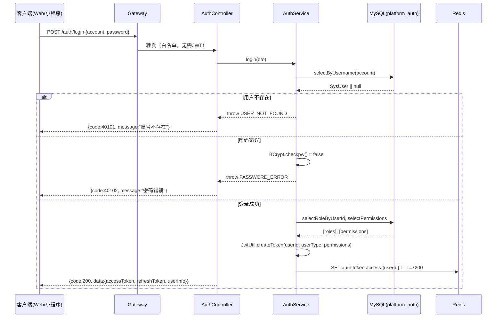
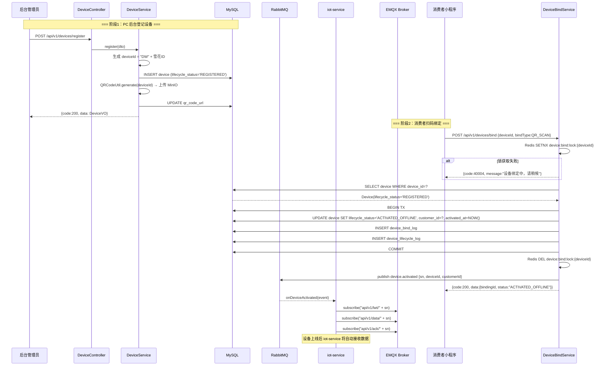
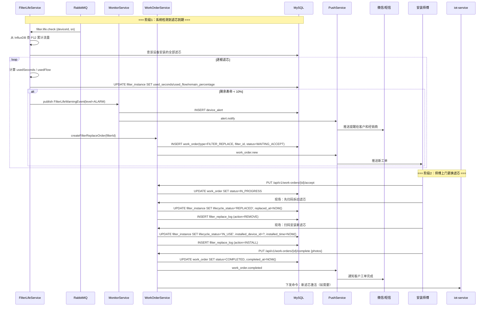
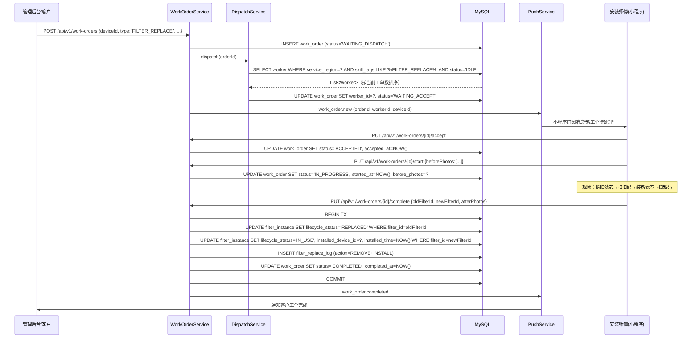
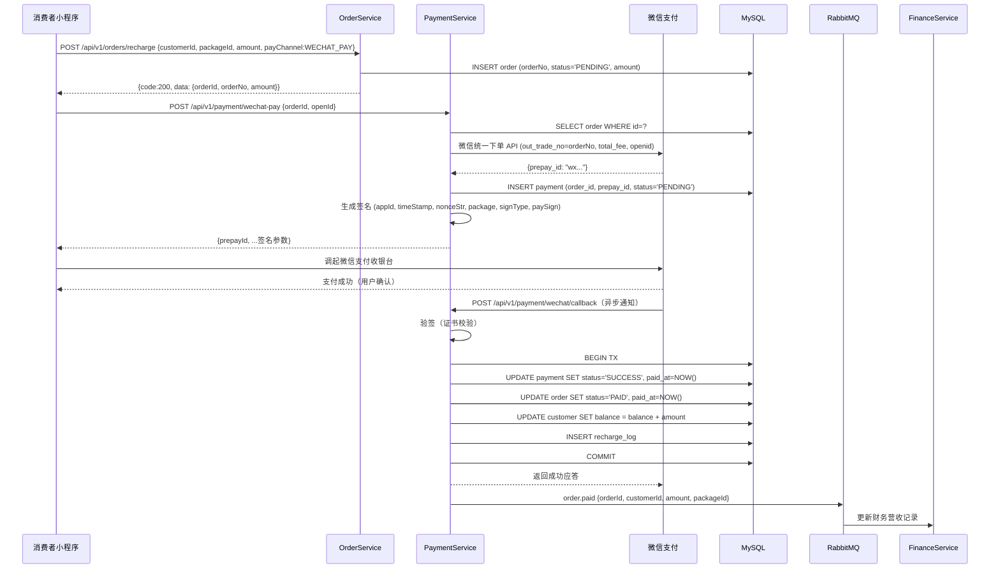
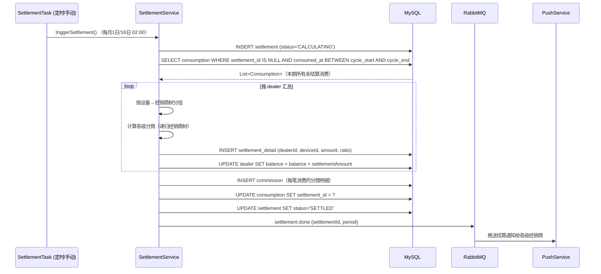
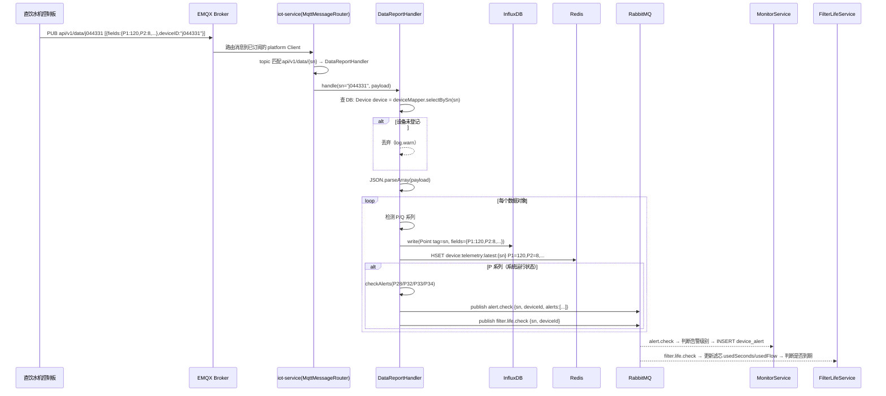

# 直饮水平台详细设计文档

> **文档版本**：V3.0  
> **编制日期**：2026-07-08  
> **文档性质**：软件开发详细设计  
> **适用范围**：后端开发、前端开发、测试、运维  
> **更新说明**：V3.0 — 第六章全面重写为 16 个微服务的完整内部类设计：每服务含包结构、核心接口方法签名、实体字段定义、关键实现逻辑伪代码；新增 8 张 Mermaid 时序图（登录认证/设备登记绑定/滤芯更换工单/充值支付/权责发生制结算/IoT数据上行/工单生命周期/远程控制）；新增 platform-common 公共基础设施设计；供应商/预警阈值/定时任务全部明细化。  
> V2.1 — MQTT 连接参数可配置、平台 ClientID UUID、设备激活后自动订阅。  
> V2.0 — MQTT 协议按硬件网关厂商文档重写。  

---

## 目录

- [一、文档概述](#一文档概述)
- [二、系统架构](#二系统架构)
- [三、数据库设计](#三数据库设计)
- [四、MQTT 协议设计](#四mqtt-协议设计)
- [五、API 接口设计](#五api-接口设计)
- [六、微服务模块设计](#六微服务模块设计)
  - [6.0 通用基础设施](#60-通用基础设施)
  - [6.1 auth-service](#61-auth-service认证授权服务)
  - [6.2 device-service](#62-device-service设备管理服务)
  - [6.3 filter-service](#63-filter-service滤芯管理服务)
  - [6.4 user-service](#64-user-service客户管理服务)
  - [6.5 dealer/worker-service](#65-dealer-service经销商管理服务--worker-service运维人员服务)
  - [6.6 worker-order-service](#66-worker-order-service工单管理服务)
  - [6.7 order/payment-service](#67-order-service订单管理--payment-service支付服务)
  - [6.8 finance-service](#68-finance-service财务管理服务)
  - [6.9 package-service](#69-package-service套餐管理服务)
  - [6.10 inventory-service](#610-inventory-service库存管理服务)
  - [6.11 iot-service](#611-iot-serviceiot-接入服务)
  - [6.12 monitor-service](#612-monitor-service监控预警服务)
  - [6.13 report-service](#613-report-service报表服务)
  - [6.14 system-service](#614-system-service系统管理服务)
  - [6.15 push-service](#615-push-service消息推送服务)
  - [6.16 定时任务总览](#616-定时任务总览)
- [七、前端路由与组件](#七前端路由与组件)
- [八、部署架构](#八部署架构)
- [附录 A：编码规范](#附录-a编码规范)
- [附录 B：错误码定义](#附录-b错误码定义)
- [附录 C：Redis Key 设计](#附录-credis-key-设计)

---

## 一、文档概述

### 1.1 文档约定

| 约定 | 说明 |
|------|------|
| **命名风格** | 数据库：snake_case；Java：camelCase；前端：camelCase |
| **ID 生成** | 雪花算法（Snowflake），全局唯一 64 位 Long 型 |
| **时间格式** | 数据库 DATETIME(3)，API 传输 ISO 8601（`yyyy-MM-dd HH:mm:ss.SSS`） |
| **金额单位** | 分（BigDecimal × 100 转 Long 存储） |
| **布尔值** | 数据库 TINYINT(1)，API 传输 `true/false` |
| **软删除** | 所有核心表含 `deleted` 字段（TINYINT(1)，默认 0） |
| **审计字段** | 所有表含 `create_time`、`update_time`、`create_by`、`update_by` |
| **枚举存储** | 数据库 VARCHAR(32) 存枚举 name()，API 传输枚举常量字符串 |
| **分页** | 统一使用 `pageNum`/`pageSize`，返回 `total`/`pages`/`records` |

### 1.2 技术栈

| 层级 | 技术 | 版本 |
|------|------|------|
| 前端-管理后台 | Vue 3 + Element Plus + Pinia + Vite | vue@3.4+ |
| 移动端 | 微信小程序原生 / uni-app | — |
| 后端框架 | Spring Boot + Spring Cloud Alibaba | boot 3.2+ / cloud 2023.x |
| 注册中心 | Nacos | 2.3+ |
| 网关 | Spring Cloud Gateway | — |
| 限流熔断 | Sentinel | 1.8+ |
| ORM | MyBatis-Plus | 3.5+ |
| 数据库 | MySQL | 8.0+ |
| 缓存 | Redis | 7.0+ |
| 时序数据库 | InfluxDB | 2.7+ |
| 消息队列 | RabbitMQ | 3.12+ |
| MQTT Broker | EMQX | 5.3+ |
| 文件存储 | MinIO | RELEASE.2024+ |
| 容器化 | Docker + Docker Compose | 24+ |

---

## 二、系统架构

### 2.1 微服务划分

```
┌──────────────────────────────────────────────────────────────────────────┐
│                       Nginx (反向代理 + HTTPS)                             │
└──────────────────────────────────────────────────────────────────────────┘
                                    │
┌───────────────────────────────────┴──────────────────────────────────────┐
│                  API Gateway (Spring Cloud Gateway :8080)                  │
│                    JWT 鉴权 · 限流 · 日志 · 跨域                            │
└───────────────────────────────────┬──────────────────────────────────────┘
                                    │
    ┌───────┬───────┬───────┬───────┼───────┬───────┬───────┬────────┐
    ▼       ▼       ▼       ▼       ▼       ▼       ▼       ▼        ▼
┌──────┐┌──────┐┌──────┐┌──────┐┌──────┐┌──────┐┌──────┐┌──────┐┌──────┐
│ auth ││device││device││filter││ iot  ││moni- ││worker││dealer││order │
│ -ser ││ -ser ││ -ser ││ -ser ││ -ser ││ tor- ││ -ser ││ -ser ││ -ser │
│ vice ││ vice ││ vice ││ vice ││ vice ││service││ vice ││ vice ││ vice │
└──────┘└──────┘└──────┘└──────┘└──────┘└──────┘└──────┘└──────┘└──────┘
┌──────┐┌──────┐┌──────┐┌──────┐┌──────┐┌──────┐┌──────┐┌──────┐
│pay-  ││finan-││pack- ││inven-││report││user- ││system││push- │
│ment- ││ce-   ││age-  ││tory- ││-ser- ││ser-  ││-ser- ││ser-  │
│service││service││service││service││vice ││vice  ││vice  ││vice  │
└──────┘└──────┘└──────┘└──────┘└──────┘└──────┘└──────┘└──────┘
```

| 服务名 | 端口 | 职责 |
|--------|------|------|
| `gateway` | 8080 | API 网关，统一入口 |
| `auth-service` | 8081 | 认证授权，JWT 签发/验证 |
| `user-service` | 8082 | 客户管理，用户反馈 |
| `device-service` | 8083 | 设备 ID 登记、设备状态机、设备型号、二维码生成 |
| `filter-service` | 8084 | 滤芯 ID 管理、滤芯生命周期、滤芯库存 |
| `iot-service` | 8085 | MQTT 数据采集、指令下发、设备协议解析 |
| `monitor-service` | 8086 | 实时监控、预警报警、滤芯寿命计算 |
| `worker-service` | 8087 | 工单管理（含滤芯更换工单）|
| `dealer-service` | 8088 | 经销商管理、多级分润规则 |
| `order-service` | 8089 | 订单管理 |
| `payment-service` | 8090 | 微信支付对接 |
| `finance-service` | 8091 | 分润结算、权责发生制 |
| `package-service` | 8092 | 套餐管理 |
| `inventory-service` | 8093 | 库存管理（设备+滤芯）、报告导入 |
| `report-service` | 8094 | 报表分析、数据导出 |
| `system-service` | 8095 | 角色管理、后台账户、审计日志、通知推送 |
| `push-service` | 8096 | 公众号/小程序消息推送 |

### 2.2 部署拓扑

```
┌─────────────────────────────────────────────────────────────────┐
│                     Docker Host                                  │
│  ┌───────────────────────────────────────────────────────────┐  │
│  │  nginx:443 → gateway:8080                                 │  │
│  │  auth:8081  user:8082  device:8083  filter:8084           │  │
│  │  iot:8085   monitor:8086  worker:8087  dealer:8088        │  │
│  │  order:8089 payment:8090  finance:8091  package:8092      │  │
│  │  inventory:8093  report:8094  system:8095  push:8096      │  │
│  ├───────────────────────────────────────────────────────────┤  │
│  │  mysql:3306  redis:6379  influxdb:8086  rabbitmq:5672     │  │
│  │  emqx:1883/tcp + 18083/http  minio:9000 + 9001/console    │  │
│  │  nacos:8848  sentinel:8858                                │  │
│  └───────────────────────────────────────────────────────────┘  │
└─────────────────────────────────────────────────────────────────┘
```

---

## 三、数据库设计

### 3.1 数据库概览

**数据库名**：`drinking_water`

所有业务表统一在该库下，不按服务分库。InfluxDB 存储时序数据，Redis 用于缓存与分布式锁。

### 3.2 设备管理模块

#### 3.2.1 设备型号表 `device_model`

```sql
CREATE TABLE device_model (
    id              BIGINT        NOT NULL AUTO_INCREMENT  COMMENT '主键ID',
    model_code      VARCHAR(64)   NOT NULL                 COMMENT '型号编码（唯一）',
    model_name      VARCHAR(128)  NOT NULL                 COMMENT '型号名称',
    category        VARCHAR(64)                            COMMENT '设备分类',
    description     VARCHAR(512)                           COMMENT '型号描述',
    status          VARCHAR(16)   NOT NULL DEFAULT 'ENABLED' COMMENT '状态：ENABLED/DISABLED',
    filter_config   JSON                                  COMMENT '滤芯配置：{"level_1":"filter_model_id","level_2":"",...}',
    created_at      DATETIME(3)   NOT NULL DEFAULT CURRENT_TIMESTAMP(3) COMMENT '创建时间',
    updated_at      DATETIME(3)   NOT NULL DEFAULT CURRENT_TIMESTAMP(3) ON UPDATE CURRENT_TIMESTAMP(3) COMMENT '更新时间',
    deleted         TINYINT(1)    NOT NULL DEFAULT 0       COMMENT '软删除',
    PRIMARY KEY (id),
    UNIQUE KEY uk_model_code (model_code),
    KEY idx_status (status)
) ENGINE=InnoDB DEFAULT CHARSET=utf8mb4 COMMENT='设备型号表';
```

#### 3.2.2 设备实例表 `device`

```sql
CREATE TABLE device (
    id              BIGINT        NOT NULL AUTO_INCREMENT  COMMENT '主键ID',
    device_id       VARCHAR(32)   NOT NULL                 COMMENT '设备ID（平台业务ID，雪花算法，设备二维码含此值）',
    sn              VARCHAR(32)   NOT NULL                 COMMENT '网关序列号（MQTT ClientID，如 j082438，设备与控制板通信标识）',
    model_id        BIGINT        NOT NULL                 COMMENT '设备型号ID，关联 device_model.id',
    iccid           VARCHAR(32)                            COMMENT '物联网卡ICCID（选填）',
    imei            VARCHAR(32)                            COMMENT '设备IMEI（选填）',
    production_date DATE                                  COMMENT '生产日期',
    production_batch VARCHAR(64)                           COMMENT '生产批次',
    qr_code_url     VARCHAR(256)                           COMMENT '设备二维码图片URL（MinIO存储）',
    online_status   TINYINT(1)    NOT NULL DEFAULT 0       COMMENT '在线状态：0=离线 1=在线',
    lifecycle_status VARCHAR(32) NOT NULL DEFAULT 'REGISTERED' COMMENT '生命周期状态：REGISTERED/ALLOCATED/PENDING_INSTALL/ACTIVATED_ONLINE/ACTIVATED_OFFLINE/RETURNED/SCRAPPED',
    dealer_id       BIGINT                                COMMENT '当前所属经销商ID',
    customer_id     BIGINT                                COMMENT '当前绑定客户ID',
    activated_at    DATETIME(3)                            COMMENT '激活时间（客户绑定成功时）',
    returned_at     DATETIME(3)                            COMMENT '退机时间',
    scrapped_at     DATETIME(3)                            COMMENT '报废时间',
    province        VARCHAR(32)                            COMMENT '省',
    city            VARCHAR(32)                            COMMENT '市',
    district        VARCHAR(32)                            COMMENT '区',
    address         VARCHAR(256)                           COMMENT '详细地址',
    charge_mode     VARCHAR(32)                            COMMENT '计费模式：FLOW_BASED/MONTHLY_RENT/PACKAGE_RECHARGE/SHARED',
    remain_duration INT          NOT NULL DEFAULT 0        COMMENT '剩余时长（秒）',
    remain_flow     BIGINT       NOT NULL DEFAULT 0        COMMENT '剩余流量（升，×1000 精确到 mL）',
    created_at      DATETIME(3)  NOT NULL DEFAULT CURRENT_TIMESTAMP(3),
    updated_at      DATETIME(3)  NOT NULL DEFAULT CURRENT_TIMESTAMP(3) ON UPDATE CURRENT_TIMESTAMP(3),
    deleted         TINYINT(1)   NOT NULL DEFAULT 0,
    PRIMARY KEY (id),
    UNIQUE KEY uk_device_id (device_id),
    UNIQUE KEY uk_sn (sn),
    KEY idx_model_id (model_id),
    KEY idx_lifecycle_status (lifecycle_status),
    KEY idx_customer_id (customer_id),
    KEY idx_dealer_id (dealer_id),
    KEY idx_online_status (online_status),
    KEY idx_created_at (created_at)
) ENGINE=InnoDB DEFAULT CHARSET=utf8mb4 COMMENT='设备实例表';
```

#### 3.2.3 设备状态变更日志 `device_status_log`

```sql
CREATE TABLE device_status_log (
    id              BIGINT        NOT NULL AUTO_INCREMENT  COMMENT '主键ID',
    device_id       VARCHAR(32)   NOT NULL                 COMMENT '设备ID',
    from_status     VARCHAR(32)                            COMMENT '变更前状态',
    to_status       VARCHAR(32)   NOT NULL                 COMMENT '变更后状态',
    operator_id     BIGINT                                COMMENT '操作人ID',
    operator_name   VARCHAR(64)                            COMMENT '操作人姓名',
    remark          VARCHAR(512)                           COMMENT '备注',
    created_at      DATETIME(3)   NOT NULL DEFAULT CURRENT_TIMESTAMP(3),
    PRIMARY KEY (id),
    KEY idx_device_id (device_id),
    KEY idx_created_at (created_at)
) ENGINE=InnoDB DEFAULT CHARSET=utf8mb4 COMMENT='设备状态变更日志';
```

#### 3.2.4 设备绑定记录 `device_binding`

```sql
CREATE TABLE device_binding (
    id              BIGINT        NOT NULL AUTO_INCREMENT  COMMENT '主键ID',
    device_id       VARCHAR(32)   NOT NULL                 COMMENT '设备ID',
    customer_id     BIGINT        NOT NULL                 COMMENT '客户ID',
    bind_type       VARCHAR(16)   NOT NULL                 COMMENT '绑定方式：QR_SCAN/INPUT_ID',
    bind_at         DATETIME(3)   NOT NULL                 COMMENT '绑定时间',
    unbind_at       DATETIME(3)                            COMMENT '解绑时间',
    status          VARCHAR(16)   NOT NULL DEFAULT 'ACTIVE' COMMENT '状态：ACTIVE/UNBOUND',
    activated_package_id BIGINT                            COMMENT '激活时选择的套餐ID',
    created_at      DATETIME(3)   NOT NULL DEFAULT CURRENT_TIMESTAMP(3),
    updated_at      DATETIME(3)   NOT NULL DEFAULT CURRENT_TIMESTAMP(3) ON UPDATE CURRENT_TIMESTAMP(3),
    PRIMARY KEY (id),
    UNIQUE KEY uk_device_active (device_id, status) COMMENT '每个设备最多一条ACTIVE绑定',
    KEY idx_customer_id (customer_id)
) ENGINE=InnoDB DEFAULT CHARSET=utf8mb4 COMMENT='设备绑定记录';
```

### 3.3 滤芯管理模块

#### 3.3.1 滤芯型号表 `filter_model`

```sql
CREATE TABLE filter_model (
    id              BIGINT        NOT NULL AUTO_INCREMENT  COMMENT '主键ID',
    model_code      VARCHAR(64)   NOT NULL                 COMMENT '滤芯型号编码（唯一）',
    model_name      VARCHAR(128)  NOT NULL                 COMMENT '滤芯型号名称',
    category        VARCHAR(32)   NOT NULL                 COMMENT '滤芯分类：PP_COTTON/GRANULAR_AC/COMPRESSED_AC/RO_MEMBRANE/POST_AC/OTHER',
    filter_level    TINYINT       NOT NULL                 COMMENT '滤芯级别：1-5（对应设备中的安装位置）',
    standard_life_duration INT    NOT NULL                 COMMENT '标准寿命-时间（月）',
    standard_life_flow     BIGINT NOT NULL                 COMMENT '标准寿命-流量（升，×1000）',
    price           BIGINT       NOT NULL DEFAULT 0        COMMENT '参考售价（分）',
    photo_url       VARCHAR(256)                           COMMENT '滤芯照片URL（MinIO）',
    description     VARCHAR(512)                           COMMENT '描述',
    status          VARCHAR(16)  NOT NULL DEFAULT 'ENABLED' COMMENT '状态：ENABLED/DISABLED',
    created_at      DATETIME(3)  NOT NULL DEFAULT CURRENT_TIMESTAMP(3),
    updated_at      DATETIME(3)  NOT NULL DEFAULT CURRENT_TIMESTAMP(3) ON UPDATE CURRENT_TIMESTAMP(3),
    deleted         TINYINT(1)   NOT NULL DEFAULT 0,
    PRIMARY KEY (id),
    UNIQUE KEY uk_model_code (model_code),
    KEY idx_category (category),
    KEY idx_filter_level (filter_level)
) ENGINE=InnoDB DEFAULT CHARSET=utf8mb4 COMMENT='滤芯型号表';
```

#### 3.3.2 滤芯实例表 `filter_instance`

```sql
CREATE TABLE filter_instance (
    id              BIGINT        NOT NULL AUTO_INCREMENT  COMMENT '主键ID',
    filter_id       VARCHAR(32)   NOT NULL                 COMMENT '滤芯ID（全局唯一出厂序列号，滤芯二维码含此值）',
    filter_model_id BIGINT        NOT NULL                 COMMENT '滤芯型号ID，关联 filter_model.id',
    production_date DATE                                  COMMENT '生产日期',
    production_batch VARCHAR(64)                           COMMENT '生产批次',
    qr_code_url     VARCHAR(256)                           COMMENT '滤芯二维码图片URL（MinIO）',
    lifecycle_status VARCHAR(32)  NOT NULL DEFAULT 'IN_STOCK' COMMENT '生命周期状态：IN_STOCK/PENDING_INSTALL/IN_USE/SCRAPPED',
    current_device_id VARCHAR(32)                          COMMENT '当前安装的设备ID（仅在IN_USE时不空）',
    installed_at    DATETIME(3)                            COMMENT '安装时间（激活到设备上）',
    installed_by    BIGINT                                COMMENT '安装人员ID',
    used_duration   INT          NOT NULL DEFAULT 0        COMMENT '已用时长（秒）',
    used_flow       BIGINT       NOT NULL DEFAULT 0        COMMENT '已用流量（升，×1000）',
    scrapped_at     DATETIME(3)                            COMMENT '报废时间',
    created_at      DATETIME(3)  NOT NULL DEFAULT CURRENT_TIMESTAMP(3),
    updated_at      DATETIME(3)  NOT NULL DEFAULT CURRENT_TIMESTAMP(3) ON UPDATE CURRENT_TIMESTAMP(3),
    deleted         TINYINT(1)   NOT NULL DEFAULT 0,
    PRIMARY KEY (id),
    UNIQUE KEY uk_filter_id (filter_id),
    KEY idx_filter_model_id (filter_model_id),
    KEY idx_lifecycle_status (lifecycle_status),
    KEY idx_current_device_id (current_device_id),
    KEY idx_production_batch (production_batch)
) ENGINE=InnoDB DEFAULT CHARSET=utf8mb4 COMMENT='滤芯实例表';
```

#### 3.3.3 滤芯状态变更日志 `filter_status_log`

```sql
CREATE TABLE filter_status_log (
    id              BIGINT        NOT NULL AUTO_INCREMENT  COMMENT '主键ID',
    filter_id       VARCHAR(32)   NOT NULL                 COMMENT '滤芯ID',
    from_status     VARCHAR(32)                            COMMENT '变更前状态',
    to_status       VARCHAR(32)   NOT NULL                 COMMENT '变更后状态',
    operator_id     BIGINT                                COMMENT '操作人ID',
    operator_name   VARCHAR(64)                            COMMENT '操作人姓名',
    device_id       VARCHAR(32)                            COMMENT '关联设备ID（安装/拆卸时记录）',
    remark          VARCHAR(512)                           COMMENT '备注',
    created_at      DATETIME(3)   NOT NULL DEFAULT CURRENT_TIMESTAMP(3),
    PRIMARY KEY (id),
    KEY idx_filter_id (filter_id),
    KEY idx_created_at (created_at)
) ENGINE=InnoDB DEFAULT CHARSET=utf8mb4 COMMENT='滤芯状态变更日志';
```

#### 3.3.4 滤芯更换记录 `filter_replace_log`

```sql
CREATE TABLE filter_replace_log (
    id              BIGINT        NOT NULL AUTO_INCREMENT  COMMENT '主键ID',
    device_id       VARCHAR(32)   NOT NULL                 COMMENT '设备ID',
    old_filter_id   VARCHAR(32)   NOT NULL                 COMMENT '旧滤芯ID',
    new_filter_id   VARCHAR(32)   NOT NULL                 COMMENT '新滤芯ID',
    work_order_id   BIGINT        NOT NULL                 COMMENT '关联工单ID',
    replaced_by     BIGINT        NOT NULL                 COMMENT '更换人员ID',
    replaced_at     DATETIME(3)   NOT NULL                 COMMENT '更换时间',
    old_used_duration INT         NOT NULL                 COMMENT '旧滤芯已用时长（秒）',
    old_used_flow   BIGINT        NOT NULL                 COMMENT '旧滤芯已用流量（升，×1000）',
    photo_urls      JSON                                  COMMENT '更换照片URL列表（MinIO）',
    remark          VARCHAR(512)                           COMMENT '备注',
    created_at      DATETIME(3)   NOT NULL DEFAULT CURRENT_TIMESTAMP(3),
    PRIMARY KEY (id),
    KEY idx_device_id (device_id),
    KEY idx_old_filter_id (old_filter_id),
    KEY idx_new_filter_id (new_filter_id),
    KEY idx_work_order_id (work_order_id),
    KEY idx_replaced_at (replaced_at)
) ENGINE=InnoDB DEFAULT CHARSET=utf8mb4 COMMENT='滤芯更换记录';
```

### 3.4 客户管理模块

#### 3.4.1 客户表 `customer`

```sql
CREATE TABLE customer (
    id              BIGINT        NOT NULL AUTO_INCREMENT  COMMENT '主键ID',
    customer_type   VARCHAR(16)   NOT NULL                 COMMENT '客户主体类型：PERSONAL/FAMILY/COMPANY/SCHOOL/OTHER_ORG',
    -- 个人/家庭字段 --
    name            VARCHAR(64)                            COMMENT '姓名（个人/家庭客户）',
    phone           VARCHAR(20)                            COMMENT '电话',
    wechat          VARCHAR(64)                            COMMENT '微信号/昵称',
    -- 公司/学校/单位字段 --
    org_name        VARCHAR(128)                           COMMENT '单位名称（公司/学校/单位客户）',
    credit_code     VARCHAR(32)                            COMMENT '统一社会信用代码',
    contact_name    VARCHAR(64)                            COMMENT '联系人姓名',
    contact_phone   VARCHAR(20)                            COMMENT '联系人电话',
    contact_wechat  VARCHAR(64)                            COMMENT '联系人微信',
    bank_account    VARCHAR(64)                            COMMENT '对公账户信息',
    -- 通用字段 --
    balance         BIGINT       NOT NULL DEFAULT 0        COMMENT '余额（分）',
    remain_duration INT          NOT NULL DEFAULT 0        COMMENT '剩余时长（秒）',
    remain_flow     BIGINT       NOT NULL DEFAULT 0        COMMENT '剩余流量（升，×1000）',
    province        VARCHAR(32)                            COMMENT '省',
    city            VARCHAR(32)                            COMMENT '市',
    district        VARCHAR(32)                            COMMENT '区',
    address         VARCHAR(256)                           COMMENT '单位地址/家庭地址',
    open_id         VARCHAR(128)                           COMMENT '微信 OpenID',
    union_id        VARCHAR(128)                           COMMENT '微信 UnionID',
    dealer_id       BIGINT                                COMMENT '所属经销商ID',
    status          VARCHAR(16)  NOT NULL DEFAULT 'ACTIVE' COMMENT '状态：ACTIVE/DISABLED',
    registered_at   DATETIME(3)  NOT NULL                 COMMENT '注册时间',
    created_at      DATETIME(3)  NOT NULL DEFAULT CURRENT_TIMESTAMP(3),
    updated_at      DATETIME(3)  NOT NULL DEFAULT CURRENT_TIMESTAMP(3) ON UPDATE CURRENT_TIMESTAMP(3),
    deleted         TINYINT(1)   NOT NULL DEFAULT 0,
    PRIMARY KEY (id),
    KEY idx_phone (phone),
    KEY idx_customer_type (customer_type),
    KEY idx_open_id (open_id),
    KEY idx_dealer_id (dealer_id),
    KEY idx_status (status),
    KEY idx_credit_code (credit_code)
) ENGINE=InnoDB DEFAULT CHARSET=utf8mb4 COMMENT='客户表（支持个人/家庭/公司/学校/其他单位）';
```

#### 3.4.2 用户反馈表 `customer_feedback`

```sql
CREATE TABLE customer_feedback (
    id              BIGINT        NOT NULL AUTO_INCREMENT  COMMENT '主键ID',
    device_id       VARCHAR(32)                            COMMENT '设备ID',
    customer_id     BIGINT        NOT NULL                 COMMENT '客户ID',
    customer_name   VARCHAR(64)                            COMMENT '客户名称',
    contact_phone   VARCHAR(20)                            COMMENT '联系电话',
    content         VARCHAR(1024) NOT NULL                 COMMENT '反馈内容',
    photo_urls      JSON                                  COMMENT '反馈照片URL列表（MinIO）',
    reply_content   VARCHAR(1024)                          COMMENT '回复内容',
    feedback_type   VARCHAR(32)                            COMMENT '反馈类型',
    status          VARCHAR(16)   NOT NULL DEFAULT 'PENDING' COMMENT '状态：PENDING/PROCESSING/RESOLVED',
    created_at      DATETIME(3)   NOT NULL DEFAULT CURRENT_TIMESTAMP(3),
    updated_at      DATETIME(3)   NOT NULL DEFAULT CURRENT_TIMESTAMP(3) ON UPDATE CURRENT_TIMESTAMP(3),
    deleted         TINYINT(1)    NOT NULL DEFAULT 0,
    PRIMARY KEY (id),
    KEY idx_customer_id (customer_id),
    KEY idx_device_id (device_id),
    KEY idx_status (status)
) ENGINE=InnoDB DEFAULT CHARSET=utf8mb4 COMMENT='用户反馈表';
```

### 3.5 经销商管理模块

#### 3.5.1 经销商表 `dealer`

```sql
CREATE TABLE dealer (
    id              BIGINT        NOT NULL AUTO_INCREMENT  COMMENT '主键ID',
    dealer_code     VARCHAR(16)   NOT NULL                 COMMENT '经销商编号（5位数字登录账号）',
    dealer_name     VARCHAR(128)  NOT NULL                 COMMENT '经销商名称',
    dealer_level    VARCHAR(16)   NOT NULL                 COMMENT '经销商层级：L1_DEALER/L2_DEALER/L3_DEALER',
    parent_id       BIGINT                                COMMENT '上级经销商ID',
    phone           VARCHAR(20)   NOT NULL                 COMMENT '手机号',
    password        VARCHAR(128)  NOT NULL                 COMMENT '密码（BCrypt加密）',
    recharge_amount BIGINT        NOT NULL DEFAULT 0        COMMENT '充值金额（分）',
    credit_balance  BIGINT        NOT NULL DEFAULT 0        COMMENT '授权余额（分）',
    total_balance   BIGINT        NOT NULL DEFAULT 0        COMMENT '累计余额（分）',
    commission_rate DECIMAL(5,4)  NOT NULL DEFAULT 0        COMMENT '分润比例（0.0000~1.0000）',
    region          VARCHAR(128)                           COMMENT '区域',
    bank_account    VARCHAR(64)                            COMMENT '银行账户',
    status          VARCHAR(16)   NOT NULL DEFAULT 'ACTIVE' COMMENT '状态：ACTIVE/DISABLED/CANCELLED',
    registered_at   DATETIME(3)   NOT NULL                 COMMENT '登记时间',
    created_at      DATETIME(3)   NOT NULL DEFAULT CURRENT_TIMESTAMP(3),
    updated_at      DATETIME(3)   NOT NULL DEFAULT CURRENT_TIMESTAMP(3) ON UPDATE CURRENT_TIMESTAMP(3),
    deleted         TINYINT(1)    NOT NULL DEFAULT 0,
    PRIMARY KEY (id),
    UNIQUE KEY uk_dealer_code (dealer_code),
    KEY idx_phone (phone),
    KEY idx_parent_id (parent_id),
    KEY idx_dealer_level (dealer_level),
    KEY idx_status (status)
) ENGINE=InnoDB DEFAULT CHARSET=utf8mb4 COMMENT='经销商表';
```

### 3.6 运维人员模块

#### 3.6.1 运维人员表 `worker`

```sql
CREATE TABLE worker (
    id              BIGINT        NOT NULL AUTO_INCREMENT  COMMENT '主键ID',
    name            VARCHAR(64)   NOT NULL                 COMMENT '姓名',
    phone           VARCHAR(20)   NOT NULL                 COMMENT '手机号（登录账号）',
    password        VARCHAR(128)  NOT NULL                 COMMENT '密码（BCrypt加密，初始123456）',
    province        VARCHAR(32)                            COMMENT '省',
    city            VARCHAR(32)                            COMMENT '市',
    district        VARCHAR(32)                            COMMENT '区',
    address         VARCHAR(256)                           COMMENT '详细地址',
    dealer_id       BIGINT        NOT NULL                 COMMENT '所属经销商ID',
    status          VARCHAR(16)   NOT NULL DEFAULT 'ACTIVE' COMMENT '状态：ACTIVE/DISABLED/CANCELLED',
    service_count   INT           NOT NULL DEFAULT 0        COMMENT '服务工单数量',
    rating          DECIMAL(3,2)  NOT NULL DEFAULT 5.00     COMMENT '平均评分',
    registered_at   DATETIME(3)   NOT NULL                 COMMENT '登记时间',
    created_at      DATETIME(3)   NOT NULL DEFAULT CURRENT_TIMESTAMP(3),
    updated_at      DATETIME(3)   NOT NULL DEFAULT CURRENT_TIMESTAMP(3) ON UPDATE CURRENT_TIMESTAMP(3),
    deleted         TINYINT(1)    NOT NULL DEFAULT 0,
    PRIMARY KEY (id),
    UNIQUE KEY uk_phone (phone),
    KEY idx_dealer_id (dealer_id),
    KEY idx_status (status)
) ENGINE=InnoDB DEFAULT CHARSET=utf8mb4 COMMENT='运维人员表';
```

### 3.7 工单管理模块

#### 3.7.1 工单表 `work_order`

```sql
CREATE TABLE work_order (
    id              BIGINT        NOT NULL AUTO_INCREMENT  COMMENT '主键ID',
    order_no        VARCHAR(32)   NOT NULL                 COMMENT '工单编号（唯一）',
    order_type      VARCHAR(32)   NOT NULL                 COMMENT '工单类型：INSTALL_APPOINTMENT/REPAIR/REMOVE/RELOCATE/FILTER_REPLACE',
    device_id       VARCHAR(32)   NOT NULL                 COMMENT '设备ID',
    customer_id     BIGINT        NOT NULL                 COMMENT '客户ID',
    customer_name   VARCHAR(64)                            COMMENT '客户名称',
    customer_phone  VARCHAR(20)                            COMMENT '客户电话',
    province        VARCHAR(32)                            COMMENT '省',
    city            VARCHAR(32)                            COMMENT '市',
    district        VARCHAR(32)                            COMMENT '区',
    address         VARCHAR(256)                           COMMENT '设备地址',
    description     VARCHAR(1024)                          COMMENT '工单描述',
    model_id        BIGINT                                COMMENT '设备型号ID',
    dealer_id       BIGINT        NOT NULL                 COMMENT '经销商ID',
    worker_id       BIGINT                                COMMENT '指派运维人员ID',
    worker_name     VARCHAR(64)                            COMMENT '运维人员姓名',
    order_status    VARCHAR(32)   NOT NULL DEFAULT 'PENDING' COMMENT '工单状态：PENDING/ASSIGNED/ACCEPTED/IN_PROGRESS/COMPLETED/CANCELLED',
    appoint_time    DATETIME(3)                            COMMENT '预约时间',
    accepted_at     DATETIME(3)                            COMMENT '接单时间',
    completed_at    DATETIME(3)                            COMMENT '完成时间',
    cancelled_at    DATETIME(3)                            COMMENT '取消时间',
    photo_urls      JSON                                  COMMENT '完成照片URL列表（MinIO）',
    remark          VARCHAR(512)                           COMMENT '完成备注',
    rating          TINYINT                                COMMENT '客户评分（1-5）',
    review_content  VARCHAR(512)                           COMMENT '客户评价内容',
    -- 滤芯更换工单特有字段 --
    old_filter_id   VARCHAR(32)                            COMMENT '旧滤芯ID',
    new_filter_id   VARCHAR(32)                            COMMENT '新滤芯ID',
    trigger_type    VARCHAR(32)                            COMMENT '触发方式：AUTO（预警自动触发）/MANUAL（手动创建）',
    created_at      DATETIME(3)   NOT NULL DEFAULT CURRENT_TIMESTAMP(3),
    updated_at      DATETIME(3)   NOT NULL DEFAULT CURRENT_TIMESTAMP(3) ON UPDATE CURRENT_TIMESTAMP(3),
    deleted         TINYINT(1)    NOT NULL DEFAULT 0,
    PRIMARY KEY (id),
    UNIQUE KEY uk_order_no (order_no),
    KEY idx_device_id (device_id),
    KEY idx_customer_id (customer_id),
    KEY idx_dealer_id (dealer_id),
    KEY idx_worker_id (worker_id),
    KEY idx_order_status (order_status),
    KEY idx_order_type (order_type),
    KEY idx_created_at (created_at)
) ENGINE=InnoDB DEFAULT CHARSET=utf8mb4 COMMENT='工单表';
```

#### 3.7.2 工单流转日志 `work_order_log`

```sql
CREATE TABLE work_order_log (
    id              BIGINT        NOT NULL AUTO_INCREMENT  COMMENT '主键ID',
    work_order_id   BIGINT        NOT NULL                 COMMENT '工单ID',
    from_status     VARCHAR(32)                            COMMENT '变更前状态',
    to_status       VARCHAR(32)   NOT NULL                 COMMENT '变更后状态',
    operator_id     BIGINT        NOT NULL                 COMMENT '操作人ID',
    operator_type   VARCHAR(16)   NOT NULL                 COMMENT '操作人类型：ADMIN/DEALER/WORKER/CUSTOMER',
    operator_name   VARCHAR(64)                            COMMENT '操作人姓名',
    remark          VARCHAR(512)                           COMMENT '备注',
    created_at      DATETIME(3)   NOT NULL DEFAULT CURRENT_TIMESTAMP(3),
    PRIMARY KEY (id),
    KEY idx_work_order_id (work_order_id),
    KEY idx_created_at (created_at)
) ENGINE=InnoDB DEFAULT CHARSET=utf8mb4 COMMENT='工单流转日志';
```

### 3.8 订单管理模块

#### 3.8.1 订单表 `order_info`

```sql
CREATE TABLE order_info (
    id              BIGINT        NOT NULL AUTO_INCREMENT  COMMENT '主键ID',
    order_no        VARCHAR(32)   NOT NULL                 COMMENT '订单编号（唯一）',
    customer_id     BIGINT        NOT NULL                 COMMENT '客户ID',
    customer_name   VARCHAR(64)                            COMMENT '客户姓名',
    customer_phone  VARCHAR(20)                            COMMENT '客户手机',
    customer_wechat VARCHAR(64)                            COMMENT '客户微信/昵称',
    product_name    VARCHAR(128)                           COMMENT '商品/套餐名称',
    package_id      BIGINT                                COMMENT '套餐ID',
    order_amount    BIGINT        NOT NULL                 COMMENT '订单金额（分）',
    face_value      BIGINT        NOT NULL                 COMMENT '面值（分）',
    pay_amount      BIGINT        NOT NULL                 COMMENT '实际支付金额（分）',
    pay_method      VARCHAR(32)                            COMMENT '支付方式：WECHAT_PAY/MANUAL_RECHARGE',
    order_status    VARCHAR(32)   NOT NULL DEFAULT 'PENDING' COMMENT '订单状态：PENDING/PAID/CANCELLED/REFUNDING/REFUNDED/ERROR',
    commission_status VARCHAR(32) NOT NULL DEFAULT 'PENDING' COMMENT '分账状态：PENDING/SETTLED',
    dealer_id       BIGINT                                COMMENT '经销商ID',
    dealer_name     VARCHAR(128)                           COMMENT '经销商名称',
    order_type      VARCHAR(32)   NOT NULL                 COMMENT '订单类型：RECHARGE/BUY_WATER',
    ordered_at      DATETIME(3)   NOT NULL                 COMMENT '下单时间',
    paid_at         DATETIME(3)                            COMMENT '支付时间',
    created_at      DATETIME(3)   NOT NULL DEFAULT CURRENT_TIMESTAMP(3),
    updated_at      DATETIME(3)   NOT NULL DEFAULT CURRENT_TIMESTAMP(3) ON UPDATE CURRENT_TIMESTAMP(3),
    deleted         TINYINT(1)    NOT NULL DEFAULT 0,
    PRIMARY KEY (id),
    UNIQUE KEY uk_order_no (order_no),
    KEY idx_customer_id (customer_id),
    KEY idx_order_status (order_status),
    KEY idx_paid_at (paid_at),
    KEY idx_dealer_id (dealer_id),
    KEY idx_order_type (order_type)
) ENGINE=InnoDB DEFAULT CHARSET=utf8mb4 COMMENT='订单表';
```

### 3.9 支付与财务管理模块

#### 3.9.1 支付记录表 `payment_record`

```sql
CREATE TABLE payment_record (
    id              BIGINT        NOT NULL AUTO_INCREMENT  COMMENT '主键ID',
    order_no        VARCHAR(32)   NOT NULL                 COMMENT '订单编号',
    pay_method      VARCHAR(32)   NOT NULL                 COMMENT '支付方式',
    transaction_id  VARCHAR(64)                            COMMENT '第三方交易流水号',
    pay_amount      BIGINT        NOT NULL                 COMMENT '支付金额（分）',
    pay_status      VARCHAR(32)   NOT NULL                 COMMENT '支付状态：SUCCESS/FAIL/REFUND',
    paid_at         DATETIME(3)                            COMMENT '支付时间',
    raw_response    JSON                                  COMMENT '原始回调数据',
    created_at      DATETIME(3)   NOT NULL DEFAULT CURRENT_TIMESTAMP(3),
    PRIMARY KEY (id),
    UNIQUE KEY uk_transaction_id (transaction_id),
    KEY idx_order_no (order_no),
    KEY idx_paid_at (paid_at)
) ENGINE=InnoDB DEFAULT CHARSET=utf8mb4 COMMENT='支付记录表';
```

#### 3.9.2 消费记录表（权责发生制基础）`consumption_record`

```sql
CREATE TABLE consumption_record (
    id              BIGINT        NOT NULL AUTO_INCREMENT  COMMENT '主键ID',
    device_id       VARCHAR(32)   NOT NULL                 COMMENT '设备ID',
    customer_id     BIGINT        NOT NULL                 COMMENT '客户ID',
    related_recharge_id BIGINT                             COMMENT '关联充值订单ID',
    consume_flow    BIGINT        NOT NULL                 COMMENT '本次消耗流量（升，×1000）',
    consume_amount  BIGINT        NOT NULL                 COMMENT '本次消耗金额（分）',
    revenue_amount  BIGINT        NOT NULL                 COMMENT '权责发生制营收（分，充赠按实际消耗比例计算）',
    consumed_at     DATETIME(3)   NOT NULL                 COMMENT '消费时间',
    created_at      DATETIME(3)   NOT NULL DEFAULT CURRENT_TIMESTAMP(3),
    PRIMARY KEY (id),
    KEY idx_device_id (device_id),
    KEY idx_customer_id (customer_id),
    KEY idx_consumed_at (consumed_at)
) ENGINE=InnoDB DEFAULT CHARSET=utf8mb4 COMMENT='消费记录表（权责发生制基础）';
```

#### 3.9.3 分润记录表 `commission_record`

```sql
CREATE TABLE commission_record (
    id              BIGINT        NOT NULL AUTO_INCREMENT  COMMENT '主键ID',
    order_no        VARCHAR(32)   NOT NULL                 COMMENT '订单编号',
    dealer_id       BIGINT        NOT NULL                 COMMENT '经销商ID',
    dealer_level    VARCHAR(16)   NOT NULL                 COMMENT '经销商层级',
    order_amount    BIGINT        NOT NULL                 COMMENT '订单金额（分）',
    commission_rate DECIMAL(5,4)  NOT NULL                 COMMENT '分润比例',
    commission_amount BIGINT      NOT NULL                 COMMENT '分润金额（分）',
    status          VARCHAR(16)   NOT NULL DEFAULT 'PENDING' COMMENT '状态：PENDING/SETTLED',
    settled_at      DATETIME(3)                            COMMENT '结算时间',
    created_at      DATETIME(3)   NOT NULL DEFAULT CURRENT_TIMESTAMP(3),
    PRIMARY KEY (id),
    KEY idx_order_no (order_no),
    KEY idx_dealer_id (dealer_id),
    KEY idx_status (status),
    KEY idx_created_at (created_at)
) ENGINE=InnoDB DEFAULT CHARSET=utf8mb4 COMMENT='分润记录表';
```

#### 3.9.4 结算账单表 `settlement_bill`

```sql
CREATE TABLE settlement_bill (
    id              BIGINT        NOT NULL AUTO_INCREMENT  COMMENT '主键ID',
    bill_no         VARCHAR(32)   NOT NULL                 COMMENT '账单编号（唯一）',
    dealer_id       BIGINT        NOT NULL                 COMMENT '经销商ID',
    bill_start_date DATE          NOT NULL                 COMMENT '账单开始日期',
    bill_end_date   DATE          NOT NULL                 COMMENT '账单结束日期（15天周期）',
    total_amount    BIGINT        NOT NULL                 COMMENT '本期总金额（分）',
    commission_amount BIGINT      NOT NULL                 COMMENT '本期分润金额（分）',
    withdraw_amount BIGINT        NOT NULL DEFAULT 0        COMMENT '已提现金额（分）',
    status          VARCHAR(16)   NOT NULL DEFAULT 'PENDING' COMMENT '状态：PENDING/SETTLED/WITHDRAWN',
    created_at      DATETIME(3)   NOT NULL DEFAULT CURRENT_TIMESTAMP(3),
    updated_at      DATETIME(3)   NOT NULL DEFAULT CURRENT_TIMESTAMP(3) ON UPDATE CURRENT_TIMESTAMP(3),
    PRIMARY KEY (id),
    UNIQUE KEY uk_bill_no (bill_no),
    KEY idx_dealer_id (dealer_id),
    KEY idx_status (status)
) ENGINE=InnoDB DEFAULT CHARSET=utf8mb4 COMMENT='结算账单表（15天周期）';
```

#### 3.9.5 发票表 `invoice`

```sql
CREATE TABLE invoice (
    id              BIGINT        NOT NULL AUTO_INCREMENT  COMMENT '主键ID',
    invoice_no      VARCHAR(32)   NOT NULL                 COMMENT '发票编号（唯一）',
    customer_id     BIGINT        NOT NULL                 COMMENT '客户ID',
    amount          BIGINT        NOT NULL                 COMMENT '发票金额（分）',
    title           VARCHAR(256)  NOT NULL                 COMMENT '发票抬头',
    tax_no          VARCHAR(32)                            COMMENT '税号',
    status          VARCHAR(16)   NOT NULL DEFAULT 'PENDING' COMMENT '状态：PENDING/ISSUED/MAILED',
    issued_at       DATETIME(3)                            COMMENT '开票时间',
    mailed_at       DATETIME(3)                            COMMENT '邮寄时间',
    mailing_address VARCHAR(256)                           COMMENT '邮寄地址',
    created_at      DATETIME(3)   NOT NULL DEFAULT CURRENT_TIMESTAMP(3),
    updated_at      DATETIME(3)   NOT NULL DEFAULT CURRENT_TIMESTAMP(3) ON UPDATE CURRENT_TIMESTAMP(3),
    PRIMARY KEY (id),
    UNIQUE KEY uk_invoice_no (invoice_no),
    KEY idx_customer_id (customer_id),
    KEY idx_status (status)
) ENGINE=InnoDB DEFAULT CHARSET=utf8mb4 COMMENT='发票表';
```

#### 3.9.6 退款记录表 `refund_record`

```sql
CREATE TABLE refund_record (
    id              BIGINT        NOT NULL AUTO_INCREMENT  COMMENT '主键ID',
    order_no        VARCHAR(32)   NOT NULL                 COMMENT '原订单编号',
    refund_no       VARCHAR(32)   NOT NULL                 COMMENT '退款编号（唯一）',
    refund_amount   BIGINT        NOT NULL                 COMMENT '退款金额（分）',
    refund_reason   VARCHAR(512)                           COMMENT '退款原因',
    status          VARCHAR(16)   NOT NULL DEFAULT 'PENDING' COMMENT '状态：PENDING/APPROVED/REJECTED/COMPLETED',
    operator_id     BIGINT                                COMMENT '操作人ID',
    operator_name   VARCHAR(64)                            COMMENT '操作人姓名',
    processed_at    DATETIME(3)                            COMMENT '处理时间',
    created_at      DATETIME(3)   NOT NULL DEFAULT CURRENT_TIMESTAMP(3),
    updated_at      DATETIME(3)   NOT NULL DEFAULT CURRENT_TIMESTAMP(3) ON UPDATE CURRENT_TIMESTAMP(3),
    PRIMARY KEY (id),
    UNIQUE KEY uk_refund_no (refund_no),
    KEY idx_order_no (order_no),
    KEY idx_status (status)
) ENGINE=InnoDB DEFAULT CHARSET=utf8mb4 COMMENT='退款记录表';
```

### 3.10 套餐管理模块

#### 3.10.1 套餐表 `package`

```sql
CREATE TABLE package (
    id              BIGINT        NOT NULL AUTO_INCREMENT  COMMENT '主键ID',
    package_code    VARCHAR(32)   NOT NULL                 COMMENT '套餐编号（唯一）',
    package_name    VARCHAR(128)  NOT NULL                 COMMENT '套餐名称',
    package_type    VARCHAR(32)   NOT NULL                 COMMENT '套餐类型：QR_SCAN/SHARED/RENTAL/WALLET/INSTALL',
    price           BIGINT        NOT NULL                 COMMENT '套餐价格（分）',
    face_value      BIGINT                                 COMMENT '面值（分，项目钱包类型使用）',
    flow_quota      BIGINT                                 COMMENT '套餐流量配额（升，×1000）',
    duration_days   INT                                    COMMENT '套餐时长（天）',
    charge_mode     VARCHAR(32)                            COMMENT '计费模式',
    model_id        BIGINT                                 COMMENT '适用设备型号ID（null 表示通用）',
    photo_url       VARCHAR(256)                           COMMENT '套餐图片URL',
    commission_amount BIGINT                               COMMENT '固定分佣金额（分）',
    commission_rate  DECIMAL(5,4)                          COMMENT '分佣比例',
    cold_water_rate  BIGINT                                COMMENT '冷水费率（分/升×1000，共享套餐使用）',
    hot_water_rate   BIGINT                                COMMENT '热水费率（分/升×1000，共享套餐使用）',
    status          VARCHAR(16)   NOT NULL DEFAULT 'ENABLED' COMMENT '状态：ENABLED/DISABLED',
    created_at      DATETIME(3)   NOT NULL DEFAULT CURRENT_TIMESTAMP(3),
    updated_at      DATETIME(3)   NOT NULL DEFAULT CURRENT_TIMESTAMP(3) ON UPDATE CURRENT_TIMESTAMP(3),
    deleted         TINYINT(1)    NOT NULL DEFAULT 0,
    PRIMARY KEY (id),
    UNIQUE KEY uk_package_code (package_code),
    KEY idx_package_type (package_type),
    KEY idx_model_id (model_id),
    KEY idx_status (status)
) ENGINE=InnoDB DEFAULT CHARSET=utf8mb4 COMMENT='套餐表';
```

### 3.11 库存管理模块

#### 3.11.1 设备库存表 `device_stock`

```sql
CREATE TABLE device_stock (
    id              BIGINT        NOT NULL AUTO_INCREMENT  COMMENT '主键ID',
    device_id       VARCHAR(32)   NOT NULL                 COMMENT '设备ID',
    batch_no        VARCHAR(64)                            COMMENT '进货批次号',
    warehouse_type  VARCHAR(32)   NOT NULL                 COMMENT '仓库类型：FACTORY/DEALER',
    warehouse_id    BIGINT                                 COMMENT '仓库ID（经销商ID或厂家仓库ID=0）',
    stock_status    VARCHAR(16)   NOT NULL                 COMMENT '库存状态：IN_STOCK/OUT_STOCK/TRANSFERRING',
    inbound_at      DATETIME(3)                            COMMENT '入库时间',
    outbound_at     DATETIME(3)                            COMMENT '出库时间',
    created_at      DATETIME(3)   NOT NULL DEFAULT CURRENT_TIMESTAMP(3),
    updated_at      DATETIME(3)   NOT NULL DEFAULT CURRENT_TIMESTAMP(3) ON UPDATE CURRENT_TIMESTAMP(3),
    PRIMARY KEY (id),
    KEY idx_device_id (device_id),
    KEY idx_batch_no (batch_no),
    KEY idx_warehouse (warehouse_type, warehouse_id),
    KEY idx_stock_status (stock_status)
) ENGINE=InnoDB DEFAULT CHARSET=utf8mb4 COMMENT='设备库存表';
```

#### 3.11.2 设备库存流水 `device_stock_log`

```sql
CREATE TABLE device_stock_log (
    id              BIGINT        NOT NULL AUTO_INCREMENT  COMMENT '主键ID',
    device_id       VARCHAR(32)   NOT NULL                 COMMENT '设备ID',
    batch_no        VARCHAR(64)                            COMMENT '批次号',
    from_warehouse  VARCHAR(32)                            COMMENT '来源仓库',
    to_warehouse    VARCHAR(32)                            COMMENT '目标仓库',
    operation       VARCHAR(32)   NOT NULL                 COMMENT '操作类型：INBOUND/OUTBOUND/TRANSFER/DISTRIBUTE',
    quantity        INT           NOT NULL DEFAULT 1        COMMENT '数量',
    operator_id     BIGINT                                 COMMENT '操作人ID',
    operator_name   VARCHAR(64)                            COMMENT '操作人姓名',
    remark          VARCHAR(512)                           COMMENT '备注',
    created_at      DATETIME(3)   NOT NULL DEFAULT CURRENT_TIMESTAMP(3),
    PRIMARY KEY (id),
    KEY idx_device_id (device_id),
    KEY idx_batch_no (batch_no),
    KEY idx_created_at (created_at)
) ENGINE=InnoDB DEFAULT CHARSET=utf8mb4 COMMENT='设备库存流水记录';
```

#### 3.11.3 滤芯库存表 `filter_stock`

```sql
CREATE TABLE filter_stock (
    id              BIGINT        NOT NULL AUTO_INCREMENT  COMMENT '主键ID',
    filter_id       VARCHAR(32)   NOT NULL                 COMMENT '滤芯ID',
    batch_no        VARCHAR(64)                            COMMENT '进货批次号',
    warehouse_type  VARCHAR(32)   NOT NULL                 COMMENT '仓库类型：FACTORY/DEALER',
    warehouse_id    BIGINT                                 COMMENT '仓库ID',
    stock_status    VARCHAR(16)   NOT NULL                 COMMENT '库存状态：IN_STOCK/OUT_STOCK/TRANSFERRING',
    inbound_at      DATETIME(3)                            COMMENT '入库时间',
    outbound_at     DATETIME(3)                            COMMENT '出库时间',
    created_at      DATETIME(3)   NOT NULL DEFAULT CURRENT_TIMESTAMP(3),
    updated_at      DATETIME(3)   NOT NULL DEFAULT CURRENT_TIMESTAMP(3) ON UPDATE CURRENT_TIMESTAMP(3),
    PRIMARY KEY (id),
    KEY idx_filter_id (filter_id),
    KEY idx_batch_no (batch_no),
    KEY idx_warehouse (warehouse_type, warehouse_id)
) ENGINE=InnoDB DEFAULT CHARSET=utf8mb4 COMMENT='滤芯库存表';
```

#### 3.11.4 进货批次表 `stock_batch`

```sql
CREATE TABLE stock_batch (
    id              BIGINT        NOT NULL AUTO_INCREMENT  COMMENT '主键ID',
    batch_no        VARCHAR(64)   NOT NULL                 COMMENT '批次号（唯一）',
    batch_type      VARCHAR(16)   NOT NULL                 COMMENT '批次类型：DEVICE/FILTER',
    product_type    VARCHAR(64)                            COMMENT '产品类型（型号编码或滤芯型号编码）',
    quantity        INT           NOT NULL                 COMMENT '数量',
    import_method   VARCHAR(16)   NOT NULL                 COMMENT '录入方式：MANUAL/EXCEL_IMPORT/CSV_IMPORT',
    import_file_url VARCHAR(256)                           COMMENT '导入文件URL（MinIO）',
    manufacturer    VARCHAR(128)                           COMMENT '生产厂家',
    produced_at     DATE                                   COMMENT '生产日期',
    remark          VARCHAR(512)                           COMMENT '备注',
    operator_id     BIGINT                                 COMMENT '操作人ID',
    operator_name   VARCHAR(64)                            COMMENT '操作人姓名',
    created_at      DATETIME(3)   NOT NULL DEFAULT CURRENT_TIMESTAMP(3),
    PRIMARY KEY (id),
    UNIQUE KEY uk_batch_no (batch_no),
    KEY idx_batch_type (batch_type),
    KEY idx_created_at (created_at)
) ENGINE=InnoDB DEFAULT CHARSET=utf8mb4 COMMENT='进货批次表';
```

### 3.12 IoT 数据模块

#### 3.12.1 指令下发日志 `command_log`

```sql
CREATE TABLE command_log (
    id              BIGINT        NOT NULL AUTO_INCREMENT  COMMENT '主键ID',
    message_id      VARCHAR(36)   NOT NULL                 COMMENT 'MQTT messageID（UUID）',
    sn              VARCHAR(32)   NOT NULL                 COMMENT '网关序列号',
    device_id       VARCHAR(32)   NOT NULL                 COMMENT '平台设备ID',
    point_id        VARCHAR(8)    NOT NULL                 COMMENT '目标测点ID（如 Q3）',
    value           VARCHAR(64)   NOT NULL                 COMMENT '下发值（String）',
    status          VARCHAR(16)   NOT NULL DEFAULT 'PENDING' COMMENT '状态：PENDING/SENT/EXECUTED/TIMEOUT/FAILED',
    operator_id     BIGINT                                COMMENT '操作人ID',
    ack_received_at DATETIME(3)                            COMMENT 'ACK接收时间',
    created_at      DATETIME(3)   NOT NULL DEFAULT CURRENT_TIMESTAMP(3),
    PRIMARY KEY (id),
    UNIQUE KEY uk_message_id (message_id),
    KEY idx_sn (sn),
    KEY idx_device_id (device_id),
    KEY idx_status (status),
    KEY idx_created_at (created_at)
) ENGINE=InnoDB DEFAULT CHARSET=utf8mb4 COMMENT='MQTT指令下发日志';
```

#### 3.12.2 设备上下线日志 `device_online_log`

```sql
CREATE TABLE device_online_log (
    id              BIGINT        NOT NULL AUTO_INCREMENT  COMMENT '主键ID',
    sn              VARCHAR(32)   NOT NULL                 COMMENT '网关序列号',
    device_id       VARCHAR(32)   NOT NULL                 COMMENT '平台设备ID',
    event_type      VARCHAR(8)    NOT NULL                 COMMENT '事件类型：ONLINE/OFFLINE',
    occurred_at     DATETIME(3)   NOT NULL                 COMMENT '发生时间',
    created_at      DATETIME(3)   NOT NULL DEFAULT CURRENT_TIMESTAMP(3),
    PRIMARY KEY (id),
    KEY idx_sn (sn),
    KEY idx_device_id (device_id),
    KEY idx_event_type (event_type),
    KEY idx_occurred_at (occurred_at)
) ENGINE=InnoDB DEFAULT CHARSET=utf8mb4 COMMENT='设备上下线日志（LWT触发）';
```

#### 3.12.3 设备告警表 `device_alert`

```sql
CREATE TABLE device_alert (
    id              BIGINT        NOT NULL AUTO_INCREMENT  COMMENT '主键ID',
    device_id       VARCHAR(32)   NOT NULL                 COMMENT '平台设备ID',
    sn              VARCHAR(32)   NOT NULL                 COMMENT '网关序列号',
    alert_type      VARCHAR(32)   NOT NULL                 COMMENT '告警类型：DEVICE_FAULT/WATER_LEAK/WATER_SHORTAGE/LOW_VOLTAGE/WATER_QUALITY/FILTER_EXPIRE/FLOW_EXPIRE/RENT_EXPIRE',
    alert_level     VARCHAR(16)   NOT NULL                 COMMENT '告警级别：WARNING/ALARM',
    alert_message   VARCHAR(512)  NOT NULL                 COMMENT '告警消息',
    push_status     VARCHAR(16)   NOT NULL DEFAULT 'UNPUSHED' COMMENT '推送状态：UNPUSHED/PUSHED',
    handled_status  VARCHAR(16)   NOT NULL DEFAULT 'UNHANDLED' COMMENT '处理状态：UNHANDLED/HANDLED',
    auto_work_order_id BIGINT                              COMMENT '自动生成的工单ID',
    related_filter_id VARCHAR(32)                           COMMENT '关联滤芯ID（滤芯到期告警时）',
    triggered_at    DATETIME(3)   NOT NULL                 COMMENT '触发时间',
    pushed_at       DATETIME(3)                            COMMENT '推送时间',
    handled_at      DATETIME(3)                            COMMENT '处理时间',
    created_at      DATETIME(3)   NOT NULL DEFAULT CURRENT_TIMESTAMP(3),
    PRIMARY KEY (id),
    KEY idx_device_id (device_id),
    KEY idx_sn (sn),
    KEY idx_alert_type (alert_type),
    KEY idx_alert_level (alert_level),
    KEY idx_push_status (push_status),
    KEY idx_triggered_at (triggered_at)
) ENGINE=InnoDB DEFAULT CHARSET=utf8mb4 COMMENT='设备告警表';
```

### 3.13 系统管理模块

#### 3.13.1 角色表 `sys_role`

```sql
CREATE TABLE sys_role (
    id              BIGINT        NOT NULL AUTO_INCREMENT  COMMENT '主键ID',
    role_code       VARCHAR(32)   NOT NULL                 COMMENT '角色编码',
    role_name       VARCHAR(64)   NOT NULL                 COMMENT '角色名称',
    role_desc       VARCHAR(256)                           COMMENT '角色描述',
    status          VARCHAR(16)   NOT NULL DEFAULT 'ENABLED' COMMENT '状态',
    created_at      DATETIME(3)   NOT NULL DEFAULT CURRENT_TIMESTAMP(3),
    updated_at      DATETIME(3)   NOT NULL DEFAULT CURRENT_TIMESTAMP(3) ON UPDATE CURRENT_TIMESTAMP(3),
    PRIMARY KEY (id),
    UNIQUE KEY uk_role_code (role_code)
) ENGINE=InnoDB DEFAULT CHARSET=utf8mb4 COMMENT='系统角色表';
```

#### 3.13.2 后台账户表 `sys_user`

```sql
CREATE TABLE sys_user (
    id              BIGINT        NOT NULL AUTO_INCREMENT  COMMENT '主键ID',
    employee_no     VARCHAR(16)   NOT NULL                 COMMENT '工号（唯一）',
    username        VARCHAR(64)   NOT NULL                 COMMENT '登录账号',
    password        VARCHAR(128)  NOT NULL                 COMMENT '密码（BCrypt加密）',
    role_id         BIGINT        NOT NULL                 COMMENT '角色ID',
    name            VARCHAR(64)                            COMMENT '姓名',
    phone           VARCHAR(20)                            COMMENT '电话',
    email           VARCHAR(128)                           COMMENT '邮箱',
    wechat          VARCHAR(64)                            COMMENT '微信',
    department      VARCHAR(128)                           COMMENT '部门',
    last_login_ip   VARCHAR(45)                            COMMENT '最近登录IP',
    last_login_at   DATETIME(3)                            COMMENT '最近登录时间',
    status          VARCHAR(16)   NOT NULL DEFAULT 'ENABLED' COMMENT '状态：ENABLED/DISABLED',
    created_at      DATETIME(3)   NOT NULL DEFAULT CURRENT_TIMESTAMP(3),
    updated_at      DATETIME(3)   NOT NULL DEFAULT CURRENT_TIMESTAMP(3) ON UPDATE CURRENT_TIMESTAMP(3),
    deleted         TINYINT(1)    NOT NULL DEFAULT 0,
    PRIMARY KEY (id),
    UNIQUE KEY uk_employee_no (employee_no),
    UNIQUE KEY uk_username (username),
    KEY idx_role_id (role_id),
    KEY idx_status (status)
) ENGINE=InnoDB DEFAULT CHARSET=utf8mb4 COMMENT='后台账户表';
```

#### 3.13.3 审计日志表 `audit_log`

```sql
CREATE TABLE audit_log (
    id              BIGINT        NOT NULL AUTO_INCREMENT  COMMENT '主键ID',
    trace_id        VARCHAR(64)   NOT NULL                 COMMENT '链路追踪ID',
    operator_id     BIGINT                                 COMMENT '操作人ID',
    operator_type   VARCHAR(16)                            COMMENT '操作人类型',
    operator_name   VARCHAR(64)                            COMMENT '操作人姓名',
    operation       VARCHAR(64)   NOT NULL                 COMMENT '操作类型：DEVICE_BIND/DEVICE_UNBIND/ORDER_PAY/REMOTE_CONTROL/DATA_EXPORT/FILTER_INSTALL/FILTER_REMOVE/...',
    target_type     VARCHAR(32)                            COMMENT '操作目标类型',
    target_id       VARCHAR(64)                            COMMENT '操作目标ID',
    request_ip      VARCHAR(45)                            COMMENT '请求IP',
    request_url     VARCHAR(256)                           COMMENT '请求URL',
    request_method  VARCHAR(16)                            COMMENT '请求方法',
    request_params  TEXT                                   COMMENT '请求参数（脱敏后）',
    response_code   INT                                    COMMENT '响应状态码',
    cost_time       INT                                    COMMENT '耗时（ms）',
    result          VARCHAR(16)                            COMMENT '结果：SUCCESS/FAIL',
    error_msg       VARCHAR(1024)                          COMMENT '错误信息',
    created_at      DATETIME(3)   NOT NULL DEFAULT CURRENT_TIMESTAMP(3),
    PRIMARY KEY (id),
    KEY idx_operator_id (operator_id),
    KEY idx_operation (operation),
    KEY idx_created_at (created_at),
    KEY idx_trace_id (trace_id)
) ENGINE=InnoDB DEFAULT CHARSET=utf8mb4 COMMENT='审计日志表（操作日志全审计）';
```

### 3.14 系统配置表

```sql
CREATE TABLE sys_config (
    id              BIGINT        NOT NULL AUTO_INCREMENT  COMMENT '主键ID',
    config_key      VARCHAR(64)   NOT NULL                 COMMENT '配置键（唯一）',
    config_value    VARCHAR(1024) NOT NULL                 COMMENT '配置值',
    config_desc     VARCHAR(256)                           COMMENT '配置描述',
    created_at      DATETIME(3)   NOT NULL DEFAULT CURRENT_TIMESTAMP(3),
    updated_at      DATETIME(3)   NOT NULL DEFAULT CURRENT_TIMESTAMP(3) ON UPDATE CURRENT_TIMESTAMP(3),
    PRIMARY KEY (id),
    UNIQUE KEY uk_config_key (config_key)
) ENGINE=InnoDB DEFAULT CHARSET=utf8mb4 COMMENT='系统配置表';

-- 初始化配置
INSERT INTO sys_config (config_key, config_value, config_desc) VALUES
('SYSTEM_NAME', '直饮水平台', '系统名称'),
('CUSTOMER_SERVICE_PHONE', '400-000-0000', '客服电话'),
('DEFAULT_PASSWORD', '123456', '新建账号初始密码'),
('SETTLEMENT_CYCLE_DAYS', '15', '结算周期（天）'),
('FILTER_WARNING_DAYS', '15', '滤芯预警天数（寿命<此值开始预警）'),
('FILTER_ALARM_DAYS', '10', '滤芯报警天数（寿命<此值升级为报警）'),
('DEVICE_HEARTBEAT_INTERVAL', '60', '设备心跳间隔（秒）'),
('DEVICE_OFFLINE_THRESHOLD', '180', '设备离线判定阈值（秒）'),
('MQTT_BROKER_HOST', 'cloud.juconyun.com', 'MQTT Broker 服务器地址（可在线修改，修改后重启 iot-service 生效）'),
('MQTT_BROKER_PORT', '1883', 'MQTT Broker TCP 端口（可在线修改）'),
('MQTT_BROKER_USERNAME', 'iotscc', 'MQTT Broker 认证用户名（可在线修改）'),
('MQTT_BROKER_PASSWORD', 'iotscc', 'MQTT Broker 认证密码（可在线修改）');
```

### 3.15 InfluxDB 时序数据设计

#### 3.15.1 Measurement：`device_metrics`

原始测点数据按 MQTT 上报的 `fields` 键值对原样存储，不做字段名转换。API 查询时通过测点映射表转为可读名称。

```sql
-- InfluxDB Bucket: drinking_water
-- Measurement: device_metrics
--
-- Tags:
--   sn:          String  网关序列号（ClientID，如 "j082438"）
--
-- Fields（P 系列 — 实时值，39 个）:
--   P1:   uint16  原水TDS（0~9999 PPM）
--   P2:   uint16  纯水TDS（0~9999 PPM）
--   P3:   uint16  矿水TDS（PPM）
--   P4:   uint16  原水温度（℃，-40~100）
--   P5:   uint16  纯水温度（℃）
--   P6:   uint16  矿水温度（℃）
--   P7:   uint16  纯水瞬时流量（L/min ×10）
--   P8:   uint16  净水瞬时流量（L/min ×10）
--   P9:   uint16  矿水瞬时流量（L/min ×10）
--   P10:  uint16  废水瞬时流量（L/min ×10）
--   P11:  uint16  原水瞬时流量（L/min ×10）
--   P12:  uint32  纯水累计流量（L）
--   P13:  uint32  净水累计流量（L）
--   P14:  uint32  矿水累计流量（L）
--   P15:  uint32  废水累计流量（L）
--   P16:  uint32  原水累计流量（L）
--   P17:  uint16  原水压力（bar ×10）
--   P18:  uint16  膜前压力（bar ×10）
--   P19:  uint16  膜后压力（bar ×10）
--   P20:  uint16  矿水压力（bar ×10）
--   P21:  uint16  比例阀开度1
--   P22:  uint16  比例阀开度2（PID输出）
--   P23:  uint16  制水状态（1=制水 0=待机）
--   P24:  uint16  TDS制水状态（1=恒TDS 0=普通）
--   P25:  uint16  RO强冲状态（1=冲洗中）
--   P26:  uint16  纯水洗膜状态（1=冲洗中）
--   P27:  uint16  超滤冲洗状态（1=冲洗中）
--   P28:  uint16  故障报警（1=有故障）
--   P29:  uint16  比例阀状态（1=开 0=关）
--   P30:  uint16  预留3
--   P31:  uint16  高压开关（1=非满水 0=满水）
--   P32:  uint16  低压开关（缺水状态）
--   P33:  uint16  漏水状态（1=漏水）
--   P34:  uint16  电压低检测（1=电压低）
--   P35:  uint16  预留4
--   P36:  uint16  预留5
--   P37:  uint16  预留6
--   P38:  uint16  DI1调试
--   P39:  uint16  DI2调试
--
-- Fields（Q 系列 — 设定参数，每 7 轮上报 1 次。仅 Q1~Q15、Q26~Q33 有效）:
--   Q1~Q15, Q26~Q33: 各 uint16/uint32，参见 MQTT 协议章节 4.4.2
--
-- Retention Policy:
--   原始数据保留 30 天
--   30天后自动降采样为 1 小时聚合，保留 365 天
--   365天后自动降采样为 1 天聚合，保留 3 年
```

#### 3.15.2 Java 测点映射常量

```java
// PointMapping.java — 测点 ID 到可读名称的映射
public class PointMapping {

    /** P 系列测点 → 中文名称 */
    public static final Map<String, String> P_NAME = Map.ofEntries(
        Map.entry("P1",  "原水TDS"),
        Map.entry("P2",  "纯水TDS"),
        Map.entry("P3",  "矿水TDS"),
        Map.entry("P4",  "原水温度"),
        Map.entry("P5",  "纯水温度"),
        Map.entry("P6",  "矿水温度"),
        Map.entry("P7",  "纯水瞬时流量"),
        Map.entry("P8",  "净水瞬时流量"),
        Map.entry("P9",  "矿水瞬时流量"),
        Map.entry("P10", "废水瞬时流量"),
        Map.entry("P11", "原水瞬时流量"),
        Map.entry("P12", "纯水累计流量"),
        Map.entry("P13", "净水累计流量"),
        Map.entry("P14", "矿水累计流量"),
        Map.entry("P15", "废水累计流量"),
        Map.entry("P16", "原水累计流量"),
        Map.entry("P17", "原水压力"),
        Map.entry("P18", "膜前压力"),
        Map.entry("P19", "膜后压力"),
        Map.entry("P20", "矿水压力"),
        Map.entry("P21", "比例阀开度1"),
        Map.entry("P22", "比例阀开度2"),
        Map.entry("P23", "制水状态"),
        Map.entry("P24", "TDS制水状态"),
        Map.entry("P25", "RO强冲状态"),
        Map.entry("P26", "纯水洗膜状态"),
        Map.entry("P27", "超滤冲洗状态"),
        Map.entry("P28", "故障报警"),
        Map.entry("P29", "比例阀状态"),
        Map.entry("P31", "高压开关"),
        Map.entry("P32", "低压开关"),
        Map.entry("P33", "漏水状态"),
        Map.entry("P34", "电压低检测")
    );

    /** Q 系列测点 → 中文名称 */
    public static final Map<String, String> Q_NAME = Map.ofEntries(
        Map.entry("Q1",  "从站地址"),
        Map.entry("Q2",  "波特率"),
        Map.entry("Q3",  "TDS1设定值"),
        Map.entry("Q4",  "TDS1差值"),
        Map.entry("Q5",  "RO强冲时间"),
        Map.entry("Q6",  "RO强冲间隔"),
        Map.entry("Q7",  "超滤排污时间"),
        Map.entry("Q8",  "超滤排污间隔"),
        Map.entry("Q9",  "纯水洗膜时间"),
        Map.entry("Q10", "恒TDS制水命令"),
        Map.entry("Q11", "纯水洗膜开启"),
        Map.entry("Q12", "RO膜强冲"),
        Map.entry("Q13", "超滤冲洗"),
        Map.entry("Q14", "TDS校准"),
        Map.entry("Q15", "调试命令"),
        Map.entry("Q26", "IP地址1"),
        Map.entry("Q27", "IP地址2"),
        Map.entry("Q28", "IP地址3"),
        Map.entry("Q29", "IP地址4"),
        Map.entry("Q30", "IMEI"),
        Map.entry("Q31", "年"),
        Map.entry("Q32", "月"),
        Map.entry("Q33", "日")
    );

    /** 报警相关测点 */
    public static final List<String> ALERT_POINTS = List.of(
        "P28",  // 故障报警
        "P32",  // 低压开关（缺水）
        "P33",  // 漏水状态
        "P34"   // 电压低检测
    );

    /** 需转换单位的测点（×10 → 实际值） */
    public static final Set<String> DIVIDE_BY_10 = Set.of(
        "P7", "P8", "P9", "P10", "P11",   // 瞬时流量 L/min ×10
        "P17", "P18", "P19", "P20"          // 压力 bar ×10
    );
}
```

---

## 四、MQTT 协议设计

> **协议来源**：本协议严格遵循硬件网关厂商提供的《MQTT 网关设备接入文档》，平台侧不自行定义消息格式，仅做数据解析与存储。

### 4.1 连接参数

> **平台侧**：以下参数均可通过 `系统管理 → 系统配置` 在线修改（`sys_config` 表 `MQTT_BROKER_*` 键），修改后需重启 `iot-service` 生效。设备侧 MQTT 服务器地址和端口可通过 4.5.2 节远程下发更新。

| 参数 | 默认值 | 说明 |
|------|--------|------|
| 服务器地址 | `cloud.juconyun.com` | MQTT Broker 地址（`sys_config.MQTT_BROKER_HOST`） |
| TCP 端口 | `1883` | 明文连接（`sys_config.MQTT_BROKER_PORT`） |
| 设备 ClientID | `j` + IMEI 后 6 位数字 | 同时作为网关序列号 `sn`，设备侧自动生成 |
| 平台 ClientID | **随机 UUID** | iot-service 连接 EMQX 时随机生成（如 `550e8400-e29b-41d4-a716-446655440001`），重启后重新生成 |
| 用户名 | `iotscc` | 认证用户名（`sys_config.MQTT_BROKER_USERNAME`） |
| 密码 | `iotscc` | 认证密码（`sys_config.MQTT_BROKER_PASSWORD`） |
| KeepAlive | 120 秒 | |
| Clean Session | true | 断线后需重新订阅 |
| QoS | 1 | 全链路统一 |

### 4.2 设备 ID（sn）生成规则

硬件网关端生成流程：

```
AT+CGSN → 获取 IMEI/MEID → 过滤出所有数字 → 取最后 6 位 → 前缀加 "j"
```

**示例**：`"20214M003205BR082438"` → `"20214003205082438"` → `"082438"` → `"j082438"`

**失败回退**：若 IMEI 获取失败，回退为 `"sn-003"`。

> **平台侧约定**：`sn`（即 ClientID）是设备与平台之间的唯一通信标识。后台登记的 `device_id` 为平台自身业务 ID（雪花算法），与 `sn` 通过 `device` 表的 `sn` 字段做一一映射。

### 4.3 主题汇总

`{sn}` 为设备网关序列号，即 ClientID。

| 方向 | 主题 | QoS | 用途 |
|------|------|-----|------|
| 上行 | `api/v1/lwt/{sn}` | 1 | 网关在线/离线状态（LWT 遗嘱消息） |
| 上行 | `api/v1/data/{sn}` | 1 | 实时数据上报（P 系列 + Q 系列） |
| 上行 | `api/v1/ack/{sn}` | 1 | 下行指令执行回执 |
| 下行 | `api/v1/set/{sn}` | 1 | 单采集点写入（参数下发） |

### 4.4 上行消息（网关 → 平台）

#### 4.4.1 网关状态 `api/v1/lwt/{sn}`

| 场景 | 消息体 | 触发方式 |
|------|--------|---------|
| 上线 | `online`（纯文本） | 连接 + 订阅完成后主动发布 |
| 离线 | `offline`（纯文本） | 遗嘱自动触发（I/O 异常 / KeepAlive 超时 / TCP 未发 DISCONNECT / 协议错误） |

**平台处理**：
- 收到 `online` → 更新 `device` 表状态为 `ACTIVATED_ONLINE`，写入 Redis `device:online:{sn}`（TTL=180s）
- 收到 `offline` → 更新 `device` 表状态为 `ACTIVATED_OFFLINE`，删除 Redis `device:online:{sn}`

#### 4.4.2 数据上报 `api/v1/data/{sn}`

上报频率约 **1 秒/次**。P 系列（实时值）和 Q 系列（设定参数）分开发送：**每 7 轮中 6 轮上报 P 系列，1 轮上报 Q 系列**。带状态变化检测过滤（TDS / 温度 / 压力 / 阀门 / 水路状态变化才触发上报）。

消息体为 **JSON 数组**，每个元素是一个测点组：

```json
[
  {
    "fields": {
      "P1": 120,
      "P2": 8,
      "P3": 45,
      "P4": 25,
      "P5": 26,
      "P6": 27,
      "P7": 15,
      "P8": 12,
      "P9": 8,
      "P10": 22,
      "P11": 57,
      "P12": 123456,
      "P13": 98765,
      "P14": 45678,
      "P15": 156789,
      "P16": 424688,
      "P17": 35,
      "P18": 42,
      "P19": 38,
      "P20": 30,
      "P21": 80,
      "P22": 55,
      "P23": 1,
      "P24": 1,
      "P25": 0,
      "P26": 0,
      "P27": 0,
      "P28": 0,
      "P29": 1,
      "P30": 0,
      "P31": 1,
      "P32": 0,
      "P33": 0,
      "P34": 0,
      "P35": 0,
      "P36": 0,
      "P37": 0,
      "P38": 0,
      "P39": 0
    },
    "deviceID": "j044331"
  }
]
```

**通用字段说明**：

| 字段 | 类型 | 必填 | 说明 |
|------|------|------|------|
| `fields` | Object | 是 | 测点 ID 与值的键值对（`"P1"` ~ `"P39"` 或 `"Q1"` ~ `"Q33"`） |
| `fields.{pointID}` | Number | — | 整数无小数点，浮点数保留 2 位小数 |
| `deviceID` | String | 是 | 网关序列号 `sn` |

> `timestamp` 省略，由平台在收到消息时自动补全为服务端接收时间。

---

**P 系列 — 实时值测点映射表（39 个）**：

| ID | Modbus 地址 | 类型 | 字段名 | 名称 | 单位/取值 |
|----|------------|------|--------|------|----------|
| P1 | 0x0000 | uint16 | tds1_shishizhi | 原水 TDS | 0~9999 PPM |
| P2 | 0x0001 | uint16 | tds2_shishizhi | 纯水 TDS | 0~9999 PPM |
| P3 | 0x0002 | uint16 | tds3_shishizhi | 矿水 TDS | PPM |
| P4 | 0x0003 | uint16 | tds1_wendu | 原水温度 | ℃ (-40~100) |
| P5 | 0x0004 | uint16 | tds2_wendu | 纯水温度 | ℃ |
| P6 | 0x0005 | uint16 | tds3_wendu | 矿水温度 | ℃ |
| P7 | 0x0006 | uint16 | liuliang1 | 纯水瞬时流量 | L/min (×10) |
| P8 | 0x0007 | uint16 | liuliang2 | 净水瞬时流量 | L/min (×10) |
| P9 | 0x0008 | uint16 | liuliang3 | 矿水瞬时流量 | L/min (×10) |
| P10 | 0x0009 | uint16 | liuliang4 | 废水瞬时流量 | L/min (×10) |
| P11 | 0x000A | uint16 | liuliang5 | 原水瞬时流量 | L/min (×10，=P7+P8+P9+P10) |
| P12 | 0x000B~C | uint32 | liuliang1_leiji | 纯水累计流量 | L |
| P13 | 0x000D~E | uint32 | liuliang2_leiji | 净水累计流量 | L |
| P14 | 0x000F~10 | uint32 | liuliang3_leiji | 矿水累计流量 | L |
| P15 | 0x0011~12 | uint32 | liuliang4_leiji | 废水累计流量 | L |
| P16 | 0x0013~14 | uint32 | liuliang5_leiji | 原水累计流量 | L（=P12+P13+P14+P15） |
| P17 | 0x0015 | uint16 | yali1 | 原水压力 | bar (×10) |
| P18 | 0x0016 | uint16 | yali2 | 膜前压力 | bar (×10) |
| P19 | 0x0017 | uint16 | yali3 | 膜后压力 | bar (×10) |
| P20 | 0x0018 | uint16 | yali4 | 矿水压力 | bar (×10) |
| P21 | 0x0019 | uint16 | bilifa_kaidu1 | 比例阀开度 1 | |
| P22 | 0x001A | uint16 | bilifa_kaidu2 | 比例阀开度 2 | 恒 TDS 制水 PID 输出 |
| P23 | 0x001B | uint16 | zhishui_zt | 制水状态 | 1=制水 0=待机 |
| P24 | 0x001C | uint16 | heng_tds_zhishui_zt | TDS 制水状态 | 1=恒 TDS 0=普通 |
| P25 | 0x001D | uint16 | qiangchong_zt | RO 强冲状态 | 1=冲洗中 0=非冲洗 |
| P26 | 0x001E | uint16 | chunshui_ximo_zt | 纯水洗膜状态 | 1=冲洗中 0=非冲洗 |
| P27 | 0x001F | uint16 | chaolv_chongxi_zt | 超滤冲洗状态 | 1=冲洗中 0=非冲洗 |
| P28 | 0x0020 | uint16 | guzhang_baojing_zt | 故障报警 | 1=有故障 0=无故障 |
| P29 | 0x0021 | uint16 | bilifa_zt | 比例阀状态 | 1=开 0=关 |
| P30 | 0x0022 | uint16 | resv3 | 预留 3 | |
| P31 | 0x0023 | uint16 | gaoya_kaiguan_zt | 高压开关 | 1=非满水 0=满水 |
| P32 | 0x0024 | uint16 | diya_kaiguan_zt | 低压开关 | 缺水状态 |
| P33 | 0x0025 | uint16 | loushui_zt | 漏水状态 | 1=漏水 |
| P34 | 0x0026 | uint16 | dianyadi_zt | 电压低检测 | 1=电压低 |
| P35 | 0x0027 | uint16 | resv4 | 预留 4 | |
| P36 | 0x0028 | uint16 | resv5 | 预留 5 | |
| P37 | 0x0029 | uint16 | resv6 | 预留 6 | |
| P38 | 0x002A | uint16 | di1_tiaoshi | DI1 调试 | |
| P39 | 0x002B | uint16 | di2_tiaoshi | DI2 调试 | |

---

**Q 系列 — 设定参数测点映射表（Q16~Q25 跳过不上报，共 24 个有效点）**：

| ID | Modbus 地址 | 类型 | 字段名 | 名称 | 取值/默认 |
|----|------------|------|--------|------|----------|
| Q1 | 0x012C | uint16 | slave_addr | 从站地址 | 0~255，默认 1 |
| Q2 | 0x012D~E | uint32 | bandrate | 波特率 | 2400~115200，默认 9600 |
| Q3 | 0x012F | uint16 | tds1_shedingzhi | TDS1 设定值 | PPM |
| Q4 | 0x0130 | uint16 | tds1_chazhi | TDS1 差值 | PID 死区 |
| Q5 | 0x0131 | uint16 | qiangchong_shijian | RO 强冲时间 | 秒 |
| Q6 | 0x0132 | uint16 | qiangchong_jiangeshijian | RO 强冲间隔 | 分钟 |
| Q7 | 0x0133 | uint16 | chaolv_paiwu_shijian | 超滤排污时间 | 秒 |
| Q8 | 0x0134 | uint16 | chaolv_paiwu_jiangeshijian | 超滤排污间隔 | 分钟 |
| Q9 | 0x0135 | uint16 | chunshun_ximo_shijian | 纯水洗膜时间 | 秒 |
| Q10 | 0x0136 | uint16 | heng_tds_zhishui_ml | 恒 TDS 制水命令 | 0=普通 1=恒 TDS |
| Q11 | 0x0137 | uint16 | chunshui_ximo_ml | 纯水洗膜开启 | 0=关闭 1=开启 |
| Q12 | 0x0138 | uint16 | qiangchong_ml | RO 膜强冲 | 0=自动 1=立即 |
| Q13 | 0x0139 | uint16 | chaolv_chongxi_ml | 超滤冲洗 | 0=自动 1=立即 |
| Q14 | 0x013A | uint16 | tds_jioazhun_ml | TDS 校准 | 0=关闭 1=校准 |
| Q15 | 0x013B | uint16 | tiaoshi_ml | 调试命令 | 0=正常 1=调试 |
| ~~Q16~Q25~~ | 0x013C~45 | — | do1~do10_tiaoshi | DO 调试输出 | **不上报** |
| Q26 | 0x0146 | uint16 | ipaddr1 | IP 地址 1 | |
| Q27 | 0x0147 | uint16 | ipaddr2 | IP 地址 2 | |
| Q28 | 0x0148 | uint16 | ipaddr3 | IP 地址 3 | |
| Q29 | 0x0149 | uint16 | ipaddr4 | IP 地址 4 | |
| Q30 | 0x014A~B | uint32 | imei | IMEI | 设备唯一标识 |
| Q31 | 0x014C | uint16 | basic_year | 年 | |
| Q32 | 0x014D | uint16 | basic_month | 月 | |
| Q33 | 0x014E | uint16 | basic_day | 日 | |

#### 4.4.3 指令回执 `api/v1/ack/{sn}`

网关收到下行指令并执行完成后，通过此主题回复。**ACK 连续发送 2 次，间隔 100ms**。

```json
{
  "messageID": "550e8400-e29b-41d4-a716-446655440000",
  "errCode": 0,
  "errMsg": ""
}
```

| 字段 | 类型 | 说明 |
|------|------|------|
| `messageID` | String | 与平台下发指令的 `messageID` 一致 |
| `errCode` | Number | 固定为 0（网关侧不做错误码细分） |
| `errMsg` | String | 固定为空字符串 |

### 4.5 下行消息（平台 → 网关）

#### 4.5.1 单采集点写入 `api/v1/set/{sn}`

平台通过此主题向网关下发单个测点的控制指令。网关收到后查测点映射表 → 写 Modbus 寄存器 → 同步内核 → 回复 ACK。

```json
{
  "messageID": "550e8400-e29b-41d4-a716-446655440000",
  "pointID": "Q3",
  "value": "50"
}
```

| 字段 | 类型 | 说明 |
|------|------|------|
| `messageID` | String(36) | 控制命令唯一 ID（UUID），ACK 回传匹配 |
| `pointID` | String | 目标测点 ID（`"P1"`~`"P39"` 或 `"Q1"`~`"Q33"`） |
| `value` | String | 控制值，统一用字符串（`"true"` / `"false"` 或数字字符串 `"100"`） |

**支持的写入数据类型**：

| data_type | 含义 | 寄存器数 | value 示例 | 值范围 |
|-----------|------|---------|-----------|--------|
| 0 | uint16 | 1 | `"100"` | [0, 65535] |
| 1 | int16 | 1 | `"-50"` | [-32768, 32767] |
| 2 | uint32 | 2 | `"100000"` | [0, 4294967295] |
| 3 | int32 | 2 | `"-50000"` | [-2147483648, 2147483647] |
| 4 | float | 2 | `"25.5"` | 无限幅 |

#### 4.5.2 MQTT 云端配置下发

平台还可通过 `api/v1/set/{sn}` 下发 MQTT 服务器地址和端口，设备下次重连时生效。

**下发服务器地址**（写入 Q34，自动填充后续寄存器 Q35~Q53）：

```json
{
  "messageID": "550e8400-e29b-41d4-a716-446655440000",
  "pointID": "Q34",
  "value": "cloud.juconyun.com"
}
```

**下发端口**（写入 Q54）：

```json
{
  "messageID": "550e8400-e29b-41d4-a716-446655440000",
  "pointID": "Q54",
  "value": "1883"
}
```

| 测点 | Modbus 地址 | 类型 | 字段 | 说明 |
|------|------------|------|------|------|
| Q34~Q53 | 0x015C~0x016F | uint16[20] | mqtt_server | MQTT 服务器地址，最长 40 字符。写入 Q34 时自动将完整字符串填入后续寄存器 |
| Q54 | 0x0170 | uint16 | mqtt_port | MQTT 端口，0 时使用默认 1883 |

### 4.6 系统运行状态汇总

| 类别 | 测点 | 数量 | 内容 |
|------|------|------|------|
| 水质 | P1~P6 | 6 | 原水/纯水/矿水 TDS + 温度 |
| 流量 | P7~P16 | 10 | 纯水/净水/矿水/废水/原水 瞬时+累计 |
| 压力 | P17~P20 | 4 | 原水/膜前/膜后/矿水 |
| 阀门 | P21~P22 | 2 | 比例阀开度 1/2 |
| 状态 | P23~P34 | 12 | 制水/恒 TDS/强冲/洗膜/超滤/故障/比例阀/高低压开关/漏水/电压低/预留 |
| 预留调试 | P35~P39 | 5 | 预留 4~6 + DI1/DI2 调试 |
| 设定参数 | Q1~Q15 | 15 | 地址/波特率/TDS 设定/冲洗时间/控制命令 |
| 网络时间 | Q26~Q33 | 8 | IP 地址/IMEI/年月日 |

### 4.7 EMQX 配置

```hocon
# emqx.conf 关键配置
mqtt.max_packet_size = 256KB
mqtt.max_clientid_len = 128
mqtt.allow_anonymous = false

# 设备认证：通过 HTTP 回调到 iot-service 验证
authentication = [
  {
    mechanism = "http"
    backend = "http"
    method = post
    url = "http://iot-service:8085/internal/auth/device"
    body {
      clientid = "${clientid}"
      username = "${username}"
      password = "${password}"
    }
  }
]

# ACL 授权：设备只能操作自己的主题（sn 为主题中 {sn} 部分）
authorization {
  sources = [
    {
      type = "http"
      method = "get"
      url = "http://iot-service:8085/internal/acl/device"
    }
  ]
}
```

**iot-service 内部认证回调逻辑**：

1. EMQX 收到连接请求 → POST 到 `/internal/auth/device`
2. iot-service 根据 `clientid` 判断：
   - 若 `clientid` 以 `j` 开头（设备 sn 格式）→ 查询 `device` 表：存在且状态为已登记/已激活 → 返回 200 允许连接
   - 若 `clientid` 为 UUID 格式（平台 ClientID）→ 直接放行（平台自身连接）
3. 验证 `username`/`password` 是否匹配 `sys_config` 中的 `MQTT_BROKER_USERNAME` / `MQTT_BROKER_PASSWORD`
4. ACL 回调：
   - 设备侧 `sn`：仅允许发布 `api/v1/lwt/{sn}`、`api/v1/data/{sn}`、`api/v1/ack/{sn}`，仅允许订阅 `api/v1/set/{sn}`
   - 平台侧：允许发布/订阅所有 `api/v1/+/+` 主题（用于全局数据监听和指令下发）

---

## 五、API 接口设计

> **说明**：以下仅列出核心 API，完整 Swagger 文档由各个微服务独立生成，通过 Gateway 聚合。
>
> **统一前缀**：`/api/{version}`，当前版本 `v1`。
>
> **统一响应体 `R<T>`**：
> ```json
> { "code": 200, "message": "success", "data": { ... }, "timestamp": 1720425600000 }
> ```
>
> **分页统一响应体 `PageResult<T>`**：
> ```json
> { "code": 200, "data": { "records": [...], "total": 100, "size": 20, "current": 1, "pages": 5 }, ... }
> ```
>
> **所有需要认证的接口 Header**：
> ```
> Authorization: Bearer {jwt_token}
> Content-Type: application/json
> ```

### 5.1 认证授权 API（auth-service）

| 方法 | 路径 | 说明 |
|------|------|------|
| POST | `/api/v1/auth/login` | 后台/经销商/师傅 账号密码登录 |
| POST | `/api/v1/auth/wechat-login` | 客户微信小程序/公众号登录 |
| POST | `/api/v1/auth/refresh` | 刷新 Token |
| POST | `/api/v1/auth/logout` | 退出登录 |
| GET | `/api/v1/auth/current-user` | 获取当前登录用户信息及权限 |

#### POST `/api/v1/auth/login`

```json
// 请求
{
  "account": "10001",          // 经销商5位编号 / 后台工号 / 手机号
  "password": "123456",
  "accountType": "DEALER"      // ADMIN / DEALER / WORKER
}

// 响应
{
  "code": 200,
  "data": {
    "accessToken": "eyJhbGciOi...",
    "refreshToken": "eyJhbGciOi...",
    "expiresIn": 7200,
    "userInfo": {
      "userId": 10001,
      "userName": "北京朝阳经销商",
      "userType": "DEALER",
      "dealerLevel": "L2_DEALER",
      "dealerId": 5,
      "permissions": ["DEVICE_VIEW", "DEVICE_EDIT", "ORDER_VIEW", ...]
    }
  }
}
```

### 5.2 设备管理 API（device-service）

| 方法 | 路径 | 说明 | 权限 |
|------|------|------|------|
| POST | `/api/v1/devices` | 设备登记（PC后台录入设备ID） | ADMIN |
| PUT | `/api/v1/devices/{deviceId}` | 编辑设备信息 | ADMIN |
| GET | `/api/v1/devices/{deviceId}` | 获取设备详情 | ADMIN/DEALER/CUSTOMER |
| GET | `/api/v1/devices` | 设备列表（分页+筛选） | ALL |
| POST | `/api/v1/devices/bind` | 客户扫码/输入ID绑定设备 | CUSTOMER |
| POST | `/api/v1/devices/unbind` | 设备解绑（恢复出厂设置） | ADMIN |
| GET | `/api/v1/devices/{deviceId}/status-logs` | 设备状态变更记录 | ADMIN/DEALER |
| GET | `/api/v1/devices/{deviceId}/qrcode` | 获取设备二维码图片 | ADMIN |
| GET | `/api/v1/device-models` | 设备型号列表 | ALL |
| POST | `/api/v1/device-models` | 新增设备型号 | ADMIN |
| PUT | `/api/v1/device-models/{id}` | 编辑设备型号 | ADMIN |
| DELETE | `/api/v1/device-models/{id}` | 删除设备型号 | ADMIN |

#### POST `/api/v1/devices` — 设备登记

```json
// 请求
{
  "deviceId": "DW202400010001",
  "gatewayId": "GW202400010001",
  "modelId": 1,
  "iccid": "",
  "imei": "",
  "productionDate": "2024-06-01",
  "productionBatch": "BATCH-2024-06"
}

// 响应
{
  "code": 200,
  "data": {
    "id": 1,
    "deviceId": "DW202400010001",
    "lifecycleStatus": "REGISTERED",
    "qrCodeUrl": "http://minio:9000/drinking-water/qrcodes/DW202400010001.png"
  }
}
```

#### POST `/api/v1/devices/bind` — 客户绑定设备

```json
// 请求（扫码绑定）
{
  "deviceId": "DW202400010001",
  "bindType": "QR_SCAN",         // QR_SCAN / INPUT_ID
  "packageId": 10,
  "chargeMode": "FLOW_BASED"
}

// 请求（输入ID绑定）
{
  "deviceId": "DW202400010001",
  "bindType": "INPUT_ID",
  "packageId": 15,
  "chargeMode": "MONTHLY_RENT"
}

// 响应-成功
{
  "code": 200,
  "data": {
    "bindingId": 1,
    "deviceId": "DW202400010001",
    "status": "ACTIVATED_ONLINE",
    "bindAt": "2024-07-08 10:30:00.000"
  }
}

// 响应-失败（设备不存在）
{
  "code": 40001,
  "message": "设备ID不存在"
}

// 响应-失败（设备未登记）
{
  "code": 40002,
  "message": "设备尚未登记，请先联系厂家录入设备信息"
}

// 响应-失败（已被绑定）
{
  "code": 40003,
  "message": "该设备已被其他用户绑定"
}
```

**绑定成功后的系统动作**：

绑定成功后，device-service 自动执行以下操作：

1. 更新 `device` 表：`lifecycle_status` = `ACTIVATED_ONLINE`，`customer_id` = 当前用户，`activated_at` = NOW
2. 更新 `device_binding` 表：插入绑定记录（`status` = `ACTIVE`）
3. 更新 Redis：`device:binding:{deviceId}` = customerId（防重复绑定）
4. 选取设备对应计费模式，初始化 `device` 表的 `remain_duration` / `remain_flow`
5. **发布 RabbitMQ 事件 `device.activated`**（消息体含 `sn` 和 `deviceId`）→ **iot-service 收到后自动为该设备订阅 MQTT 主题**

```java
// device-service: DeviceBindService.java
@Transactional
public DeviceBindResult bind(String deviceId, String bindType, Long packageId, String chargeMode) {
    // 1. 校验设备是否存在、是否已登记、是否已被绑定（Redis 分布式锁防并发）
    // 2. 写入 device_binding 表
    // 3. 更新 device 表状态
    // 4. 发布 RabbitMQ 事件 → iot-service 自动订阅 MQTT 主题
    rabbitTemplate.convertAndSend("device.activated",
        new DeviceActivatedEvent(device.getSn(), device.getDeviceId()));

    log.info("设备绑定成功，已发送激活事件: deviceId={}, sn={}", deviceId, device.getSn());
    return buildResult(binding);
}
```

#### GET `/api/v1/devices` — 设备列表

**请求参数**：

| 参数 | 类型 | 必填 | 说明 |
|------|------|------|------|
| `pageNum` | Integer | 否 | 页码，默认 1 |
| `pageSize` | Integer | 否 | 每页条数，默认 20 |
| `deviceId` | String | 否 | 设备 ID（精确搜索） |
| `gatewayId` | String | 否 | 网关 ID |
| `lifecycleStatus` | String | 否 | 生命周期状态 |
| `modelId` | Long | 否 | 型号 ID |
| `customerId` | Long | 否 | 客户 ID |
| `dealerId` | Long | 否 | 经销商 ID |
| `keyword` | String | 否 | 关键词（模糊搜索：设备ID/客户姓名/电话/地址） |

### 5.3 滤芯管理 API（filter-service）

| 方法 | 路径 | 说明 | 权限 |
|------|------|------|------|
| POST | `/api/v1/filter-instances` | 滤芯入库（批量录入滤芯ID） | ADMIN |
| GET | `/api/v1/filter-instances/{filterId}` | 获取滤芯详情 | ALL |
| GET | `/api/v1/filter-instances` | 滤芯列表（分页） | ALL |
| POST | `/api/v1/filter-instances/install` | 滤芯安装（师傅扫码安装） | WORKER |
| POST | `/api/v1/filter-instances/replace` | 滤芯更换（扫码拆卸旧+安装新） | WORKER |
| GET | `/api/v1/filter-instances/{filterId}/trace` | 滤芯全生命周期追溯 | ADMIN/DEALER |
| GET | `/api/v1/filter-instances/qrcode/{filterId}` | 获取滤芯二维码 | ADMIN |
| POST | `/api/v1/filter-instances/batch-qrcode` | 按批次生成二维码标签 | ADMIN |
| GET | `/api/v1/filter-models` | 滤芯型号列表 | ALL |
| POST | `/api/v1/filter-models` | 新增滤芯型号 | ADMIN |
| PUT | `/api/v1/filter-models/{id}` | 编辑滤芯型号 | ADMIN |
| DELETE | `/api/v1/filter-models/{id}` | 删除滤芯型号 | ADMIN |
| GET | `/api/v1/filter-stats/summary` | 滤芯统计概览 | ADMIN/DEALER |

#### POST `/api/v1/filter-instances` — 滤芯入库

```json
// 请求（单根录入）
{
  "filterId": "FL202400010001",
  "filterModelId": 1,
  "productionDate": "2024-06-01",
  "productionBatch": "BATCH-FL-2024-06",
  "batchNo": "STOCK-2024-001"
}

// 请求（批量Excel/CSV报告导入）
{
  "batchNo": "STOCK-2024-001",
  "importType": "EXCEL_IMPORT",
  "fileUrl": "http://minio:9000/drinking-water/imports/filter_batch_2024.xlsx",
  "filters": [
    {"filterId": "FL202400010001", "filterModelCode": "FM-PP-100", "productionDate": "2024-06-01"},
    {"filterId": "FL202400010002", "filterModelCode": "FM-GAC-100", "productionDate": "2024-06-01"},
    ...
  ]
}

// 响应
{
  "code": 200,
  "data": {
    "successCount": 50,
    "failCount": 0,
    "failList": []
  }
}
```

#### POST `/api/v1/filter-instances/replace` — 滤芯更换

```json
// 请求（师傅手机端操作）
{
  "deviceId": "DW202400010001",
  "workOrderId": 123,
  "oldFilterId": "FL202400010001",      // 扫码获取旧滤芯ID
  "newFilterId": "FL202400020001",      // 扫码获取新滤芯ID
  "photoUrls": ["http://minio/.../install1.jpg", "http://minio/.../install2.jpg"],
  "remark": "定期更换，旧滤芯已用11个月"
}

// 响应
{
  "code": 200,
  "data": {
    "replaceLogId": 1,
    "oldFilterStatus": "SCRAPPED",
    "newFilterStatus": "IN_USE",
    "replacedAt": "2024-07-08 10:30:00.000"
  }
}
```

### 5.4 客户管理 API（user-service）

| 方法 | 路径 | 说明 | 权限 |
|------|------|------|------|
| GET | `/api/v1/customers` | 客户列表（分页） | ADMIN/DEALER |
| GET | `/api/v1/customers/{id}` | 客户详情 | ADMIN/DEALER/CUSTOMER |
| PUT | `/api/v1/customers/{id}` | 编辑客户 | ADMIN/DEALER |
| POST | `/api/v1/customers/{id}/disable` | 禁用客户 | ADMIN |
| GET | `/api/v1/customers/my-devices` | 当前客户绑定的设备列表 | CUSTOMER |
| POST | `/api/v1/feedbacks` | 提交反馈 | CUSTOMER |
| GET | `/api/v1/feedbacks` | 反馈列表（分页） | ADMIN/DEALER |
| PUT | `/api/v1/feedbacks/{id}/reply` | 回复反馈 | ADMIN/DEALER |

#### POST `/api/v1/customers` — 新建客户（注册时）

```json
// 个人客户
{
  "customerType": "PERSONAL",
  "name": "张三",
  "phone": "13800138000",
  "wechat": "zhangsan_wx",
  "openId": "oABC123..."
}

// 公司客户
{
  "customerType": "COMPANY",
  "orgName": "某某科技有限公司",
  "creditCode": "91110108MA01XXXXX",
  "contactName": "李四",
  "contactPhone": "13900139000",
  "contactWechat": "lisi_wx",
  "bankAccount": "6222021234567890 工商银行",
  "address": "北京市朝阳区XX路XX号",
  "openId": "oDEF456..."
}
```

### 5.5 工单管理 API（worker-service）

| 方法 | 路径 | 说明 | 权限 |
|------|------|------|------|
| POST | `/api/v1/work-orders` | 创建工单（客户报修/预约/自动） | ALL |
| GET | `/api/v1/work-orders` | 工单列表（分页+筛选） | ALL |
| GET | `/api/v1/work-orders/{id}` | 工单详情 | ALL |
| PUT | `/api/v1/work-orders/{id}/assign` | 派单（经销商指定师傅） | ADMIN/DEALER |
| PUT | `/api/v1/work-orders/{id}/accept` | 师傅接单 | WORKER |
| PUT | `/api/v1/work-orders/{id}/complete` | 完成工单（上传照片+备注） | WORKER |
| PUT | `/api/v1/work-orders/{id}/cancel` | 取消工单 | ADMIN/DEALER |
| PUT | `/api/v1/work-orders/{id}/transfer` | 工单转移 | WORKER |
| PUT | `/api/v1/work-orders/{id}/evaluate` | 客户评价工单 | CUSTOMER |
| GET | `/api/v1/work-orders/stats` | 工单统计 | ADMIN/DEALER |
| GET | `/api/v1/workers` | 运维人员列表 | ADMIN/DEALER |
| POST | `/api/v1/workers` | 添加运维人员 | ADMIN/DEALER |
| PUT | `/api/v1/workers/{id}` | 编辑运维人员 | ADMIN/DEALER |
| DELETE | `/api/v1/workers/{id}` | 删除运维人员 | ADMIN |

#### PUT `/api/v1/work-orders/{id}/complete` — 完成工单

```json
// 请求（普通维修工单）
{
  "photoUrls": ["http://minio/.../fix1.jpg", "http://minio/.../fix2.jpg"],
  "remark": "更换了RO膜，设备恢复正常"
}

// 请求（滤芯更换工单）
{
  "photoUrls": ["http://minio/.../replace1.jpg"],
  "remark": "按预警更换第4级RO膜滤芯",
  "oldFilterId": "FL202400010004",
  "newFilterId": "FL202400020004"
}
```

### 5.6 订单与支付 API

#### 订单 API（order-service）

| 方法 | 路径 | 说明 | 权限 |
|------|------|------|------|
| POST | `/api/v1/orders` | 创建订单（选择套餐充值） | CUSTOMER |
| GET | `/api/v1/orders` | 订单列表（分页） | ALL |
| GET | `/api/v1/orders/{orderNo}` | 订单详情 | ALL |
| GET | `/api/v1/orders/abnormal` | 异常订单列表 | ADMIN |
| PUT | `/api/v1/orders/{orderNo}/fix` | 处理异常订单 | ADMIN |

#### 支付 API（payment-service）

| 方法 | 路径 | 说明 | 权限 |
|------|------|------|------|
| POST | `/api/v1/payments/wechat-pay` | 微信支付下单 | CUSTOMER |
| POST | `/api/v1/payments/wechat-callback` | 微信支付回调（不需认证，验签） | — |
| POST | `/api/v1/payments/manual-recharge` | 后台手动充值 | ADMIN |
| GET | `/api/v1/payments/records` | 充值记录（分页） | ADMIN/DEALER |

### 5.7 财务 API（finance-service）

| 方法 | 路径 | 说明 | 权限 |
|------|------|------|------|
| GET | `/api/v1/finance/settlements` | 结算账单列表 | ADMIN/DEALER |
| GET | `/api/v1/finance/settlements/{billNo}` | 结算账单详情 | ADMIN/DEALER |
| POST | `/api/v1/finance/settlements/trigger` | 手动触发结算（日常自动定时） | ADMIN |
| GET | `/api/v1/finance/commissions` | 分佣明细 | ADMIN/DEALER |
| POST | `/api/v1/finance/withdraw` | 经销商提现申请 | DEALER |
| GET | `/api/v1/finance/invoices` | 发票列表 | ALL |
| POST | `/api/v1/finance/invoices` | 申请开票 | CUSTOMER |
| PUT | `/api/v1/finance/invoices/{id}/issue` | 开票 | ADMIN |
| PUT | `/api/v1/finance/invoices/{id}/mail` | 邮寄 | ADMIN |
| POST | `/api/v1/finance/refunds` | 申请退款 | CUSTOMER/ADMIN |
| PUT | `/api/v1/finance/refunds/{id}/approve` | 审批退款 | ADMIN |

### 5.8 套餐 API（package-service）

| 方法 | 路径 | 说明 | 权限 |
|------|------|------|------|
| GET | `/api/v1/packages` | 套餐列表（分页+筛选） | ALL |
| GET | `/api/v1/packages/{id}` | 套餐详情 | ALL |
| POST | `/api/v1/packages` | 新增套餐 | ADMIN |
| PUT | `/api/v1/packages/{id}` | 编辑套餐 | ADMIN |
| DELETE | `/api/v1/packages/{id}` | 删除套餐 | ADMIN |
| GET | `/api/v1/packages/available` | 客户可选的套餐（按机型+计费模式） | CUSTOMER |

### 5.9 经销商 API（dealer-service）

| 方法 | 路径 | 说明 | 权限 |
|------|------|------|------|
| GET | `/api/v1/dealers` | 经销商列表（分页） | ADMIN |
| POST | `/api/v1/dealers` | 添加经销商 | ADMIN |
| PUT | `/api/v1/dealers/{id}` | 编辑经销商 | ADMIN |
| PUT | `/api/v1/dealers/{id}/disable` | 注销经销商 | ADMIN |
| PUT | `/api/v1/dealers/{id}/commission` | 设置分润比例 | ADMIN |
| GET | `/api/v1/dealers/children` | 获取下级经销商列表 | DEALER |
| POST | `/api/v1/dealers/children` | 创建下级经销商 | L1_DEALER |

### 5.10 库存 API（inventory-service）

| 方法 | 路径 | 说明 | 权限 |
|------|------|------|------|
| POST | `/api/v1/inventory/batches` | 录入进货批次（手动/报告导入） | ADMIN |
| GET | `/api/v1/inventory/batches` | 进货批次列表 | ADMIN |
| POST | `/api/v1/inventory/batches/import` | 上传并解析 Excel/CSV 报告 | ADMIN |
| GET | `/api/v1/inventory/device-stocks` | 设备库存列表 | ADMIN/DEALER |
| GET | `/api/v1/inventory/filter-stocks` | 滤芯库存列表 | ADMIN/DEALER |
| POST | `/api/v1/inventory/distribute` | 设备/滤芯配发 | ADMIN |
| POST | `/api/v1/inventory/transfer` | 库存调拨 | ADMIN/DEALER |
| POST | `/api/v1/inventory/check` | 库存盘点 | ADMIN |
| GET | `/api/v1/inventory/warnings` | 库存预警（低于阈值） | ADMIN |

### 5.11 报表 API（report-service）

| 方法 | 路径 | 说明 | 权限 |
|------|------|------|------|
| GET | `/api/v1/reports/water-quality` | 水质报表（支持时间筛选） | ADMIN/DEALER |
| GET | `/api/v1/reports/flow` | 流量报表（支持时间筛选） | ADMIN/DEALER |
| GET | `/api/v1/reports/revenue` | 营收报表（支持时间筛选） | ADMIN/DEALER |
| GET | `/api/v1/reports/work-order` | 工单报表（支持时间筛选） | ADMIN/DEALER |
| GET | `/api/v1/reports/filter` | 滤芯统计报表 | ADMIN/DEALER |
| GET | `/api/v1/reports/dashboard` | 仪表盘总览数据 | ADMIN/DEALER |
| GET | `/api/v1/reports/export/{reportType}` | 导出报表（Excel/PDF） | ADMIN |
| GET | `/api/v1/reports/device/{deviceId}/metrics` | 单设备时序数据查询（指定时间范围） | ALL |

### 5.12 IoT 控制 API（iot-service）

| 方法 | 路径 | 说明 | 权限 |
|------|------|------|------|
| POST | `/api/v1/iot/device/{deviceId}/set-point` | 单测点写入（下发至 `api/v1/set/{sn}`） | ADMIN/DEALER |
| GET | `/api/v1/iot/device/{deviceId}/telemetry/latest` | 获取设备最新遥测数据（从 Redis 缓存读） | ALL |
| GET | `/api/v1/iot/device/{deviceId}/telemetry/history` | 设备遥测历史（InfluxDB，支持时间范围 + 测点筛选） | ALL |
| GET | `/api/v1/iot/device/{deviceId}/telemetry/points` | 获取设备支持的测点列表（P/Q 系列中文映射） | ALL |
| GET | `/api/v1/iot/device/{deviceId}/online-status` | 获取设备在线状态 | ALL |
| GET | `/api/v1/iot/alerts` | 告警列表 | ADMIN/DEALER |
| PUT | `/api/v1/iot/alerts/{id}/handle` | 处理告警 | ADMIN/DEALER |
| PUT | `/api/v1/iot/alerts/{id}/push` | 手动推送告警给经销商 | ADMIN |

#### POST `/api/v1/iot/device/{deviceId}/set-point`

```json
// 请求
{
  "pointID": "Q3",              // 测点ID，如 Q3(TDS设定值)、Q5(RO强冲时间) 等
  "value": "50"                 // String 类型，按 data_type 取值
}

// 响应
{
  "code": 200,
  "data": {
    "messageID": "550e8400-e29b-41d4-a716-446655440000",
    "sn": "j082438",
    "status": "SENT"            // SENT=已发送, TIMEOUT=超时, EXECUTED=已执行
  }
}
```

**支持的常用 pointID**：

| pointID | 名称 | 数据类型 | 说明 |
|---------|------|---------|------|
| Q3 | TDS1设定值 | uint16 | 目标TDS值（PPM） |
| Q4 | TDS1差值 | uint16 | PID死区 |
| Q5 | RO强冲时间 | uint16 | 秒 |
| Q6 | RO强冲间隔 | uint16 | 分钟 |
| Q7 | 超滤排污时间 | uint16 | 秒 |
| Q8 | 超滤排污间隔 | uint16 | 分钟 |
| Q9 | 纯水洗膜时间 | uint16 | 秒 |
| Q10 | 恒TDS制水命令 | uint16 | 0=普通 1=恒TDS |
| Q11 | 纯水洗膜开启 | uint16 | 0=关闭 1=开启 |
| Q12 | RO膜强冲 | uint16 | 0=自动 1=立即 |
| Q13 | 超滤冲洗 | uint16 | 0=自动 1=立即 |
| Q14 | TDS校准 | uint16 | 0=关闭 1=校准 |

#### GET `/api/v1/iot/device/{deviceId}/telemetry/latest`

```json
// 响应
{
  "code": 200,
  "data": {
    "sn": "j082438",
    "timestamp": "2026-07-08 10:30:15.000",
    "points": {
      "P1": {"name": "原水TDS", "value": 120, "unit": "PPM"},
      "P2": {"name": "纯水TDS", "value": 8, "unit": "PPM"},
      "P23": {"name": "制水状态", "value": 1, "unit": "1=制水 0=待机"},
      "P12": {"name": "纯水累计流量", "value": 123456, "unit": "L"}
    }
  }
}
```

> **说明**：最新数据从 Redis `device:telemetry:latest:{sn}` 缓存读取，不直接查 InfluxDB。历史数据走 `GET /history` 接口查 InfluxDB。

### 5.13 系统管理 API（system-service）

| 方法 | 路径 | 说明 | 权限 |
|------|------|------|------|
| GET | `/api/v1/system/roles` | 角色列表 | ADMIN |
| POST | `/api/v1/system/roles` | 新增角色 | ADMIN |
| PUT | `/api/v1/system/roles/{id}` | 编辑角色 | ADMIN |
| GET | `/api/v1/system/users` | 后台账户列表 | ADMIN |
| POST | `/api/v1/system/users` | 新增后台账户 | ADMIN |
| PUT | `/api/v1/system/users/{id}` | 编辑后台账户 | ADMIN |
| PUT | `/api/v1/system/users/{id}/disable` | 禁用账户 | ADMIN |
| GET | `/api/v1/system/configs` | 系统配置列表 | ADMIN |
| PUT | `/api/v1/system/configs/{key}` | 更新系统配置 | ADMIN |
| GET | `/api/v1/system/audit-logs` | 审计日志列表（分页+筛选） | ADMIN |

### 5.14 公共枚举值

```java
// 设备生命周期状态
REGISTERED("已登记（未激活）"),
ALLOCATED("已配发（在库）"),
PENDING_INSTALL("待安装"),
ACTIVATED_ONLINE("已激活（在线）"),
ACTIVATED_OFFLINE("已激活（离线）"),
RETURNED("已退机"),
SCRAPPED("已报废");

// 滤芯生命周期状态
IN_STOCK("在库"),
PENDING_INSTALL("待安装"),
IN_USE("使用中"),
SCRAPPED("已报废");

// 客户主体类型
PERSONAL("个人"),
FAMILY("家庭"),
COMPANY("公司"),
SCHOOL("学校"),
OTHER_ORG("其他单位");

// 工单类型
INSTALL_APPOINTMENT("预约装机"),
REPAIR("维修"),
REMOVE("拆机"),
RELOCATE("迁机"),
FILTER_REPLACE("滤芯更换");

// 工单状态
PENDING("待处理"),
ASSIGNED("已派单"),
ACCEPTED("已接单"),
IN_PROGRESS("处理中"),
COMPLETED("已完成"),
CANCELLED("已取消");

// 订单类型
RECHARGE("充值"),
BUY_WATER("购水");

// 支付方式
WECHAT_PAY("微信支付"),
MANUAL_RECHARGE("后台手动充值");

// 告警类型
WATER_QUALITY("水质异常"),
DEVICE_FAULT("设备故障"),
WATER_LEAK("漏水"),
WATER_SHORTAGE("缺水"),
LOW_VOLTAGE("电压低"),
FILTER_EXPIRE("滤芯到期"),
FLOW_EXPIRE("流量到期"),
RENT_EXPIRE("租期到期");

// 指令状态
PENDING("待发送"),
SENT("已发送"),
EXECUTED("已执行"),
TIMEOUT("超时"),
FAILED("失败");

// 告警级别
WARNING("预警"),
ALARM("报警");
```

---

## 六、微服务模块设计

> **说明**：本章为每个微服务提供完整的包结构、核心类职责定义、关键字段与方法签名、以及核心交互的 Mermaid 时序图。开发人员可按本节内容直接编码实现。

---

### 6.0 通用基础设施

#### 6.0.1 公共模块 `platform-common`

所有微服务依赖此模块，提供通用工具类和基础组件。

```
com.platform.common
  ├── base/
  │   ├── BaseEntity.java              // 所有实体基类（id, createTime, updateTime, createBy, updateBy, deleted）
  │   ├── BaseController.java          // 通用控制器（统一分页响应封装）
  │   └── BaseMapper.java              // 通用 Mapper 扩展
  ├── result/
  │   ├── R.java                       // 统一响应包装 {code, message, data, timestamp}
  │   ├── PageResult.java              // 分页响应 {total, pages, current, records}
  │   └── ResultCode.java              // 错误码枚举（参考附录B）
  ├── exception/
  │   ├── BusinessException.java       // 业务异常
  │   ├── GlobalExceptionHandler.java  // 全局异常处理器
  │   └── ErrorCode.java               // 错误码接口
  ├── auth/
  │   ├── JwtUtil.java                 // JWT 签发与校验
  │   ├── UserContext.java             // ThreadLocal 存储当前登录用户信息
  │   ├── CurrentUser.java             // 当前用户 DTO（userId, userType, dealerId, permissions）
  │   └── TokenUserInterceptor.java    // Feign 请求拦截器（自动传递 X-User-Id 等 Header）
  ├── config/
  │   ├── MybatisPlusConfig.java       // MyBatis-Plus 配置（分页插件、乐观锁、自动填充）
  │   ├── RedisConfig.java             // Redis 序列化配置
  │   ├── RabbitMqConfig.java          // RabbitMQ 通用配置
  │   └── JacksonConfig.java           // JSON 序列化配置（Long→String、日期格式化）
  ├── enums/                            // 公共枚举（见 5.14）
  ├── dto/
  │   ├── PageQueryDTO.java            // 通用分页请求 {pageNum, pageSize, orderBy, orderDirection}
  │   └── ActivationEvent.java         // 设备激活事件模型
  └── util/
      ├── SnowflakeIdUtil.java         // 雪花ID生成器
      ├── BigDecimalUtil.java          // 金额计算工具（分<->元转换）
      └── QRCodeUtil.java              // 二维码生成工具
```

**`R.java` 核心方法签名**：

| 方法 | 说明 |
|------|------|
| `static <T> R<T> ok(T data)` | 成功（code=200） |
| `static <T> R<T> ok()` | 成功无数据 |
| `static <T> R<T> fail(ResultCode code)` | 失败（指定错误码） |
| `static <T> R<T> fail(int code, String msg)` | 失败（自定义消息） |
| `R<T> message(String msg)` | 附加消息（链式） |

**`BaseEntity.java` 公共字段**：

```
@MappedSuperclass
public class BaseEntity {
    @TableId(type = IdType.ASSIGN_ID)   // 雪花算法
    private Long id;
    @TableField(fill = FieldFill.INSERT)
    private LocalDateTime createTime;
    @TableField(fill = FieldFill.INSERT_UPDATE)
    private LocalDateTime updateTime;
    private Long createBy;
    private Long updateBy;
    @TableLogic
    private Integer deleted;            // 0=未删除, 1=已删除
}
```

---

### 6.1 auth-service（认证授权服务）

**端口**：8081 | **数据库**：MySQL `platform_auth`

#### 6.1.1 包结构

```
com.platform.auth
  ├── controller/
  │   └── AuthController.java
  ├── service/
  │   ├── AuthService.java              // 接口
  │   └── impl/
  │       └── AuthServiceImpl.java      // 实现
  ├── manager/
  │   ├── WechatAuthManager.java        // 微信 auth.code2Session 封装
  │   └── SmsManager.java               // 短信验证码服务（预留）
  ├── mapper/
  │   ├── SysUserMapper.java
  │   ├── SysRoleMapper.java
  │   └── SysUserRoleMapper.java
  ├── entity/
  │   ├── SysUser.java
  │   ├── SysRole.java
  │   └── SysUserRole.java
  └── config/
      ├── SecurityConfig.java
      └── PasswordEncoderConfig.java
```

#### 6.1.2 核心类设计

**`AuthService` 接口**：

| 方法 | 参数 | 返回 | 说明 |
|------|------|------|------|
| `login` | `LoginDTO {account, password}` | `LoginVO {accessToken, refreshToken, expiresIn, userInfo}` | 账号密码登录 |
| `wechatLogin` | `WechatLoginDTO {code, iv, encryptedData}` | `LoginVO` | 微信小程序登录 |
| `refreshToken` | `String refreshToken` | `LoginVO` | 刷新 accessToken |
| `logout` | `Long userId` | `void` | 登出（Redis 标记 token 失效） |
| `sendSmsCode` | `String phone` | `void` | 发送短信验证码 |
| `smsLogin` | `SmsLoginDTO {phone, code}` | `LoginVO` | 短信验证码登录 |

**`SysUser` 实体核心字段**（extends BaseEntity）：

| 字段 | 类型 | 说明 |
|------|------|------|
| `username` | String(64) | 登录账号（唯一） |
| `password` | String(256) | BCrypt 加密后的密码 |
| `salt` | String(32) | 密码盐值 |
| `realName` | String(64) | 真实姓名 |
| `phone` | String(20) | 手机号 |
| `email` | String(128) | 邮箱 |
| `avatar` | String(256) | 头像 URL（MinIO） |
| `userType` | String(32) | 用户类型枚举：ADMIN/WORKER/DEALER/CUSTOMER |
| `status` | Integer | 状态：1=正常, 0=禁用, -1=删除 |

**`AuthServiceImpl` 关键逻辑**：

```
login(dto):
  1. sysUserMapper.selectByUsername(dto.account)
     → 不存在 → throw BusinessException(USER_NOT_FOUND)
  2. BCrypt.checkpw(dto.password, user.password)
     → 不匹配 → throw BusinessException(PASSWORD_ERROR)
  3. user.status != 1 → throw BusinessException(ACCOUNT_DISABLED)
  4. 查询角色和权限：roleMapper.selectByUserId → permissionMapper.selectByRoleId
  5. buildToken(user) → accessToken(2h) + refreshToken(7d)
  6. Redis SET auth:token:access:{userId} = token, EX=7200
  7. 返回 LoginVO
```

#### 6.1.3 时序图：账号密码登录



---

### 6.2 device-service（设备管理服务）

**端口**：8082 | **数据库**：MySQL `platform_device`

#### 6.2.1 包结构

```
com.platform.device
  ├── controller/
  │   ├── DeviceController.java         // 设备 CRUD
  │   └── DeviceBindController.java     // 设备绑定/解绑
  ├── service/
  │   ├── DeviceService.java
  │   ├── DeviceBindService.java
  │   └── impl/
  │       ├── DeviceServiceImpl.java
  │       └── DeviceBindServiceImpl.java
  ├── mapper/
  │   ├── DeviceMapper.java
  │   ├── DeviceModelMapper.java
  │   ├── DeviceBindLogMapper.java
  │   └── DeviceLifecycleLogMapper.java
  ├── entity/
  │   ├── Device.java
  │   ├── DeviceModel.java
  │   ├── DeviceBindLog.java
  │   └── DeviceLifecycleLog.java
  ├── event/
  │   ├── DeviceActivatedEvent.java     // 设备激活事件
  │   └── DeviceUnboundEvent.java       // 设备解绑事件
  └── config/
      └── DeviceServiceConfig.java
```

#### 6.2.2 核心类设计

**`DeviceService` 接口**：

| 方法 | 参数 | 返回 | 说明 |
|------|------|------|------|
| `register` | `DeviceRegisterDTO` | `DeviceVO` | PC 后台登记设备 |
| `registerBatch` | `List<DeviceRegisterDTO>` | `List<DeviceVO>` | 批量登记 |
| `getById` | `Long id` | `DeviceVO` | 查设备详情 |
| `getByDeviceId` | `String deviceId` | `DeviceVO` | 按 device_id 查 |
| `getBySn` | `String sn` | `DeviceVO` | 按 sn 查 |
| `pageQuery` | `DevicePageQueryDTO` | `PageResult<DeviceVO>` | 分页列表 |
| `update` | `DeviceUpdateDTO` | `DeviceVO` | 编辑设备信息 |
| `allocate` | `AllocateDTO {deviceId, dealerId, region}` | `void` | 设备配发给经销商 |
| `changeStatus` | `Long id, LifecycleStatus status` | `void` | 变更生命周期状态 |
| `getDeviceTelemetry` | `String sn, TimeRangeDTO` | `DeviceTelemetryVO` | 获取设备遥测数据 |

**`Device` 实体核心字段**（extends BaseEntity）：

| 字段 | 类型 | 说明 |
|------|------|------|
| `deviceId` | String(32) | 全局唯一设备ID（如 `DW202400010001`） |
| `sn` | String(32) | 网关序列号（即 MQTT ClientID） |
| `modelId` | Long | 设备型号ID |
| `iccid` | String(32) | 物联网卡ICCID（选填） |
| `imei` | String(32) | IMEI（选填） |
| `productionDate` | LocalDate | 生产日期 |
| `productionBatch` | String(64) | 生产批次 |
| `qrCodeUrl` | String(256) | 二维码图片URL |
| `lifecycleStatus` | String(32) | 生命周期状态 |
| `onlineStatus` | Integer | 在线状态：1=在线, 0=离线 |
| `dealerId` | Long | 所属经销商ID |
| `customerId` | Long | 绑定客户ID |
| `activatedAt` | LocalDateTime | 激活时间 |
| `returnedAt` | LocalDateTime | 退机时间 |
| `scrappedAt` | LocalDateTime | 报废时间 |
| `province` | String(32) | 省 |
| `city` | String(32) | 市 |
| `district` | String(32) | 区 |
| `address` | String(256) | 详细地址 |
| `chargeMode` | String(32) | 计费模式 |
| `remainDuration` | Integer | 剩余时长（秒） |
| `remainFlow` | Long | 剩余流量（升×1000） |

**`DeviceBindService` 接口**：

| 方法 | 参数 | 返回 | 说明 |
|------|------|------|------|
| `bind` | `BindRequestDTO {deviceId, customerId, bindType, packageId, chargeMode}` | `BindResultVO` | 客户绑定设备 |
| `unbind` | `Long deviceId, Long customerId` | `void` | 客户解绑设备 |
| `getCustomerDevices` | `Long customerId` | `List<DeviceVO>` | 查客户所有设备 |
| `validateBindable` | `String deviceId` | `DeviceBindCheckVO` | 校验设备是否可绑定 |

**`DeviceBindServiceImpl.bind()` 核心流程**：

```
bind(dto):
  1. 获取分布式锁: Redis SETNX device:bind:lock:{deviceId}, EX=10
     → 获取失败 → throw BusinessException(BIND_IN_PROGRESS)
  2. deviceMapper.selectByDeviceId(dto.deviceId)
     → 不存在 → throw BIND_DEVICE_NOT_FOUND
  3. lifecycleStatus != REGISTERED && lifecycleStatus != ALLOCATED
     → throw BIND_DEVICE_ALREADY_BOUND
  4. packageMapper.selectById(dto.packageId)
     → 不存在 → throw BIND_PACKAGE_NOT_FOUND
  5. 开启事务:
     a. UPDATE device SET lifecycle_status='ACTIVATED_OFFLINE',
        customer_id=dto.customerId, charge_mode=dto.chargeMode,
        activated_at=NOW(), remain_duration=package.duration,
        remain_flow=package.flow
     b. INSERT device_bind_log (device_id, customer_id, bind_type, bind_at)
     c. INSERT device_lifecycle_log (device_id, from_status, to_status='ACTIVATED_OFFLINE')
     d. INSERT customer_device (customer_id, device_id)
  6. 释放分布式锁
  7. rabbitTemplate.send("device.activated", DeviceActivatedEvent)
  8. 返回 BindResultVO
```

#### 6.2.3 时序图：设备登记与客户绑定全流程



---

### 6.3 filter-service（滤芯管理服务）

**端口**：8083 | **数据库**：MySQL `platform_filter`

#### 6.3.1 包结构

```
com.platform.filter
  ├── controller/
  │   ├── FilterController.java         // 滤芯 CRUD
  │   └── FilterStockController.java    // 滤芯库存
  ├── service/
  │   ├── FilterService.java
  │   ├── FilterStockService.java
  │   ├── FilterLifeService.java        // 滤芯寿命计算与预警
  │   └── impl/
  │       ├── FilterServiceImpl.java
  │       ├── FilterStockServiceImpl.java
  │       └── FilterLifeServiceImpl.java
  ├── mapper/
  │   ├── FilterModelMapper.java
  │   ├── FilterInstanceMapper.java
  │   ├── FilterReplaceLogMapper.java
  │   └── FilterStockMapper.java
  ├── entity/
  │   ├── FilterModel.java
  │   ├── FilterInstance.java
  │   ├── FilterReplaceLog.java
  │   └── FilterStock.java
  └── event/
      └── FilterLifeWarningEvent.java
```

#### 6.3.2 核心类设计

**`FilterService` 接口**：

| 方法 | 参数 | 返回 | 说明 |
|------|------|------|------|
| `createModel` | `FilterModelDTO` | `FilterModelVO` | 创建滤芯型号 |
| `updateModel` | `FilterModelDTO` | `FilterModelVO` | 编辑型号 |
| `deleteModel` | `Long modelId` | `void` | 删除型号 |
| `registerInstance` | `FilterRegisterDTO` | `FilterVO` | 登记单个滤芯（生成滤芯ID） |
| `registerBatch` | `List<FilterRegisterDTO>` | `List<FilterVO>` | 批量登记 |
| `getInstanceById` | `String filterId` | `FilterVO` | 按滤芯ID查 |
| `getInstanceByQrCode` | `String filterId` | `FilterVO` | 扫码查滤芯 |
| `pageInstances` | `FilterPageQueryDTO` | `PageResult<FilterVO>` | 滤芯实例分页 |
| `getLifecycleTrace` | `String filterId` | `List<FilterLogVO>` | 追溯完整生命周期 |
| `getReplaceHistory` | `String deviceId, TimeRangeDTO` | `List<FilterReplaceVO>` | 某设备滤芯更换历史 |

**`FilterModel` 实体核心字段**：

| 字段 | 类型 | 说明 |
|------|------|------|
| `modelName` | String(128) | 型号名称 |
| `filterCategory` | String(32) | 分类：PP_COTTON/ACTIVATED_CARBON/RO_MEMBRANE/POST_CARBON/UF_MEMBRANE |
| `filterLevel` | Integer | 级别（1-5） |
| `standardLifeHours` | Integer | 标准寿命-时间（小时） |
| `standardLifeLiters` | Long | 标准寿命-流量（升） |
| `price` | Long | 单价（分） |
| `specDesc` | String(512) | 规格说明 |
| `compatibleModels` | String(512) | 兼容设备型号（JSON数组） |
| `qrCodePrefix` | String(8) | 滤芯ID前缀（如 "FL"） |

**`FilterInstance` 实体核心字段**（extends BaseEntity）：

| 字段 | 类型 | 说明 |
|------|------|------|
| `filterId` | String(32) | 全局唯一滤芯ID（如 `FL202400010001`） |
| `modelId` | Long | 滤芯型号ID |
| `productionBatch` | String(64) | 生产批次 |
| `productionDate` | LocalDate | 生产日期 |
| `qrCodeUrl` | String(256) | 滤芯二维码URL |
| `lifecycleStatus` | String(32) | 生命周期状态枚举 |
| `installedDeviceId` | String(32) | 安装到的设备ID |
| `installedTime` | LocalDateTime | 安装时间 |
| `usedSeconds` | Long | 已累计使用秒数 |
| `usedFlowLiters` | Long | 已累计流量（升） |
| `remainPercentage` | Integer | 剩余寿命百分比（0-100） |
| `expiredTime` | LocalDateTime | 预计到期时间 |
| `replacedAt` | LocalDateTime | 被更换时间 |
| `replaceWorkOrderId` | Long | 关联更换工单ID |

**`FilterLifeService` 接口**：

| 方法 | 参数 | 返回 | 说明 |
|------|------|------|------|
| `onLifeCheck` | `FilterLifeCheckEvent` | `void` | RabbitMQ 消费，更新滤芯剩余寿命 |
| `checkExpiringSoon` | — | `List<FilterVO>` | 定时任务：查即将到期滤芯 |
| `calculateRemain` | `FilterInstance filter` | `RemainResult` | 计算剩余寿命百分比 |
| `generateWarning` | `FilterInstance filter` | `void` | 生成预警并推送 |

**`onLifeCheck` 处理逻辑**（RabbitMQ `filter.life.check` 消费者）：

```
onLifeCheck(event):
  1. InfluxDB 查询 P12(纯水累计流量) 和 data 上报时间
  2. device 表查该设备安装的全部滤芯 filterInstance 列表
  3. for each filter:
     a. newUsedSeconds = (now - filter.installedTime).seconds
     b. newUsedFlow = P12 当前值 - 安装时P12值
     c. UPDATE filter_instance SET used_seconds=newUsedSeconds, used_flow_liters=newUsedFlow
     d. remainPercent = min(
          (1 - newUsedSeconds / model.standardLifeHours) * 100,
          (1 - newUsedFlow / model.standardLifeLiters) * 100
        )
     e. remainPercent < 15 → publish FilterLifeWarningEvent(WARNING, filter)
     f. remainPercent < 10 → publish FilterLifeWarningEvent(ALARM, filter)
        + 自动调用 workOrderService.createFilterReplaceOrder(filter)
```

#### 6.3.3 时序图：滤芯更换工单全流程



---

### 6.4 user-service（客户管理服务）

**端口**：8084 | **数据库**：MySQL `platform_user`

#### 6.4.1 包结构

```
com.platform.user
  ├── controller/
  │   ├── CustomerController.java       // 客户 CRUD
  │   └── FeedbackController.java       // 用户反馈
  ├── service/
  │   ├── CustomerService.java
  │   └── impl/
  │       └── CustomerServiceImpl.java
  ├── mapper/
  │   ├── CustomerMapper.java
  │   └── FeedbackMapper.java
  ├── entity/
  │   ├── Customer.java
  │   └── Feedback.java
  └── dto/
      ├── CustomerCreateDTO.java        // 根据 subjectType 动态校验
      └── CustomerUpdateDTO.java
```

#### 6.4.2 核心类设计

**`CustomerService` 接口**：

| 方法 | 参数 | 返回 | 说明 |
|------|------|------|------|
| `create` | `CustomerCreateDTO` | `CustomerVO` | 创建客户（自动判断主体类型表单） |
| `update` | `CustomerUpdateDTO` | `CustomerVO` | 编辑客户 |
| `getById` | `Long id` | `CustomerVO` | 查客户详情 |
| `getByOpenId` | `String openId` | `CustomerVO` | 按微信 openId 查 |
| `pageQuery` | `CustomerPageQueryDTO` | `PageResult<CustomerVO>` | 分页列表 |
| `getCustomerDevices` | `Long customerId` | `List<DeviceBriefVO>` | 客户绑定的设备列表 |
| `getCustomerBalance` | `Long customerId` | `BalanceVO` | 客户账户余额 |
| `getCustomerConsumption` | `Long customerId, TimeRangeDTO` | `ConsumptionVO` | 客户消费统计（支持时间筛选） |

**`Customer` 实体核心字段**（extends BaseEntity）：

| 字段 | 类型 | 说明 |
|------|------|------|
| `subjectType` | String(32) | 主体类型：PERSONAL/FAMILY/COMPANY/SCHOOL/OTHER_UNIT |
| `name` | String(64) | **（个人）姓名** |
| `phone` | String(20) | **（个人）电话** |
| `wechat` | String(64) | **（个人）微信号** |
| `openId` | String(128) | 微信 openId |
| `unionId` | String(128) | 微信 unionId |
| `balance` | Long | 账户余额（分） |
| `remainDuration` | Integer | 剩余时长（秒） |
| `remainFlow` | Long | 剩余流量（升×1000） |
| `address` | String(256) | **（个人）地址** |
| `unitName` | String(128) | **（企业）单位名称** |
| `creditCode` | String(64) | **（企业）统一社会信用代码** |
| `contactName` | String(64) | **（企业）联系人姓名** |
| `contactPhone` | String(20) | **（企业）联系人电话** |
| `contactWechat` | String(64) | **（企业）联系人微信** |
| `corpAccount` | String(256) | **（企业）对公账户信息（JSON）** |
| `unitAddress` | String(256) | **（企业）单位地址** |

**`CustomerCreateDTO`**（使用 `@Validated` + 自定义校验）：

```
@CustomerValid  // 自定义注解：根据 subjectType 校验对应字段
public class CustomerCreateDTO {
    @NotBlank SubjectType;           // 必选
    // 个人/家庭字段组（当 subjectType ∈ {PERSONAL, FAMILY} 时必填）
    @ConditionalRequired Name;
    @ConditionalRequired Phone;
    @ConditionalRequired Address;
    // 企业/学校/单位字段组（当 subjectType ∈ {COMPANY, SCHOOL, OTHER_UNIT} 时必填）
    @ConditionalRequired UnitName;
    @ConditionalRequired CreditCode;
    @ConditionalRequired ContactName;
    @ConditionalRequired ContactPhone;
}
```

---

### 6.5 dealer-service（经销商管理服务）+ worker-service（运维人员服务）

**dealer-service 端口**：8087 | **worker-service 端口**：8088

#### 6.5.1 包结构

```
com.platform.dealer                     com.platform.worker
  ├── controller/                         ├── controller/
  │   └── DealerController.java           │   └── WorkerController.java
  ├── service/                            ├── service/
  │   ├── DealerService.java              │   └── WorkerService.java
  │   └── DealerTreeService.java          ├── mapper/
  ├── mapper/                             │   └── WorkerMapper.java
  │   └── DealerMapper.java               └── entity/
  └── entity/                                 └── Worker.java
      └── Dealer.java
```

#### 6.5.2 核心类设计

**`DealerService` 接口**：

| 方法 | 参数 | 返回 | 说明 |
|------|------|------|------|
| `create` | `DealerCreateDTO` | `DealerVO` | 创建经销商（绑定 parentId） |
| `update` | `DealerUpdateDTO` | `DealerVO` | 编辑 |
| `getById` | `Long id` | `DealerVO` | 查详情 |
| `pageQuery` | `DealerPageQueryDTO` | `PageResult<DealerVO>` | 分页列表 |
| `getTree` | `Long rootId` | `List<DealerTreeNode>` | 经销商树形结构 |
| `getDevices` | `Long dealerId` | `List<DeviceVO>` | 经销商管辖设备 |
| `getSettlements` | `Long dealerId, TimeRangeDTO` | `PageResult<SettlementVO>` | 结算记录 |
| `getCommissionStats` | `Long dealerId, TimeRangeDTO` | `CommissionVO` | 分佣统计（支持时间筛选） |

**`Dealer` 实体核心字段**：

| 字段 | 类型 | 说明 |
|------|------|------|
| `dealerName` | String(128) | 经销商名称 |
| `dealerLevel` | Integer | 级别：1=一级(省级), 2=二级(市级), 3=三级(区县级) |
| `parentId` | Long | 上级经销商ID（顶级为 0） |
| `contactName` | String(64) | 联系人 |
| `contactPhone` | String(20) | 联系电话 |
| `province` | String(32) | 管辖省 |
| `city` | String(32) | 管辖市 |
| `district` | String(32) | 管辖区县 |
| `commissionRate` | BigDecimal | 分佣比例 |
| `balance` | Long | 账户余额（分） |
| `status` | Integer | 状态：1=启用, 0=停用 |

**`WorkerService` 接口**：

| 方法 | 参数 | 返回 | 说明 |
|------|------|------|------|
| `create` | `WorkerCreateDTO` | `WorkerVO` | 创建运维人员 |
| `update` | `WorkerUpdateDTO` | `WorkerVO` | 编辑 |
| `pageQuery` | `WorkerPageQueryDTO` | `PageResult<WorkerVO>` | 分页列表 |
| `getAssignedOrders` | `Long workerId` | `PageResult<WorkOrderVO>` | 分配工单列表 |
| `getStats` | `Long workerId, TimeRangeDTO` | `WorkerStatsVO` | 运维人员统计（完成数/及时率） |

**`Worker` 实体核心字段**：

| 字段 | 类型 | 说明 |
|------|------|------|
| `workerName` | String(64) | 姓名 |
| `phone` | String(20) | 电话 |
| `idCard` | String(32) | 身份证 |
| `serviceRegion` | String(256) | 服务区域（JSON数组） |
| `skillTags` | String(256) | 技能标签：INSTALL/REPAIR/FILTER_REPLACE |
| `status` | Integer | 状态：1=空闲, 0=忙碌, -1=离职 |

---

### 6.6 worker-order-service（工单管理服务）

**端口**：8089 | **数据库**：MySQL `platform_workorder`

#### 6.6.1 包结构

```
com.platform.workorder
  ├── controller/
  │   └── WorkOrderController.java
  ├── service/
  │   ├── WorkOrderService.java
  │   ├── WorkOrderDispatchService.java  // 工单派单引擎
  │   └── impl/
  │       ├── WorkOrderServiceImpl.java
  │       └── WorkOrderDispatchServiceImpl.java
  ├── mapper/
  │   └── WorkOrderMapper.java
  ├── entity/
  │   └── WorkOrder.java
  └── enums/
      └── WorkOrderType.java             // INSTALL/REPAIR/FILTER_REPLACE/INSPECTION/MAINTENANCE
```

#### 6.6.2 核心类设计

**`WorkOrderService` 接口**：

| 方法 | 参数 | 返回 | 说明 |
|------|------|------|------|
| `create` | `WorkOrderCreateDTO` | `WorkOrderVO` | 创建工单（手动） |
| `createFilterReplace` | `FilterReplaceDTO` | `WorkOrderVO` | 系统自动创建滤芯更换工单 |
| `dispatch` | `Long orderId, Long workerId` | `void` | 派单 |
| `accept` | `Long orderId` | `void` | 接单 |
| `startWork` | `Long orderId, StartWorkDTO` | `void` | 开始作业（上传现场照片） |
| `complete` | `Long orderId, CompleteDTO` | `void` | 工单完成（含旧滤芯扫码、新滤芯扫码） |
| `cancel` | `Long orderId, String reason` | `void` | 取消 |
| `pageQuery` | `WorkOrderPageQueryDTO` | `PageResult<WorkOrderVO>` | 分页列表 |
| `getStatistics` | `WorkOrderStatsQueryDTO` | `WorkOrderStatsVO` | 工单统计（数量/及时率/平均耗时） |

**`WorkOrder` 实体核心字段**（extends BaseEntity）：

| 字段 | 类型 | 说明 |
|------|------|------|
| `orderNo` | String(32) | 工单编号（WO + 日期 + 序号） |
| `orderType` | String(32) | 工单类型：INSTALL/REPAIR/FILTER_REPLACE/INSPECTION/MAINTENANCE |
| `deviceId` | String(32) | 关联设备ID |
| `customerId` | Long | 客户ID |
| `dealerId` | Long | 经销商ID |
| `workerId` | Long | 分配的师傅ID |
| `status` | String(32) | 状态枚举 |
| `priority` | Integer | 优先级：1=紧急, 2=高, 3=中, 4=低 |
| `description` | String(1024) | 问题描述 |
| `oldFilterId` | String(32) | 旧滤芯ID（滤芯更换工单） |
| `newFilterId` | String(32) | 新滤芯ID（滤芯更换工单） |
| `beforePhotos` | String(1024) | 作业前照片（JSON数组，MinIO URL） |
| `afterPhotos` | String(1024) | 作业后照片 |
| `acceptedAt` | LocalDateTime | 接单时间 |
| `startedAt` | LocalDateTime | 开始作业时间 |
| `completedAt` | LocalDateTime | 完成时间 |
| `cancelReason` | String(512) | 取消原因 |

**`WorkOrderDispatchService` 派单逻辑**：

```
dispatch(order):
  1. 获取工单 deviceId → 查 device.region → 确定服务区域
  2. workerMapper.selectAvailable(region, orderType)
     → 按技能匹配 + 当前工单数排序（少者优先）
     → 若订单类型是 FILTER_REPLACE，加滤芯变更权限验证
  3. worker.status = IDLE AND skillTags contains orderType
  4. 取排名第一的 worker → 更新 work_order.worker_id
  5. push-service 推送小程序通知给师傅
```

#### 6.6.3 时序图：工单生命周期



---

### 6.7 order-service（订单管理）+ payment-service（支付服务）

**order-service 端口**：8090 | **payment-service 端口**：8091

#### 6.7.1 包结构

```
com.platform.order                      com.platform.payment
  ├── controller/                         ├── controller/
  │   └── OrderController.java            │   ├── PaymentController.java
  ├── service/                            │   └── RefundController.java
  │   ├── OrderService.java               ├── service/
  │   └── impl/                           │   ├── PaymentService.java
  │       └── OrderServiceImpl.java       │   ├── WechatPayService.java
  ├── mapper/                             │   └── impl/
  │   ├── OrderMapper.java                │       ├── PaymentServiceImpl.java
  │   └── RechargeLogMapper.java          │       └── WechatPayServiceImpl.java
  └── entity/                             ├── mapper/
      ├── Order.java                      │   ├── PaymentMapper.java
      └── RechargeLog.java                │   └── RefundMapper.java
                                          ├── entity/
                                          │   ├── Payment.java
                                          │   └── Refund.java
                                          └── client/
                                              └── WechatPayClient.java  // 微信支付 SDK 封装
```

#### 6.7.2 核心类设计

**`OrderService` 接口**：

| 方法 | 参数 | 返回 | 说明 |
|------|------|------|------|
| `createRechargeOrder` | `RechargeDTO {customerId, packageId, amount, payChannel}` | `OrderVO` | 创建充值订单 |
| `payCallback` | `PayCallbackDTO` | `void` | 支付成功回调 |
| `getOrderById` | `Long orderId` | `OrderVO` | 查订单详情 |
| `pageQuery` | `OrderPageQueryDTO` | `PageResult<OrderVO>` | 订单分页 |
| `getAbnormalOrders` | `AbnormalQueryDTO` | `PageResult<OrderVO>` | 异常订单列表 |
| `getOrdersByCustomer` | `Long customerId` | `PageResult<OrderVO>` | 客户订单 |
| `getOrdersByDealer` | `Long dealerId` | `PageResult<OrderVO>` | 经销商订单 |

**`PaymentService` 接口**：

| 方法 | 参数 | 返回 | 说明 |
|------|------|------|------|
| `createPayment` | `PaymentCreateDTO` | `PaymentVO` | 创建支付单 |
| `wechatPay` | `WechatPayDTO {orderId, openId}` | `WechatPayVO {prepayId, ...}` | 发起微信支付 |
| `wechatPayCallback` | `String notifyData` | `void` | 微信支付异步回调 |
| `refund` | `RefundDTO` | `RefundVO` | 退款申请 |
| `refundCallback` | `String notifyData` | `void` | 微信退款回调 |
| `getPaymentsByOrder` | `Long orderId` | `List<PaymentVO>` | 订单关联的支付记录 |

**`Order` 实体核心字段**：

| 字段 | 类型 | 说明 |
|------|------|------|
| `orderNo` | String(32) | 订单号（OR + 日期 + 序号） |
| `customerId` | Long | 客户ID |
| `dealerId` | Long | 经销商ID（二级及以上经销商客户） |
| `orderType` | String(32) | 类型：RECHARGE/BUY_DEVICE/BUY_FILTER |
| `packageId` | Long | 套餐ID（充值订单） |
| `amount` | Long | 订单金额（分） |
| `discountAmount` | Long | 优惠金额（分） |
| `actualAmount` | Long | 实付金额（分） |
| `payChannel` | String(32) | 支付渠道：WECHAT_PAY/ALIPAY/TRANSFER/OFFLINE |
| `status` | String(32) | 状态枚举 |
| `paidAt` | LocalDateTime | 支付时间 |
| `remark` | String(512) | 备注 |

#### 6.7.3 时序图：客户充值-支付-到账



---

### 6.8 finance-service（财务管理服务）

**端口**：8092 | **数据库**：MySQL `platform_finance`

#### 6.8.1 包结构

```
com.platform.finance
  ├── controller/
  │   ├── FinanceController.java         // 营收/结算/分佣查询
  │   ├── InvoiceController.java         // 发票管理
  │   └── SettlementController.java      // 结算管理
  ├── service/
  │   ├── FinanceService.java
  │   ├── SettlementService.java         // 权责发生制结算引擎
  │   ├── ConsumptionService.java        // 充值消耗记录
  │   └── impl/
  │       ├── FinanceServiceImpl.java
  │       ├── SettlementServiceImpl.java
  │       └── ConsumptionServiceImpl.java
  ├── mapper/
  │   ├── ConsumptionMapper.java
  │   ├── SettlementMapper.java
  │   ├── CommissionMapper.java
  │   └── InvoiceMapper.java
  ├── entity/
  │   ├── Consumption.java
  │   ├── Settlement.java
  │   ├── Commission.java
  │   └── Invoice.java
  └── task/
      └── SettlementTask.java            // 定时结算任务
```

#### 6.8.2 核心类设计

**`FinanceService` 接口**：

| 方法 | 参数 | 返回 | 说明 |
|------|------|------|------|
| `getRevenueStats` | `RevenueQueryDTO {timeRange, dealerId}` | `RevenueVO` | 营收统计（支持时间筛选） |
| `getRevenueTrend` | `RevenueQueryDTO` | `List<TrendPointVO>` | 营收趋势（按日/周/月） |
| `getWaterQualityTrend` | `Long deviceId, TimeRangeDTO` | `List<QualityPointVO>` | 水质趋势 |
| `getFlowStats` | `Long deviceId, TimeRangeDTO` | `FlowStatsVO` | 流量统计（今日/本年/累计） |

**`ConsumptionService` 接口**：

| 方法 | 参数 | 返回 | 说明 |
|------|------|------|------|
| `recordConsumption` | `ConsumptionDTO {customerId, deviceId, type, amount, flow}` | `void` | 记录一次消费（权责发生制） |
| `getConsumptionByCustomer` | `Long customerId, TimeRangeDTO` | `List<ConsumptionVO>` | 客户消费明细 |
| `getConsumptionStats` | `ConsumptionStatsDTO` | `ConsumptionStatsVO` | 消费统计汇总 |

**`SettlementService` 接口**：

| 方法 | 参数 | 返回 | 说明 |
|------|------|------|------|
| `triggerSettlement` | `SettlementTriggerDTO` | `void` | 手动/定时触发结算 |
| `executeSettlement` | `Long settlementId` | `SettlementVO` | 执行结算计算 |
| `getSettlementList` | `SettlementPageQueryDTO` | `PageResult<SettlementVO>` | 结算账单列表 |
| `getCommissionDetail` | `Long settlementId` | `List<CommissionVO>` | 某次结算的分佣明细 |

**`Consumption` 实体核心字段**（权责发生制核心表）：

| 字段 | 类型 | 说明 |
|------|------|------|
| `customerId` | Long | 客户ID |
| `deviceId` | String(32) | 设备ID |
| `type` | String(32) | 消耗类型：TIME(时长消耗)/FLOW(流量消耗) |
| `amount` | Long | 本次消费金额（分） |
| `flowAmount` | Long | 本次消耗流量（升×1000） |
| `durationSeconds` | Integer | 本次消耗时长（秒） |
| `balanceBefore` | Long | 消费前余额（分） |
| `balanceAfter` | Long | 消费后余额（分） |
| `rechargeRecordId` | Long | 关联充值记录ID（追溯用） |
| `consumedAt` | LocalDateTime | 消费时间 |

**结算引擎 `SettlementServiceImpl` 核心逻辑**：

```
executeSettlement(settlementId):
  1. 获取结算周期的所有 consumption 记录（未结算）
  2. 按 device → dealer_path 分组计算：
     a. 一级经销商营收 = 直属设备消费 × 一级分佣比例
     b. 二级经销商营收 = 直属设备消费 × 二级分佣比例
     c. 三级经销商营收 = 直属设备消费 × 三级分佣比例
     d. 上级分佣 = 下级营收 × (上级比例 - 下级比例)
  3. 生成 settlement 记录（按经销商汇总）
  4. 生成 commission 明细（按设备逐笔）
  5. UPDATE consumption SET settlement_id = settlementId
  6. UPDATE dealer SET balance = balance + settlementAmount
```

#### 6.8.3 时序图：权责发生制结算流程



---

### 6.9 package-service（套餐管理服务）

**端口**：8093

#### 6.9.1 包结构

```
com.platform.package
  ├── controller/
  │   └── PackageController.java
  ├── service/
  │   ├── PackageService.java
  │   └── impl/
  │       └── PackageServiceImpl.java
  ├── mapper/
  │   └── PackageMapper.java
  └── entity/
      └── WaterPackage.java
```

**`PackageService` 接口**：

| 方法 | 参数 | 返回 | 说明 |
|------|------|------|------|
| `create` | `PackageCreateDTO` | `PackageVO` | 创建套餐 |
| `update` | `PackageUpdateDTO` | `PackageVO` | 编辑 |
| `delete` | `Long id` | `void` | 删除（软删除） |
| `getById` | `Long id` | `PackageVO` | 查详情 |
| `listActive` | — | `List<PackageVO>` | 全部在售套餐 |
| `enable/disable` | `Long id` | `void` | 上架/下架 |

**`WaterPackage` 实体字段**：

| 字段 | 类型 | 说明 |
|------|------|------|
| `packageName` | String(128) | 套餐名 |
| `chargeMode` | String(32) | 计费模式枚举 |
| `price` | Long | 价格（分） |
| `duration` | Integer | 时长（秒），仅 MONTHLY_RENT |
| `flowAmount` | Long | 流量额度（升×1000），仅 FLOW_BASED |
| `purchaseDuration` | Integer | 购买时长（天），仅 MONTHLY_RENT |
| `shareRatio` | BigDecimal | 分润比例 |
| `bonusAmount` | Long | 赠送金额（分） |
| `bonusFlow` | Long | 赠送流量（升×1000） |
| `isActive` | Integer | 是否在售：1=上架, 0=下架 |
| `sortOrder` | Integer | 排序顺序 |

---

### 6.10 inventory-service（库存管理服务）

**端口**：8094

#### 6.10.1 包结构

```
com.platform.inventory
  ├── controller/
  │   ├── DeviceStockController.java     // 设备库存
  │   ├── FilterStockController.java     // 滤芯库存
  │   └── BatchController.java           // 进货批次管理
  ├── service/
  │   ├── DeviceStockService.java
  │   ├── FilterStockService.java
  │   ├── BatchService.java
  │   └── impl/
  │       ├── DeviceStockServiceImpl.java
  │       ├── FilterStockServiceImpl.java
  │       └── BatchServiceImpl.java
  ├── mapper/
  │   ├── DeviceStockMapper.java
  │   ├── FilterStockLogMapper.java
  │   ├── BatchMapper.java
  │   └── InventoryLogMapper.java
  ├── entity/
  │   ├── DeviceStock.java
  │   ├── FilterStock.java
  │   ├── Batch.java
  │   └── InventoryLog.java
  └── util/
      └── BatchImportUtil.java           // Excel/CSV 报告解析
```

#### 6.10.2 核心类设计

**`BatchService` 接口**：

| 方法 | 参数 | 返回 | 说明 |
|------|------|------|------|
| `createManual` | `BatchCreateDTO` | `BatchVO` | 手动录入进货批次 |
| `importFromReport` | `MultipartFile file` | `BatchImportVO` | 通过 Excel/CSV 报告导入批次 |
| `getById` | `Long batchId` | `BatchVO` | 查批次详情 |
| `pageQuery` | `BatchPageQueryDTO` | `PageResult<BatchVO>` | 批次分页 |
| `confirmInbound` | `Long batchId` | `void` | 确认入库 |
| `getStockAlert` | — | `List<StockAlertVO>` | 库存预警列表 |

**`Batch` 实体核心字段**：

| 字段 | 类型 | 说明 |
|------|------|------|
| `batchNo` | String(64) | 批次号 |
| `batchType` | String(32) | 类型：DEVICE/FILTER |
| `modelId` | Long | 型号ID |
| `quantity` | Integer | 进货数量 |
| `unitPrice` | Long | 进货单价（分） |
| `supplier` | String(128) | 供应商 |
| `supplyDate` | LocalDate | 供货日期 |
| `importMethod` | String(32) | 导入方式：MANUAL/REPORT |
| `reportFileUrl` | String(256) | 原始报告文件 MinIO URL |
| `status` | String(32) | 状态：PENDING_CONFIRM/CONFIRMED/CANCELLED |
| `remark` | String(512) | 备注 |

**`BatchServiceImpl.importFromReport()`**：

```
importFromReport(file):
  1. BatchImportUtil.parse(file)
     - Excel(.xlsx/.xls) → Apache POI 读取
     - CSV → OpenCSV 读取
  2. 校验模板格式：
     - 必填列：批次号、型号、数量、供应商、供货日期
     - 数据类型校验、数量>0、日期格式
  3. 建立 Batch → 逐行生成 DeviceStock / FilterStock
  4. 返回 BatchImportVO {batchInfo, successCount, failCount, errors[]}
```

---

### 6.11 iot-service（IoT 接入服务）

**端口**：8085

#### 6.11.1 包结构

```
com.platform.iot
  ├── controller/
  │   ├── IotController.java            // REST API：遥测查询、指令下发
  │   └── InternalAuthController.java   // EMQX 认证/ACL 回调
  ├── mqtt/
  │   ├── MqttConnectionConfig.java     // Spring Bean：MQTT 连接配置与初始化
  │   ├── MqttMessageRouter.java        // 入口：根据 topic 分发到具体 Handler
  │   ├── MqttConnectionManager.java    // 连接管理（重连回调、断线检测）
  │   ├── LwtHandler.java               // 上线/离线
  │   ├── DataReportHandler.java        // 数据上报
  │   ├── AckHandler.java               // 指令回执
  │   └── CommandSender.java            // 下行指令
  ├── service/
  │   ├── IotDataService.java           // InfluxDB 读写
  │   ├── DeviceOnlineService.java      // 在线状态管理 + 上线/离线日志
  │   └── MqttSubscriptionService.java  // 主题订阅（激活/启动/重连触发）
  ├── mapper/
  │   ├── DeviceMapper.java             // 读取 device 表（仅 selectBySn等读操作）
  │   ├── CommandLogMapper.java
  │   └── DeviceOnlineLogMapper.java
  ├── entity/
  │   ├── CommandLog.java
  │   └── DeviceOnlineLog.java
  ├── config/
  │   ├── InfluxDBConfig.java           // InfluxDB 客户端配置
  │   └── PointMapping.java             // 测点常量映射
  └── event/
      ├── AlertCheckEvent.java          // 预警检查事件
      └── FilterLifeCheckEvent.java     // 滤芯寿命检查事件
```

#### 6.11.2 核心类设计

**`MqttConnectionConfig`**：

| 字段/方法 | 说明 |
|----------|------|
| `brokerHost` | `@Value("${sys.config.MQTT_BROKER_HOST}")` 从 sys_config 动态读取 |
| `brokerPort` | `@Value("${sys.config.MQTT_BROKER_PORT}")` |
| `username` | `@Value("${sys.config.MQTT_BROKER_USERNAME}")` |
| `password` | `@Value("${sys.config.MQTT_BROKER_PASSWORD}")` |
| `mqttClient()` | `@Bean` — 随机 UUID ClientID，连接 EMQX，设置重连回调 |

**`MqttConnectionManager`**：

| 方法 | 说明 |
|------|------|
| `onReconnect()` | EMQX 重连回调：遍历所有 ACTIVATED_* 设备重新订阅 |
| `isHealthy()` | 健康检查：mqttClient.isConnected() |
| `getActiveSubscriptions()` | 返回当前已订阅的 topic 列表 |

**`MqttMessageRouter`**：

| 方法 | 说明 |
|------|------|
| `route(String topic, String payload)` | `@MqttMessageListener` 监听通配符主题，根据 topic 提取 sn 并路由 |

**`LwtHandler`**：

| 方法 | 说明 |
|------|------|
| `handleOnline(String sn)` | Redis SET device:online:{sn}=1, update device, insert online_log |
| `handleOffline(String sn)` | Redis DEL device:online:{sn}, update device, insert online_log |

**`DataReportHandler`**：

| 方法 | 说明 |
|------|------|
| `handle(String sn, String payload)` | 解析 JSON 数组，写 InfluxDB + Redis 缓存 + 报警检查 |
| `checkAlerts(Device device, JSONObject fields)` | 检查 P28/P32/P33/P34 并发送 alert.check 事件 |
| `checkFilterLife(Device device, JSONObject fields)` | 检查 P12 累计流量，发送 filter.life.check 事件 |

**`AckHandler`**：

| 方法 | 说明 |
|------|------|
| `handle(String sn, String payload)` | 解析 {messageID, pointID, value}，UPDATE command_log SET status='EXECUTED' |

**`CommandSender`**：

| 方法 | 说明 |
|------|------|
| `send(String sn, String pointID, String value)` | 生成 messageID → 组装 JSON → mqttClient.publish → INSERT command_log |
| `getPendingCommands(String sn)` | 查所有 PENDING 指令（超时检测用） |
| `checkTimeout()` | 定时扫描 30 秒未 ACK → status='TIMEOUT' |

**`InternalAuthController`**：

| 方法 | 说明 |
|------|------|
| `authenticate(clientid, username, password)` | EMQX 认证回调：platform UUID → 直接放行，设备 sn → 校验 username/password + 查表 |
| `authorize(clientid, topic, action)` | EMQX ACL 回调：设备只允许自己 sn 的主题，平台允许全部 |

**`IotController`**（Rest API）：

| 方法 | 说明 |
|------|------|
| `getLatestTelemetry(String sn)` | GET Redis device:telemetry:latest:{sn} |
| `getHistoryTelemetry(String sn, TimeRangeDTO)` | InfluxDB 范围查询 |
| `sendSetPoint(String sn, SetPointDTO)` | 下发单采集点指令 |
| `getCommandLog(String sn)` | 查该设备指令执行历史 |

#### 6.11.3 时序图：IoT 数据上行完整链路



---

### 6.12 monitor-service（监控预警服务）

**端口**：8086

#### 6.12.1 包结构

```
com.platform.monitor
  ├── consumer/
  │   ├── AlertCheckConsumer.java       // RabbitMQ: alert.check
  │   └── FilterLifeCheckConsumer.java  // RabbitMQ: filter.life.check（委托给 filter-service）
  ├── service/
  │   ├── AlertService.java
  │   ├── ThresholdService.java        // 阈值配置管理
  │   └── impl/
  │       ├── AlertServiceImpl.java
  │       └── ThresholdServiceImpl.java
  ├── mapper/
  │   └── DeviceAlertMapper.java
  └── entity/
      └── DeviceAlert.java
```

#### 6.12.2 核心类设计

**`AlertService` 接口**：

| 方法 | 参数 | 返回 | 说明 |
|------|------|------|------|
| `processAlert` | `AlertCheckEvent event` | `void` | 处理预警（RabbitMQ 消费） |
| `getDeviceAlerts` | `String deviceId, TimeRangeDTO` | `List<AlertVO>` | 设备告警列表 |
| `handleAlert` | `Long alertId, String handlerNote` | `void` | 处理告警 |
| `pushAlert` | `Long alertId` | `void` | 手动推送告警 |
| `getUnhandledCount` | — | `Map<String, Long>` | 待处理告警数统计 |

**`ThresholdService` 接口**：

| 方法 | 参数 | 返回 | 说明 |
|------|------|------|------|
| `getThresholds` | — | `List<ThresholdVO>` | 全部告警阈值 |
| `updateThreshold` | `ThresholdDTO` | `void` | 更新阈值（存入 sys_config） |
| `getEffectiveThreshold` | `String key` | `Object` | 获取当前生效的阈值 |

**告警阈值配置（sys_config 表）**：

| Key | 关联测点 | 默认值 | 说明 |
|-----|---------|--------|------|
| `ALERT_TDS_THRESHOLD` | P2（纯水TDS） | 50 | 超过此值告警 |
| `ALERT_PRESSURE_LOW_BAR` | P36（增压泵后压力） | 2.0 | 低于此值告警 |
| `FILTER_WARNING_DAYS` | — | 15 | 滤芯剩余天数预警 |
| `FILTER_ALARM_DAYS` | — | 10 | 滤芯剩余天数报警 |
| `DEVICE_HEARTBEAT_INTERVAL` | — | 60 | 设备心跳间隔（秒） |
| `DEVICE_OFFLINE_THRESHOLD` | — | 180 | 离线判定（秒） |

**`AlertServiceImpl.processAlert()`**：

```
processAlert(event):
  1. 从 InfluxDB 查最近 P 系列数据
  2. 遍历告警类型：
     - TDS_ABNORMAL: P2 > ALERT_TDS_THRESHOLD → ALARM
     - DEVICE_FAULT:  P28 = 1 → ALARM
     - WATER_LEAK:    P33 = 1 → ALARM
     - WATER_SHORTAGE:P32 = 1 → ALARM
     - LOW_VOLTAGE:   P34 = 1 → WARNING
     - LOW_PRESSURE:  P36 < ALERT_PRESSURE_LOW_BAR → WARNING
     - FILTER_EXPIRE: remainPercent < 10% → ALARM
     - FILTER_WARNING: remainPercent < 15% → WARNING
  3. INSERT device_alert (含防重复：同一 device+type 15 分钟内不重复插入)
  4. rabbitTemplate.send("alert.notify", AlertNotifyEvent)
```

---

### 6.13 report-service（报表服务）

**端口**：8095

#### 6.13.1 包结构

```
com.platform.report
  ├── controller/
  │   └── ReportController.java
  ├── service/
  │   ├── ReportService.java
  │   ├── WaterQualityReportService.java
  │   ├── FlowReportService.java
  │   ├── RevenueReportService.java
  │   └── impl/
  │       ├── WaterQualityReportServiceImpl.java
  │       ├── FlowReportServiceImpl.java
  │       └── RevenueReportServiceImpl.java
  └── dto/
      ├── WaterQualityReportDTO.java
      ├── FlowReportDTO.java
      └── RevenueReportDTO.java
```

**`ReportService` 统一入口**：

| 方法 | 说明 |
|------|------|
| `getWaterQualityReport(WaterQualityReportDTO)` | 水质报表：InfluxDB 聚合 P1/P2/P3 按时段统计 |
| `getFlowReport(FlowReportDTO {deviceId\|dealerId, timeRange})` | 流量报表：P12(纯水累计)/P4(瞬时流量) + 同比环比 |
| `getRevenueReport(RevenueReportDTO {timeRange, dealerId, granularity})` | 营收报表：MySQL order+consumption 聚合，支持按时间筛选 |
| `getWorkOrderReport(WorkOrderReportDTO)` | 工单报表：按类型/区域/时段统计 |
| `exportExcel(ReportExportDTO)` | 导出 Excel（Apache POI） |

---

### 6.14 system-service（系统管理服务）

**端口**：8096

#### 6.14.1 包结构

```
com.platform.system
  ├── controller/
  │   ├── RoleController.java
  │   ├── UserController.java
  │   ├── ConfigController.java        // 系统配置管理（含 MQTT 连接参数）
  │   └── AuditLogController.java
  ├── service/
  │   ├── RoleService.java
  │   ├── SysConfigService.java
  │   └── AuditLogService.java
  ├── mapper/
  │   ├── SysConfigMapper.java
  │   └── AuditLogMapper.java
  └── entity/
      ├── SysConfig.java
      └── AuditLog.java
```

**`SysConfigService` 接口**：

| 方法 | 参数 | 返回 | 说明 |
|------|------|------|------|
| `getAllConfig` | — | `Map<String, String>` | 全部配置（从 Redis 缓存读取） |
| `getConfig` | `String key` | `String` | 获取单项配置 |
| `updateConfig` | `String key, String value` | `void` | 更新单项配置 |
| `batchUpdate` | `Map<String, String> map` | `void` | 批量更新 |
| `refreshCache` | — | `void` | 刷新 Redis 缓存 |
| `onConfigChanged` | `ConfigChangedEvent` | `void` | 配置变更后发布 MQTT 事件，通知 iot-service 重连 |

**`AuditLogService` 接口**：

| 方法 | 参数 | 返回 | 说明 |
|------|------|------|------|
| `log` | `AuditLogDTO {userId, action, targetType, targetId, detail, ip}` | `void` | 异步记录审计日志 |
| `pageQuery` | `AuditLogPageQueryDTO` | `PageResult<AuditLogVO>` | 审计日志分页查询 |
| `export` | `AuditLogExportDTO` | `byte[]` | 导出审计日志 |

**`AuditLog` 实体核心字段**：

| 字段 | 类型 | 说明 |
|------|------|------|
| `userId` | Long | 操作人ID |
| `userName` | String | 操作人姓名 |
| `userType` | String | 操作人类型 |
| `action` | String(64) | 操作动作（登录/创建设备/绑定/解绑/修改配置/删除/导出） |
| `targetType` | String(64) | 操作对象类型（Device/Customer/Order/Config） |
| `targetId` | String(64) | 操作对象ID |
| `detail` | String(2048) | 操作详情（JSON序列化） |
| `ipAddress` | String(45) | 操作IP |
| `userAgent` | String(512) | UA |
| `result` | String(16) | 操作结果：SUCCESS/FAIL |

---

### 6.15 push-service（消息推送服务）

**端口**：8097

#### 6.15.1 包结构

```
com.platform.push
  ├── consumer/
  │   ├── AlertNotifyConsumer.java      // RabbitMQ: alert.notify
  │   ├── WorkOrderNotifyConsumer.java  // RabbitMQ: work_order.*
  │   └── SettlementNotifyConsumer.java // RabbitMQ: settlement.*
  ├── service/
  │   ├── WechatMpPushService.java      // 公众号模板消息
  │   ├── MiniAppSubscribeService.java  // 小程序订阅消息
  │   └── SmsService.java              // 短信服务（预留）
  └── client/
      ├── WechatMpClient.java           // 公众号 API 封装
      └── WechatMiniAppClient.java      // 小程序 API 封装
```

#### 6.15.2 推送规则

| 事件源 | 触发条件 | 推送渠道 | 接收人 |
|--------|---------|---------|--------|
| `alert.notify` | 设备报警 | 公众号模板消息 + 小程序订阅消息 | 客户 + 经销商 |
| `work_order.new` | 新工单创建 | 小程序订阅消息 | 安装师傅 |
| `work_order.completed` | 工单完成 | 小程序订阅消息 | 消费者 |
| `settlement.done` | 结算完成 | 公众号模板消息 | 经销商 |
| `filter.expiring` | 滤芯即将到期 | 公众号模板消息 + 小程序订阅消息 | 消费者 + 经销商 |

---

### 6.16 定时任务总览

| 归属服务 | 任务 | Cron | 说明 |
|---------|------|------|------|
| iot-service | 设备离线检测 | `*/30 * * * * *` | 30s 扫描 Redis `device:online:*`，TTL=0 视为离线 |
| iot-service | 指令超时检测 | `*/10 * * * * *` | 10s 扫描 command_log PENDING>30s → TIMEOUT |
| iot-service | 订阅补偿重试 | `*/30 * * * * *` | 30s 消费 `mqtt.subscription.retry` 队列 |
| filter-service | 滤芯寿命定检 | `0 0 */1 * * *` | 每小时全面检查一次 |
| filter-service | 库存预警 | `0 0 9 * * *` | 每日 9:00 检查低库存 |
| finance-service | 结算周期触发 | `0 0 2 1,16 * *` | 每月 1、16 日 02:00 |
| finance-service | 租期到期检查 | `0 0 3 * * *` | 每日 03:00 检查 MONTHLY_RENT 到期 |
| finance-service | InfluxDB 数据降采样 | `0 0 3 * * *` | 每日 03:00 CQ：30天→1小时→1天 |
| system-service | 审计日志归档 | `0 0 4 1 * *` | 每月 1 日 04:00 归档到冷存储 |

---

## 七、前端路由与组件

### 7.1 管理后台（PC 端）

**路由设计**：

```
/admin
  ├── /login                         登录页
  ├── /dashboard                     仪表盘（可视化大屏）
  ├── /devices                       设备管理
  │   ├── /list                      设备列表
  │   ├── /register                  设备登记
  │   └── /detail/:deviceId          设备详情
  ├── /filters                       滤芯管理
  │   ├── /list                      滤芯列表
  │   ├── /inbound                   滤芯入库
  │   ├── /trace/:filterId           滤芯追溯
  │   └── /stats                     滤芯统计
  ├── /customers                     客户管理
  │   └── /detail/:id                客户详情
  ├── /dealers                       经销商管理
  ├── /workers                       运维人员管理
  ├── /work-orders                   工单管理
  ├── /orders                        订单管理
  │   └── /abnormal                  异常订单
  ├── /packages                      套餐管理
  ├── /inventory                     库存管理
  │   ├── /devices                   设备库存
  │   ├── /filters                   滤芯库存
  │   └── /batches                   进货批次
  ├── /finance                       财务管理
  │   ├── /records                   充值记录
  │   ├── /settlements               结算账单
  │   ├── /commissions               分佣明细
  │   ├── /invoices                  发票管理
  │   └── /refunds                   退款管理
  ├── /reports                       报表中心
  │   ├── /water-quality             水质报表
  │   ├── /flow                      流量报表
  │   ├── /revenue                   营收报表
  │   └── /work-order                工单报表
  └── /system                        系统管理
      ├── /roles                     角色管理
      ├── /users                     账户管理
      ├── /configs                   系统配置
      └── /audit-logs                审计日志
```

**核心组件**：

| 组件 | 路径 | 说明 |
|------|------|------|
| `Layout` | `@/layouts/AdminLayout.vue` | 后台布局（侧边栏+顶栏+内容区） |
| `DeviceTable` | `@/views/devices/components/DeviceTable.vue` | 设备列表表格 |
| `DeviceRegisterForm` | `@/views/devices/components/DeviceRegisterForm.vue` | 设备登记表单 |
| `FilterInboundForm` | `@/views/filters/components/FilterInboundForm.vue` | 滤芯入库表单（含批量导入） |
| `FilterTrace` | `@/views/filters/components/FilterTrace.vue` | 滤芯追溯时间线 |
| `CustomerForm` | `@/views/customers/components/CustomerForm.vue` | 客户表单（动态切换个人/企业字段） |
| `DashboardCharts` | `@/views/dashboard/components/DashboardCharts.vue` | 大屏图表 |
| `BatchImport` | `@/components/BatchImport.vue` | 通用批量导入组件（Excel/CSV 上传解析预览） |
| `TimeRangeFilter` | `@/components/TimeRangeFilter.vue` | 通用时间范围筛选组件 |

### 7.2 消费者小程序

**页面路径**（pages）：

```
pages/
  ├── index/index                    首页（设备数/余额/用水量概览）
  ├── devices/list                   我的设备列表
  ├── devices/detail                 设备详情（实时数据+已安装滤芯）
  ├── devices/bind                   设备绑定（扫码/输入ID）
  ├── devices/bind-result            绑定结果
  ├── recharge/index                 充值中心（套餐选择+微信支付）
  ├── recharge/result                支付结果
  ├── invoices/list                  发票列表
  ├── invoices/apply                 申请开票
  ├── work-orders/list               我的工单
  ├── work-orders/detail             工单详情
  ├── work-orders/evaluate           工单评价
  ├── feedback/create                提交反馈
  └── profile/index                  个人中心（信息+地址管理）
```

### 7.3 经销商小程序

**页面路径**：

```
pages/
  ├── index/index                    首页（待处理工单/设备数/营收概览）
  ├── devices/list                   设备列表（含监控入口）
  ├── devices/monitor                设备监控详情（实时数据+预警）
  ├── devices/warning                预警管理（滤芯到期等推送）
  ├── work-orders/list               工单管理（全部/待处理/处理中/已完成）
  ├── work-orders/detail             工单详情（含评价信息）
  ├── work-orders/assign             派单（选择师傅）
  ├── analysis/index                 数据分析（图表）
  ├── finance/index                  分润与结算
  └── profile/index                  个人中心
```

### 7.4 安装师傅小程序

**页面路径**：

```
pages/
  ├── orders/list                    工单列表（待处理/处理中/已完成）
  ├── orders/detail                  工单详情
  ├── orders/complete                完成工单（上传照片+备注+滤芯扫码操作）
  ├── orders/filter-replace          滤芯更换（旧扫码→拆→新扫码→装）
  ├── stats/index                    工作统计
  └── profile/index                  个人中心
```

---

## 八、部署架构

### 8.1 Docker Compose 完整配置

```yaml
# docker-compose.yml（摘要版本）
version: '3.8'
services:
  mysql:
    image: mysql:8.0
    environment:
      MYSQL_ROOT_PASSWORD: ${MYSQL_ROOT_PASSWORD}
      MYSQL_DATABASE: drinking_water
    ports: ["3306:3306"]
    volumes:
      - mysql_data:/var/lib/mysql
      - ./init.sql:/docker-entrypoint-initdb.d/init.sql

  redis:
    image: redis:7-alpine
    command: redis-server --requirepass ${REDIS_PASSWORD} --appendonly yes
    ports: ["6379:6379"]

  influxdb:
    image: influxdb:2.7
    environment:
      DOCKER_INFLUXDB_INIT_MODE: setup
      DOCKER_INFLUXDB_INIT_USERNAME: admin
      DOCKER_INFLUXDB_INIT_PASSWORD: ${INFLUXDB_PASSWORD}
      DOCKER_INFLUXDB_INIT_ORG: platform
      DOCKER_INFLUXDB_INIT_BUCKET: drinking_water
    ports: ["8086:8086"]

  rabbitmq:
    image: rabbitmq:3.12-management-alpine
    environment:
      RABBITMQ_DEFAULT_USER: admin
      RABBITMQ_DEFAULT_PASS: ${RABBITMQ_PASSWORD}
    ports: ["5672:5672", "15672:15672"]

  emqx:
    image: emqx:5.3
    environment:
      EMQX_DASHBOARD__DEFAULT_PASSWORD: ${EMQX_PASSWORD}
    ports: ["1883:1883", "18083:18083", "8083:8083", "8883:8883"]

  minio:
    image: minio/minio:latest
    command: server /data --console-address ":9001"
    environment:
      MINIO_ROOT_USER: admin
      MINIO_ROOT_PASSWORD: ${MINIO_PASSWORD}
    ports: ["9000:9000", "9001:9001"]
    volumes: [minio_data:/data]

  nacos:
    image: nacos/nacos-server:v2.3.0
    environment:
      MODE: standalone
    ports: ["8848:8848", "9848:9848"]

  gateway:
    build: ./gateway
    ports: ["8080:8080"]
    depends_on: [nacos]

  # ... 各微服务类似，通过 Dockerfile 构建

volumes:
  mysql_data:
  minio_data:
```

### 8.2 Nginx 反向代理配置

```nginx
server {
    listen 443 ssl http2;
    server_name platform.example.com;

    ssl_certificate     /etc/nginx/certs/server.crt;
    ssl_certificate_key /etc/nginx/certs/server.key;

    # API 网关
    location /api/ {
        proxy_pass http://gateway:8080/api/;
        proxy_set_header X-Real-IP $remote_addr;
        proxy_set_header X-Forwarded-For $proxy_add_x_forwarded_for;
        proxy_set_header X-Forwarded-Proto $scheme;
    }

    # 管理后台静态资源
    location /admin/ {
        root /app/web;
        index index.html;
        try_files $uri $uri/ /admin/index.html;
    }

    # MinIO 文件访问
    location /files/ {
        proxy_pass http://minio:9000/drinking-water/;
    }
}
```

---

## 附录 A：编码规范

### A.1 Java 后端

- 统一项目包名：`com.platform.{service-name}`
- 统一 DTO 命名：`XxxCreateRequest`、`XxxUpdateRequest`、`XxxResponse`、`XxxPageRequest`
- 统一 Service 接口 + Impl 实现
- 使用 Lombok `@Data`、`@Builder`
- 参数校验使用 Jakarta Validation：`@NotNull`、`@NotBlank`、`@Size`、`@Min`
- 全局异常处理：`@RestControllerAdvice` + `@ExceptionHandler`
- 日志框架：SLF4J + Logback

### A.2 前端

- 组件目录：每个页面一个文件夹，含 `index.vue` 和 `components/` 子目录
- API 请求：统一封装 `@/utils/request.js`（axios 实例，拦截器注入 token + 统一错误处理）
- 状态管理：Pinia Store，命名 `useXxxStore`
- 路由守卫：`beforeEach` 检查 token 有效性
- 表单验证：Element Plus Form rules

---

## 附录 B：错误码定义

| 错误码 | HTTP 状态 | 说明 |
|--------|----------|------|
| 200 | 200 | 成功 |
| 40001 | 400 | 设备 ID 不存在 |
| 40002 | 400 | 设备尚未登记 |
| 40003 | 400 | 设备已被其他用户绑定 |
| 40004 | 400 | 滤芯 ID 不存在 |
| 40005 | 400 | 套餐不存在或已禁用 |
| 40006 | 400 | 经销商不存在或已禁用 |
| 40007 | 400 | 参数校验失败 |
| 40100 | 401 | 未登录或 Token 过期 |
| 40300 | 403 | 无权限访问 |
| 40400 | 404 | 资源不存在 |
| 50000 | 500 | 服务器内部错误 |
| 50001 | 500 | MQTT 指令下发失败 |
| 50002 | 500 | 支付下单失败 |
| 50003 | 500 | 文件上传失败 |

**统一错误返回格式**：

```json
{
  "code": 40003,
  "message": "该设备已被其他用户绑定",
  "timestamp": 1720425600000,
  "path": "/api/v1/devices/bind"
}
```

---

## 附录 C：Redis Key 设计

| Key Pattern | 类型 | TTL | 说明 |
|-------------|------|-----|------|
| `auth:token:access:{userId}` | String | 7200s | Access Token |
| `auth:token:refresh:{userId}` | String | 604800s | Refresh Token |
| `device:online:{sn}` | String | 180s | 设备在线状态（LWT online 写入，TTL 过期视为离线） |
| `device:telemetry:latest:{sn}` | Hash | — | 设备最新 P 系列遥测数据快照（直接存 fields 键值对） |
| `device:binding:{deviceId}` | String | — | 设备绑定客户ID（防重复绑定校验） |
| `device:bind:lock:{deviceId}` | String | 10s | 设备绑定操作分布式锁 |
| `customer:devices:{customerId}` | Set | — | 客户绑定的设备ID集合 |
| `dealer:devices:{dealerId}` | Set | — | 经销商权限内的设备ID集合 |
| `filter:stock:warning` | Set | — | 库存低于阈值的滤芯型号集合 |
| `filter:life:check:{filterId}` | String | 3600s | 滤芯寿命检查防重标记 |
| `sys:config:all` | Hash | — | 系统配置全量缓存 |
| `cmd:timeout:{messageID}` | String | 30s | 指令下发超时检测标记（ACK 收到后删除） |
| `rate:limit:{userId}:{api}` | String | 60s | 限流计数器 |

---

> **文档结束**  
> **编制**：AI 辅助设计  
> **审核状态**：待审核  
> **下一版本计划**：补充时序图、状态机转换详细代码、各模块内部类设计细节
